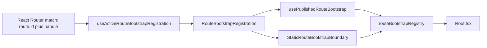
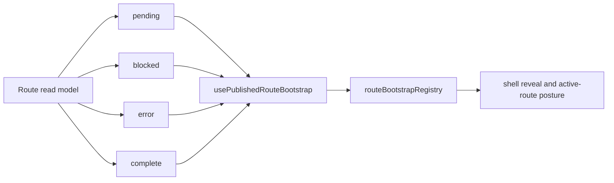

# Graph Route Bootstrap Architecture

## Intent

Define one shell-facing route startup contract that is explicit, typed, and
route-identity based.

## Governing Sources

- [Graph Frontend Architecture](./graph-frontend-architecture.md)
- [Canvas Component Map And Modernization Review](./canvas-component-map-and-modernization-review.md)
- [Canvas Controller Current To Target Architecture](./canvas-controller-current-to-target-architecture.md)

## Module Ownership

| Module                                   | Responsibility                                             |
| ---------------------------------------- | ---------------------------------------------------------- |
| `routeBootstrapContract.ts`              | Contract types and helpers                                 |
| `routeBootstrapRegistration.ts`          | Parse route handle into typed registration                 |
| `routeBootstrapRegistry.ts`              | Passive publication and read lifecycle keyed by `route.id` |
| `routeBootstrapDataRouterContext.ts`     | Isolate Data Router context presence detection             |
| `useActiveRouteBootstrapRegistration.ts` | Resolve active registration from router matches            |
| `usePublishedRouteBootstrap.ts`          | Publish route read-model posture                           |
| `routeBootstrapErrors.ts`                | Typed bootstrap error taxonomy                             |
| `routeBootstrapErrorCopy.ts`             | Locale-resolved bootstrap copy                             |
| `StaticRouteBootstrapBoundary.tsx`       | Settle truly static routes on mount                        |

## Startup Modes

| Mode        | Meaning                                                        | Rule                                              |
| ----------- | -------------------------------------------------------------- | ------------------------------------------------- |
| `published` | Route has startup loading, recovery, missing, or error posture | It must publish posture from its route read model |
| `static`    | Route is already useful at mount time                          | It may settle once through the static boundary    |

Classification rule:

- if a route owns startup loading, error, or recovery semantics, it is
  `published`
- `mount != settled`
- missing classification is design drift, not an implicit default

## Contract Topology

## Published Route Lifecycle

Reading rule:

- the registry stores posture; it does not invent it
- `Root.tsx` consumes the active route contract; it does not infer readiness
  from pathname or widget state
- a published route may complete shell bootstrap only when the route is safe and
  useful as the first visible workbench surface
- `blocked` is reserved for startup blockers that must keep the pre-React gate
  visible because revealing the workbench would be misleading
- `failed` is reserved for controlled route-local failures that can render a
  governed error or recovery surface; it records startup evidence but must not
  keep the shell hidden behind the pre-React gate
- normal updates replace posture in place; reset only happens on teardown or
  route identity change

## Failure Policy

- production-like runtime is fail-fast for bootstrap contract violations
- missing Data Router context throws typed bootstrap failure
- missing active registration throws typed bootstrap failure at shell
  consumption time
- missing explicit registration for a published route throws typed bootstrap
  failure
- API backend readiness failures for Canvas are route-visible blockers, not
  pre-React startup blockers. The shell may reveal Canvas once the route can
  render a governed backend-blocked surface with unsafe interactions disabled.
- Missing or failing route-local data that already has a governed route error
  state must publish `failed` rather than `error`; `error` remains for bootstrap
  contract failures where the route cannot safely render.
- fallback to empty matches or no-op publication is allowed only in test
  runtime for isolated non-router tests

## Invariants

- the registry is passive state storage
- startup for a mounted published route updates in place
- static settlement happens only through `StaticRouteBootstrapBoundary.tsx`
- locale resolution for bootstrap errors is centralized in
  `routeBootstrapErrorCopy.ts`
- Data Router context probing is isolated in
  `routeBootstrapDataRouterContext.ts`
- publisher ownership is strict by route identity

## Route Matrix

| Route id                      | Path           | Mode        | Owner family                    |
| ----------------------------- | -------------- | ----------- | ------------------------------- |
| `dbt.canvas`                  | `/canvas`      | `published` | Canvas draft presentation state |
| `dvt.templates`               | `/templates`   | `published` | Governed source generation      |
| `monitoring.runs`             | `/runs`        | `published` | Runs route bootstrap            |
| `monitoring.run-detail`       | `/runs/:runId` | `published` | Runs route bootstrap            |
| `cost.dashboard`              | `/cost`        | `published` | Cost route bootstrap            |
| `shell.default-core-redirect` | `/`            | `published` | Redirect posture handoff        |
| `shell.plugins`               | `/plugins`     | `static`    | Static shell route              |
| `shell.admin`                 | `/admin`       | `static`    | Static shell route              |

Special case:

- `shell.default-core-redirect` is transiently `published` while it hands
  startup ownership to the destination route

## Acceptance Evidence

| Rule                                                               | Evidence anchors                                                                                                                                                                                                                                                   |
| ------------------------------------------------------------------ | ------------------------------------------------------------------------------------------------------------------------------------------------------------------------------------------------------------------------------------------------------------------ |
| Every active route declares explicit bootstrap metadata            | [routes.ts](../../../../../apps/web/src/app/routes.ts), [routes.test.tsx](../../../../../apps/web/src/app/routes.test.tsx)                                                                                                                                         |
| Published routes publish typed posture by explicit route identity  | [usePublishedRouteBootstrap.ts](../../../../../apps/web/src/app/bootstrap/usePublishedRouteBootstrap.ts), route bootstrap tests under `apps/web/src/app/views/*/*RouteBootstrap.test.ts`                                                                           |
| Publication is monotonic while mounted                             | [usePublishedRouteBootstrap.test.tsx](../../../../../apps/web/src/app/bootstrap/usePublishedRouteBootstrap.test.tsx)                                                                                                                                               |
| Missing Data Router context is typed and fail-fast                 | [useActiveRouteBootstrapRegistration.ts](../../../../../apps/web/src/app/bootstrap/useActiveRouteBootstrapRegistration.ts), [useActiveRouteBootstrapRegistration.test.tsx](../../../../../apps/web/src/app/bootstrap/useActiveRouteBootstrapRegistration.test.tsx) |
| Missing active registration fails closed at shell consumption time | [Root.tsx](../../../../../apps/web/src/app/Root.tsx), [Root.test.tsx](../../../../../apps/web/src/app/Root.test.tsx), [routeBootstrapErrors.ts](../../../../../apps/web/src/app/bootstrap/routeBootstrapErrors.ts)                                                 |
| Static routes settle only through the static boundary              | [StaticRouteBootstrapBoundary.tsx](../../../../../apps/web/src/app/bootstrap/StaticRouteBootstrapBoundary.tsx), [Root.bootstrapFlow.test.tsx](../../../../../apps/web/src/app/Root.bootstrapFlow.test.tsx)                                                         |

## Current State

As of 2026-08-02:

- SRP split is implemented and validated
- Canvas, Templates, Runs, Run Detail, and Cost use explicit startup handles
- Code and Lineage are contextual Canvas surfaces, not peer routes
- `/canvas` is the only Canvas route authority; exhausted workbench URL
  translation and its one-shot query transport are absent
- static settlement exists only through the explicit static boundary
- bootstrap errors are typed and locale-resolved
- fallback behavior remains restricted to test runtime

## Evolution Rules

- every new top-level route must declare explicit startup classification
- new published routes must ship route-specific posture tests
- shell logic must continue consuming the contract instead of route-local
  heuristics
