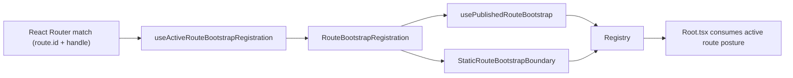

# Graph Route Bootstrap Architecture

## Intent

Define one shell-facing route startup contract that is explicit, typed, and
route-identity based.

## Module Ownership (SRP)

| Module                                   | Responsibility                                                          |
| ---------------------------------------- | ----------------------------------------------------------------------- |
| `routeBootstrapContract.ts`              | Startup contract types + factory helpers.                               |
| `routeBootstrapRegistration.ts`          | Parse route handle and produce typed registration.                      |
| `routeBootstrapRegistry.ts`              | Passive in-memory publication/read/reset lifecycle keyed by `route.id`. |
| `routeBootstrapDataRouterContext.ts`     | Isolate React Router Data Router context presence detection.            |
| `useActiveRouteBootstrapRegistration.ts` | Resolve active registration from router matches.                        |
| `usePublishedRouteBootstrap.ts`          | Adapter that publishes route read-model posture.                        |
| `routeBootstrapErrors.ts`                | Typed route-bootstrap error taxonomy and codes.                         |
| `routeBootstrapErrorCopy.ts`             | Localizable bootstrap error copy and runtime locale detection.          |
| `StaticRouteBootstrapBoundary.tsx`       | Settle static routes on mount.                                          |

## Startup Taxonomy

- `published`: route publishes `pending|blocked|error|complete` from its read model.
- `static`: route becomes useful immediately at mount and can settle once.

Rule:

- If a route has startup loading/error/recovery semantics, it must be
  `published`, not `static`.

## Topology

## Failure Policy

- Production-like runtime is fail-fast for bootstrap contract violations.
- Missing Data Router context throws typed
  `RouteBootstrapDataRouterContextError`.
- Missing active route registration at shell-consumption time throws typed
  `RouteBootstrapActiveRegistrationMissingError`.
- Missing explicit registration for a published route throws typed
  `RouteBootstrapRegistrationNotFoundError`.
- Fallback to empty matches / no-op publication is allowed only in test runtime
  (`import.meta.env.MODE === 'test'` or `import.meta.env.VITEST`) so isolated
  view tests can mount without `RouterProvider`.
- Test fallback is operational scaffolding for tests, not part of normal route
  runtime semantics.

## Invariants

- Registry is passive state storage; it does not derive route semantics and it
  does not synthesize fallback posture when registration is absent.
- Reset happens only on unmount or route identity change.
- Startup for a mounted published route updates in place; no incidental fallback
  to implicit complete.
- `Root.tsx` consumes the active route contract; it does not infer route
  operability from pathname heuristics.
- Missing Data Router context is surfaced as typed bootstrap failure
  (`ROUTE_BOOTSTRAP_DATA_ROUTER_CONTEXT_MISSING`) instead of being treated as
  normal route state.
- Missing explicit registration for a published route is surfaced as typed
  bootstrap failure (`ROUTE_BOOTSTRAP_REGISTRATION_NOT_FOUND`) outside test
  runtime.
- Missing active route registration is surfaced as typed bootstrap failure
  (`ROUTE_BOOTSTRAP_ACTIVE_REGISTRATION_MISSING`) instead of degrading to a
  shell-owned pending fallback.
- Bootstrap error messages resolve locale from runtime
  (`navigator.language`, then `navigator.languages[0]`, then
  `document.documentElement.lang`, fallback `en`) through
  `routeBootstrapErrorCopy.ts`; locale is no longer hardcoded in hooks and the
  bootstrap-local dictionary currently overrides Spanish copy while English
  continues to resolve through fallback copy.
- Missing Data Router context fallback is allowed only in test runtime for
  isolated view tests; production/runtime paths fail fast.
- React Router `UNSAFE_*DataRouter*Context` usage is contained in
  `routeBootstrapDataRouterContext.ts` so upstream router-presence coupling does
  not leak across the bootstrap slice.
- Publisher ownership is strict by route: published-route adapters must resolve
  registration by explicit `routeId` and must not publish through shared
  active-match fallback.

## Route Matrix (Current)

As of 2026-04-18, the active startup matrix is:

| Route id                      | Path           | Mode        | Source anchor                                                                                                                                                                          | Test evidence                                                                                                                                                                  |
| ----------------------------- | -------------- | ----------- | -------------------------------------------------------------------------------------------------------------------------------------------------------------------------------------- | ------------------------------------------------------------------------------------------------------------------------------------------------------------------------------ |
| `dbt.canvas`                  | `/canvas`      | `published` | `apps/web/src/app/plugins/dbt/dbtContributions.ts` + `apps/web/src/app/views/canvas/canvasDraftPresentationModel.ts` + `apps/web/src/app/views/canvas/canvasDraftPresentationStore.ts` | `apps/web/src/app/views/canvas/canvasDraftPresentationModel.test.ts` + `apps/web/src/app/views/canvas/canvasDraftPresentationStore.test.ts` + `apps/web/src/app/Root.test.tsx` |
| `dbt.lineage`                 | `/lineage`     | `published` | `apps/web/src/app/plugins/dbt/dbtContributions.ts` + `apps/web/src/app/views/lineage/lineageRouteBootstrap.ts`                                                                         | `apps/web/src/app/views/lineage/lineageRouteBootstrap.test.ts`                                                                                                                 |
| `dbt.code`                    | `/code`        | `published` | `apps/web/src/app/plugins/dbt/dbtContributions.ts` + `apps/web/src/app/views/code/codeRouteBootstrap.ts`                                                                               | `apps/web/src/app/views/code/codeRouteBootstrap.test.ts`                                                                                                                       |
| `dbt.diff`                    | `/diff`        | `published` | `apps/web/src/app/plugins/dbt/dbtContributions.ts` + `apps/web/src/app/views/diff/diffRouteBootstrap.ts`                                                                               | `apps/web/src/app/views/diff/diffRouteBootstrap.test.ts`                                                                                                                       |
| `dbt.artifacts`               | `/artifacts`   | `published` | `apps/web/src/app/plugins/dbt/dbtContributions.ts` + `apps/web/src/app/views/artifacts/artifactsRouteBootstrap.ts`                                                                     | `apps/web/src/app/views/artifacts/artifactsRouteBootstrap.test.ts`                                                                                                             |
| `monitoring.runs`             | `/runs`        | `published` | `apps/web/src/app/plugins/monitoring/monitoringContributions.ts` + `apps/web/src/app/views/runs/runsRouteBootstrap.ts`                                                                 | `apps/web/src/app/views/runs/runsRouteBootstrap.test.ts`                                                                                                                       |
| `monitoring.run-detail`       | `/runs/:runId` | `published` | `apps/web/src/app/plugins/monitoring/monitoringContributions.ts` + `apps/web/src/app/views/runs/runsRouteBootstrap.ts`                                                                 | `apps/web/src/app/views/runs/runsRouteBootstrap.test.ts` + `apps/web/src/app/Root.test.tsx`                                                                                    |
| `cost.dashboard`              | `/cost`        | `published` | `apps/web/src/app/plugins/registry.ts` + `apps/web/src/app/views/cost/costRouteBootstrap.ts`                                                                                           | `apps/web/src/app/views/cost/costRouteBootstrap.test.ts` + `apps/web/src/app/routes.test.tsx`                                                                                  |
| `shell.default-core-redirect` | `/`            | `published` | `apps/web/src/app/routes.ts`                                                                                                                                                           | `apps/web/src/app/routes.test.tsx`                                                                                                                                             |
| `shell.plugins`               | `/plugins`     | `static`    | `apps/web/src/app/routes.ts`                                                                                                                                                           | `apps/web/src/app/routes.test.tsx`                                                                                                                                             |
| `shell.admin`                 | `/admin`       | `static`    | `apps/web/src/app/routes.ts`                                                                                                                                                           | `apps/web/src/app/routes.test.tsx` + `apps/web/src/app/Root.test.tsx`                                                                                                          |

`shell.default-core-redirect` is a transient `published` route: while mounted
it explicitly publishes pending redirect posture through
`usePublishedRouteBootstrap`, then hands startup ownership to the navigated
target route.

`apps/web/src/app/Root.test.tsx` covers static-route runtime behavior directly
for `shell.admin` and also exercises the generic static-route contract pattern
through a synthetic Plugins route; the per-route shell matrix above cites
direct route evidence where available.

## Per-route Acceptance Checks

- `Every route in the active set declares explicit handle.routeBootstrap`
  Evidence: `apps/web/src/app/routes.ts` (plugin views are guarded by
  `requireViewRouteHandle`; shell routes declare handles inline) +
  `apps/web/src/app/routes.test.tsx`
- `Published routes derive typed posture and publish by explicit route identity`
  Evidence: `apps/web/src/app/bootstrap/usePublishedRouteBootstrap.ts` +
  `apps/web/src/app/bootstrap/usePublishedRouteBootstrap.test.tsx` +
  `apps/web/src/app/routes.test.tsx` + route bootstrap tests in
  `apps/web/src/app/views/artifacts/artifactsRouteBootstrap.test.ts`,
  `apps/web/src/app/views/code/codeRouteBootstrap.test.ts`,
  `apps/web/src/app/views/cost/costRouteBootstrap.test.ts`,
  `apps/web/src/app/views/diff/diffRouteBootstrap.test.ts`,
  `apps/web/src/app/views/lineage/lineageRouteBootstrap.test.ts`,
  `apps/web/src/app/views/runs/runsRouteBootstrap.test.ts`, and
  `apps/web/src/app/views/canvas/canvasDraftPresentationModel.test.ts` +
  `apps/web/src/app/views/canvas/canvasDraftPresentationStore.test.ts`
- `Publisher lifecycle is monotonic for mounted route (no reset on ordinary updates)`
  Evidence: `apps/web/src/app/bootstrap/usePublishedRouteBootstrap.test.tsx`
- `Missing Data Router context is typed and non-router exceptions are not masked`
  Evidence: `apps/web/src/app/bootstrap/useActiveRouteBootstrapRegistration.ts` +
  `apps/web/src/app/bootstrap/useActiveRouteBootstrapRegistration.test.tsx`
- `Missing active route registration fails fast at shell-consumption time`
  Evidence: `apps/web/src/app/Root.tsx` + `apps/web/src/app/Root.test.tsx` +
  `apps/web/src/app/bootstrap/routeBootstrapErrors.ts` +
  `apps/web/src/app/bootstrap/routeBootstrapErrorCopy.test.ts`
- `Missing published registration fails closed with localized typed copy`
  Evidence: `apps/web/src/app/bootstrap/usePublishedRouteBootstrap.ts` +
  `apps/web/src/app/bootstrap/usePublishedRouteBootstrap.test.tsx` +
  `apps/web/src/app/bootstrap/routeBootstrapErrors.ts` +
  `apps/web/src/app/bootstrap/routeBootstrapErrorCopy.test.ts`
- `Static routes settle only through explicit static boundary`
  Evidence: `apps/web/src/app/routes.ts` (`withRouteBootstrapBoundary`) +
  `apps/web/src/app/bootstrap/StaticRouteBootstrapBoundary.tsx` +
  `apps/web/src/app/Root.test.tsx`

## Current State

As of 2026-04-18:

- SRP split is implemented and validated.
- Canvas and graph-adjacent routes use explicit startup handles.
- static settlement exists only through the explicit static boundary seam.
- bootstrap error handling now uses typed fail-fast errors plus runtime
  locale-resolved copy.
- fallback behavior is intentionally restricted to test runtime for isolated
  non-router view tests.

## Future Evolution

- enforce explicit startup classification for every new top-level route at PR
  review.
- add contract-level tests for monotonic publication and invalid handle rejection
  across future route additions.
