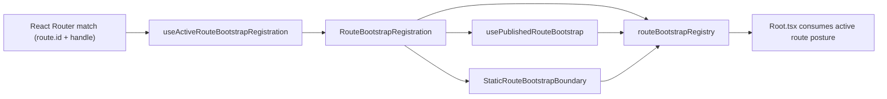

# Graph Route Bootstrap Architecture

## Intent

Define one shell-facing route startup contract that is explicit, typed, and
route-identity based.

## Module Ownership (SRP)

| Module                                   | Responsibility                                                  |
| ---------------------------------------- | --------------------------------------------------------------- |
| `routeBootstrapContract.ts`              | Startup contract types + factory helpers.                       |
| `routeBootstrapRegistration.ts`          | Parse route handle and produce typed registration.              |
| `routeBootstrapRegistry.ts`              | In-memory publication/read/reset lifecycle keyed by `route.id`. |
| `useActiveRouteBootstrapRegistration.ts` | Resolve active registration from router matches.                |
| `usePublishedRouteBootstrap.ts`          | Adapter that publishes route read-model posture.                |
| `routeBootstrapErrors.ts`                | Typed route-bootstrap error taxonomy and codes.                 |
| `routeBootstrapErrorCopy.ts`             | Localizable bootstrap error copy and runtime locale detection.  |
| `StaticRouteBootstrapBoundary.tsx`       | Settle static routes on mount.                                  |

## Startup Taxonomy

- `published`: route publishes `pending|blocked|error|complete` from its read model.
- `static`: route becomes useful immediately at mount and can settle once.

Rule:

- If a route has startup loading/error/recovery semantics, it must be
  `published`, not `static`.

## Topology

## Invariants

- Registry is passive state storage; it does not derive route semantics.
- Reset happens only on unmount or route identity change.
- Startup for a mounted published route updates in place; no incidental fallback
  to implicit complete.
- `Root.tsx` consumes the active route contract; it does not infer route
  operability from pathname heuristics.
- Missing Data Router context is surfaced as typed bootstrap failure
  (`ROUTE_BOOTSTRAP_DATA_ROUTER_CONTEXT_MISSING`) instead of being treated as
  normal route state.
- Missing explicit registration for a published route is surfaced as typed
  bootstrap failure (`ROUTE_BOOTSTRAP_REGISTRATION_NOT_FOUND`) outside test
  runtime.
- Bootstrap error messages resolve locale from runtime (`navigator.language`,
  fallback `en`) through `routeBootstrapErrorCopy.ts`; locale is no longer
  hardcoded in hooks.
- Missing Data Router context fallback is allowed only in test runtime for
  isolated view tests; production/runtime paths fail fast.
- Publisher ownership is strict by route: published-route adapters must resolve
  registration by explicit `routeId` and must not publish through shared
  active-match fallback.

## Route Classification (Current)

As of 2026-04-17, startup mode classification is:

| Route id                      | Mode        | Source anchor                                                                                                          |
| ----------------------------- | ----------- | ---------------------------------------------------------------------------------------------------------------------- |
| `dbt.canvas`                  | `published` | `apps/web/src/app/plugins/dbt/dbtContributions.ts` + `apps/web/src/app/views/canvas/canvasDraftPresentationState.ts`   |
| `dbt.lineage`                 | `published` | `apps/web/src/app/plugins/dbt/dbtContributions.ts` + `apps/web/src/app/views/lineage/lineageRouteBootstrap.ts`         |
| `dbt.code`                    | `published` | `apps/web/src/app/plugins/dbt/dbtContributions.ts` + `apps/web/src/app/views/code/codeRouteBootstrap.ts`               |
| `dbt.diff`                    | `published` | `apps/web/src/app/plugins/dbt/dbtContributions.ts` + `apps/web/src/app/views/diff/diffRouteBootstrap.ts`               |
| `dbt.artifacts`               | `published` | `apps/web/src/app/plugins/dbt/dbtContributions.ts` + `apps/web/src/app/views/artifacts/artifactsRouteBootstrap.ts`     |
| `monitoring.runs`             | `published` | `apps/web/src/app/plugins/monitoring/monitoringContributions.ts` + `apps/web/src/app/views/runs/runsRouteBootstrap.ts` |
| `monitoring.run-detail`       | `published` | `apps/web/src/app/plugins/monitoring/monitoringContributions.ts` + `apps/web/src/app/views/runs/runsRouteBootstrap.ts` |
| `cost.dashboard`              | `published` | `apps/web/src/app/plugins/registry.ts` + `apps/web/src/app/views/cost/costRouteBootstrap.ts`                           |
| `shell.default-core-redirect` | `published` | `apps/web/src/app/routes.ts`                                                                                           |
| `shell.plugins`               | `static`    | `apps/web/src/app/routes.ts`                                                                                           |
| `shell.admin`                 | `static`    | `apps/web/src/app/routes.ts`                                                                                           |

## Per-route Acceptance Checks

| Acceptance criterion                                                              | Verifiable evidence                                                                                                                                                                                                                                                                                                                                                                                                                                                                                                                                                                                           |
| --------------------------------------------------------------------------------- | ------------------------------------------------------------------------------------------------------------------------------------------------------------------------------------------------------------------------------------------------------------------------------------------------------------------------------------------------------------------------------------------------------------------------------------------------------------------------------------------------------------------------------------------------------------------------------------------------------------- |
| Every route declares explicit `handle.routeBootstrap`                             | `apps/web/src/app/routes.ts` (`requireViewRouteHandle`) + `apps/web/src/app/routes.test.tsx`                                                                                                                                                                                                                                                                                                                                                                                                                                                                                                                  |
| Published routes derive typed posture and publish by explicit route identity      | `apps/web/src/app/bootstrap/usePublishedRouteBootstrap.ts` + `apps/web/src/app/bootstrap/usePublishedRouteBootstrap.test.tsx` + route bootstrap tests in `apps/web/src/app/views/artifacts/artifactsRouteBootstrap.test.ts`, `apps/web/src/app/views/code/codeRouteBootstrap.test.ts`, `apps/web/src/app/views/cost/costRouteBootstrap.test.ts`, `apps/web/src/app/views/diff/diffRouteBootstrap.test.ts`, `apps/web/src/app/views/lineage/lineageRouteBootstrap.test.ts`, `apps/web/src/app/views/runs/runsRouteBootstrap.test.ts`, and `apps/web/src/app/views/canvas/canvasDraftPresentationState.test.ts` |
| Publisher lifecycle is monotonic for mounted route (no reset on ordinary updates) | `apps/web/src/app/bootstrap/usePublishedRouteBootstrap.test.tsx`                                                                                                                                                                                                                                                                                                                                                                                                                                                                                                                                              |
| Missing Data Router context is typed and non-router exceptions are not masked     | `apps/web/src/app/bootstrap/useActiveRouteBootstrapRegistration.ts` + `apps/web/src/app/bootstrap/useActiveRouteBootstrapRegistration.test.tsx`                                                                                                                                                                                                                                                                                                                                                                                                                                                               |
| Missing published registration fails closed outside test runtime                  | `apps/web/src/app/bootstrap/usePublishedRouteBootstrap.ts` + `apps/web/src/app/bootstrap/routeBootstrapErrors.ts`                                                                                                                                                                                                                                                                                                                                                                                                                                                                                             |
| Static routes settle only through explicit static boundary                        | `apps/web/src/app/routes.ts` (`withRouteBootstrapBoundary`) + `apps/web/src/app/bootstrap/StaticRouteBootstrapBoundary.tsx`                                                                                                                                                                                                                                                                                                                                                                                                                                                                                   |

## Current State

As of 2026-04-17:

- SRP split is implemented and validated.
- Canvas and graph-adjacent routes use explicit startup handles.
- static settlement exists only through the explicit static boundary seam.
- bootstrap error handling now uses typed errors plus runtime locale-resolved
  copy.

## Future Evolution

- enforce explicit startup classification for every new top-level route at PR
  review.
- add contract-level tests for monotonic publication and invalid handle rejection
  across future route additions.
