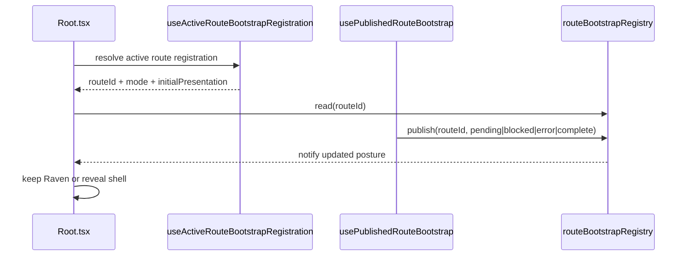
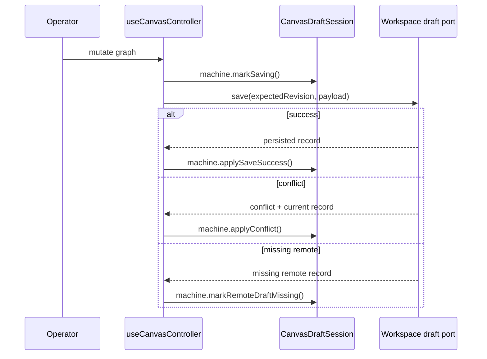
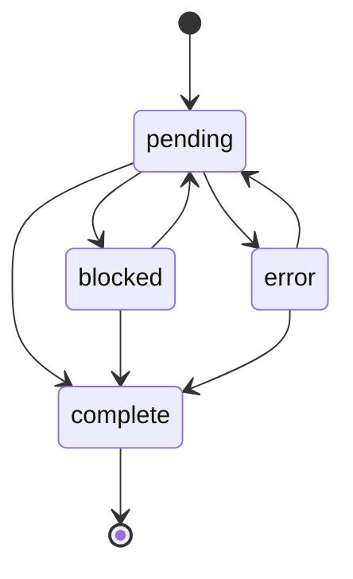
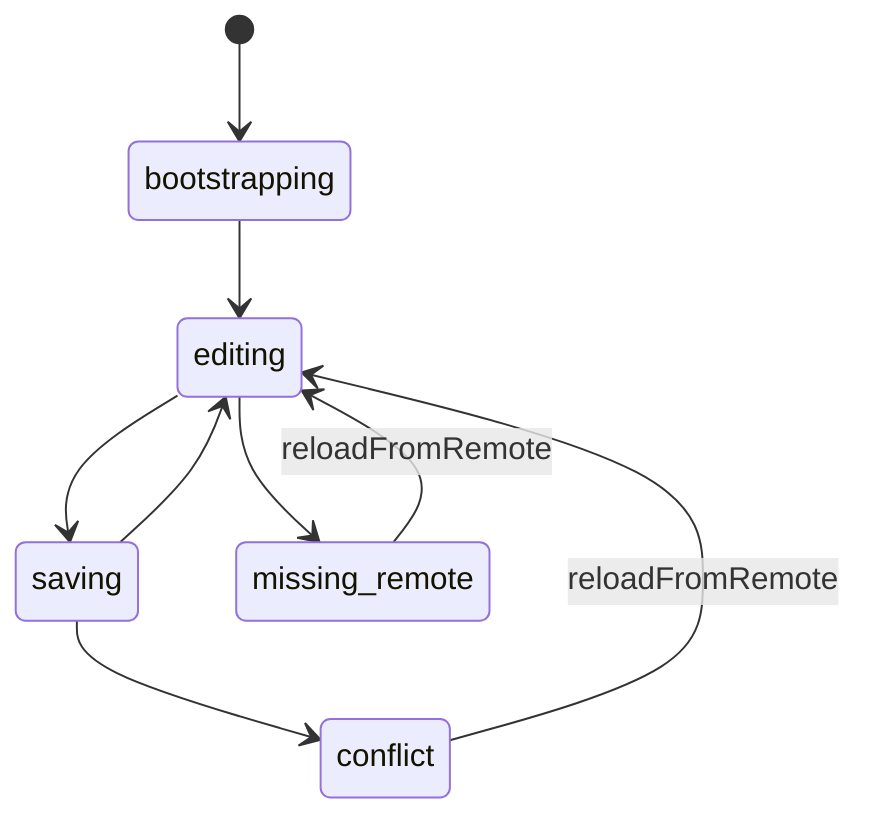

# Graph Sequences And State Machines

## Sequence 1: Published Route Startup

## Sequence 2: Save With CAS Conflict

## State Machine: Route Startup

Rule:

- reset to initial posture only on unmount or route identity change.

## State Machine: Canvas Draft Session

Rule:

- conflict and missing-remote are fail-closed mutation states until an
  authoritative remote reload succeeds.
