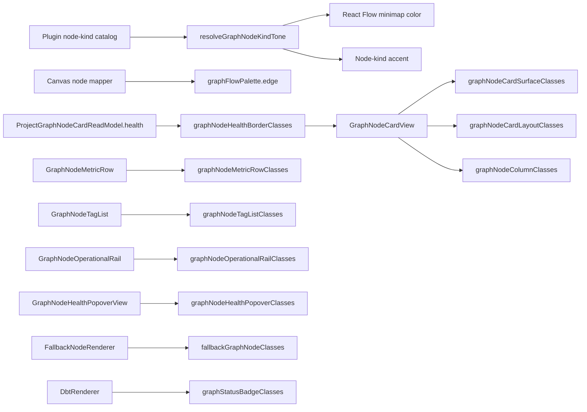

# React Flow Visual Token Component

This component owns the React Flow graph visual tokens used by Canvas graph
projection, generic plugin graph node rendering, and graph-node card chrome.

## Public API

- `graphNodeCardSurfaceClasses`: outer card surface and state classes.
- `graphNodeCardLayoutClasses`: graph-node card internal layout classes.
- `graphNodeMetricRowClasses`: compact card metric row classes.
- `graphNodeTagListClasses`: graph-node tag list classes.
- `graphNodeOperationalRailClasses`: operational metric rail classes.
- `graphNodeHealthPopoverClasses`: operational health popover classes.
- `graphNodeHealthBorderClasses`: healthy, failed, and neutral card-border
  classes projected from `ProjectGraphNodeCardReadModel`.
- `fallbackGraphNodeClasses`: fallback node renderer classes.
- `graphNodeColumnClasses`: optional graph-node column list classes.
- `graphStatusBadgeClasses`: inspector badge tone classes for plugin node
  runtime state.
- `graphNodeKindToneClasses`: semantic border and minimap tones for known node
  kinds.
- `graphFlowPalette`: React Flow edge and fallback minimap palette values.
- `resolveGraphNodeKindTone(kind)`: returns a known node-kind tone or the
  fallback tone.
- `projectCanvasNodeAccessibleHealth(...)`: applies strategy-owned health to a
  focusable React Flow node label without duplicating health rules.

## Invariants

- Canvas edge projection reads edge colors from `graphFlowPalette`.
- Node-kind catalogs do not own hex minimap literals.
- Generic graph renderers and plugin-owned dbt node renderer chrome do not own
  `slate-*`, `gray-*`, `neutral-*`, or hex visual decisions.
- Graph-node card presentation components consume responsibility-specific token
  groups instead of a shared catch-all class bag.
- A card's base border comes only from its projected health: solid green for
  healthy, dashed red for failed, and solid neutral when evidence is absent or
  non-terminal. The line style keeps failure distinguishable without color.
- Selection and keyboard focus remain separate rings; they do not replace or
  reinterpret health.
- Cost, runtime, and other overlay borders render on an inner decoration layer;
  they never overwrite the outer health border.
- The focusable React Flow node label includes health from the same card read
  model that selects the border; health is not repeated as a visible status
  chip.
- If a plugin card strategy throws while projecting accessible health, the
  focusable label falls back to canonical default health for that node; plugin
  failure cannot replace the Canvas route.
- Draft-backed and dbt project-file Canvas controllers use the same accessible
  health projector.
- Shell-owned runtime enrichment re-runs that projector from the final node data
  so the focusable label and rendered border cannot diverge.
- Plugin-specific behavior remains in plugin contracts; this component owns only
  presentation tokens.

## Transitions

## Consumers

- `nodeTypeCatalog.dbt.ts`
- `dvtNodeTypeCatalog.ts`
- `canvasNodeMapper.ts`
- `GraphNodeRenderer.tsx`
- `GraphNodeCardView.tsx`
- `GraphNodeMetricRow.tsx`
- `GraphNodeTagList.tsx`
- `GraphNodeOperationalRail.tsx`
- `GraphNodeHealthPopoverView.tsx`
- `FallbackNodeRenderer.tsx`
- `DbtNodeRenderer.tsx`

## Drift Guard

`graphVisualTokenConvergence.architecture.test.ts` rejects reintroduced local
color-family or hex ownership in the graph renderer, fallback renderer, dbt
node renderer, graph-node card presentation components, node-kind catalogs, and
Canvas edge mapper.
