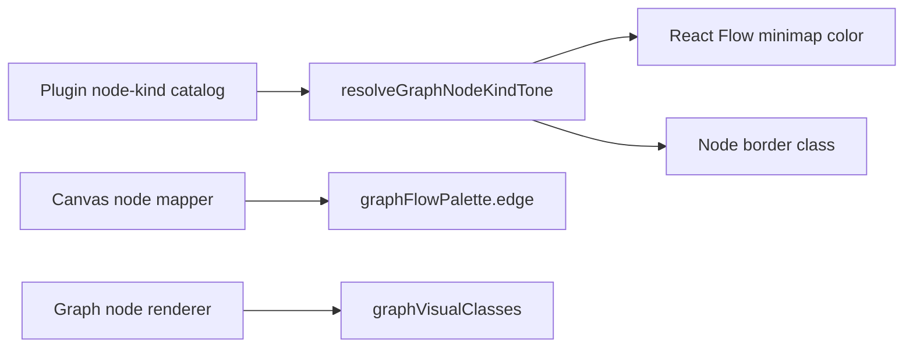

# React Flow Visual Token Component

This component owns the operator-workbench visual tokens used by Canvas React
Flow projection and generic plugin graph node rendering.

## Public API

- `graphVisualClasses`: shared structural classes for graph node cards, fallback
  cards, tags, metadata rows, and column chrome.
- `graphStatusDotClasses`: status dot tone classes for node execution state.
- `graphStatusRingClasses`: selected runtime status ring classes.
- `graphNodeKindToneClasses`: semantic border and minimap tones for known node
  kinds.
- `graphFlowPalette`: React Flow edge and fallback minimap palette values.
- `resolveGraphNodeKindTone(kind)`: returns a known node-kind tone or the
  fallback tone.

## Invariants

- Canvas edge projection reads edge colors from `graphFlowPalette`.
- Node-kind catalogs do not own hex minimap literals.
- Generic graph renderers do not own `slate-*`, `gray-*`, `neutral-*`, or hex
  visual decisions.
- Plugin-specific behavior remains in plugin contracts; this component owns only
  presentation tokens.

## Transitions

## Consumers

- `nodeTypeCatalog.dbt.ts`
- `dvtNodeTypeCatalog.ts`
- `canvasNodeMapper.ts`
- `GraphNodeRenderer.tsx`
- `FallbackNodeRenderer.tsx`

## Drift Guard

`graphVisualTokenConvergence.architecture.test.ts` rejects reintroduced local
color-family or hex ownership in the graph renderer, fallback renderer, node-kind
catalogs, and Canvas edge mapper.
