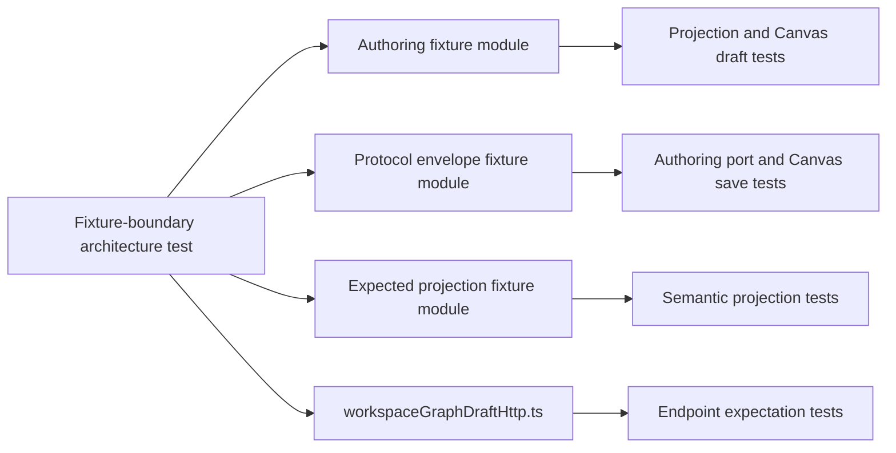

# Workspace Graph Draft Test Fixture Boundary Component

## Owned Concern

This test-support component owns fixture boundaries for workspace graph draft
tests. It keeps authoring draft shape, protected protocol envelopes, and
expected projection objects in separate modules so tests depend on the same
semantic seams as production code.

It does not own runtime projection behavior, HTTP endpoint construction,
Canvas controller logic, or contract definitions.

Scenario coverage is tracked in
[Workspace Graph Draft Test Fixture Boundary User Stories](./workspace-graph-draft-test-fixture-boundary-user-stories.md).

## Public API

- `workspaceGraphDraftAuthoring.test.fixtures.ts`
  Builds `WorkspaceGraphAuthoringDraft` and protected
  `WorkspaceGraphDraftRecord` fixtures.
- `workspaceGraphDraftProtocol.test.fixtures.ts`
  Builds protected read/save envelope fixtures for authoring-port and Canvas
  controller tests.
- `workspaceGraphDraftProjectionExpected.test.fixtures.ts`
  Builds expected semantic graph projection fixtures.
- `workspaceGraphDraftFixtureBoundaries.architecture.test.ts`
  Fails when the deleted monolithic fixture returns, when fixture modules lose
  owned-concern docblocks, or when docs stop naming the boundary.
- `workspaceGraphDraftHttp.ts`
  Remains the production source for `buildWorkspaceGraphDraftEndpoint`; tests
  should import endpoint behavior from that boundary instead of duplicating it
  in fixtures.

## Invariants

- No compatibility barrel named `workspaceGraphDraft.test.fixtures.ts` exists.
- Authoring fixtures do not build protocol envelopes or expected projection
  objects.
- Protocol fixtures do not build authoring draft graphs or expected projection
  objects.
- Expected projection fixtures do not import protected read/write protocol
  response types.
- Endpoint expectations use `workspaceGraphDraftHttp.ts`, the production HTTP
  boundary.
- Every fixture module starts with a short owned-concern docblock.

## Transitions

- Before: one fixture file built endpoint strings, authoring draft graphs,
  protected records, read/save envelopes, expected semantic graphs, and
  projected presentation records.
- Red: `workspaceGraphDraftFixtureBoundaries.architecture.test.ts` failed
  because the monolithic fixture still existed.
- Green: tests imported concern-specific fixtures directly and the monolithic
  fixture was deleted.
- Future changes: a new fixture concern must get its own named module rather
  than extending an unrelated fixture.

## Consumers

- `workspaceGraphDraftAuthoring.api.test.ts`
- `workspaceGraphDraftProjection.test.ts`
- `workspaceGraphDraftSnapshotProjection.test.ts`
- `workspaceService.api.test.ts`
- Canvas controller draft lifecycle and reload tests under
  `apps/web/src/app/views/canvas`
- `canvasDraftRecoveryBoundary.architecture.test.ts`
- `workspaceGraphDraftFixtureBoundaries.architecture.test.ts`

## Diagrams

## Fowler Reading

Mature systems usually keep fixtures close to the bounded context they model.
The old file behaved like a grab-bag test data builder and created a Hidden
Dependency smell: importing one helper implicitly granted unrelated fixture
authority. The split applies Information Expert and Single Responsibility to
test support, not only production code.

## Drift Guards

- `workspaceGraphDraftFixtureBoundaries.architecture.test.ts`
  validates module ownership, absence of the monolithic fixture, and local
  documentation coverage.
- `pnpm --filter @dvt/web test -- src/app/services/workspace/workspaceGraphDraftFixtureBoundaries.architecture.test.ts`
  is the focused regression command.
