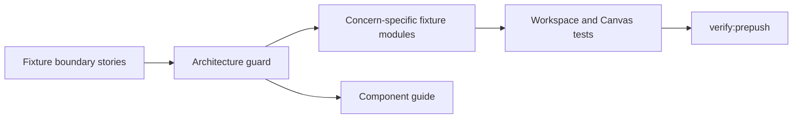

# Workspace Graph Draft Test Fixture Boundary User Stories

## Purpose

This document captures the test-maintainer scenarios for workspace graph draft
fixture boundaries after the Fowler follow-up.

It complements the component guide:

- [Workspace Graph Draft Test Fixture Boundary Component](./workspace-graph-draft-test-fixture-boundary-component.md)

## User Stories

### US-WORKSPACE-FIXTURE-001: import only the fixture concern a test needs

As a test maintainer, I want workspace graph draft tests to import only the
fixture concern they exercise, so a projection test does not depend on protocol
envelopes and a protocol test does not depend on projection expected objects.

Acceptance criteria:

- Given a projection test, when it needs an expected semantic graph, then it
  imports `workspaceGraphDraftProjectionExpected.test.fixtures.ts`.
- Given a Canvas save test, when it needs protected save envelopes, then it
  imports `workspaceGraphDraftProtocol.test.fixtures.ts`.
- Given a test needs a protected draft record, then it imports
  `workspaceGraphDraftAuthoring.test.fixtures.ts`.

### US-WORKSPACE-FIXTURE-002: keep endpoint truth in the production boundary

As a frontend maintainer, I want endpoint expectations to import the production
HTTP boundary, so test fixtures do not become a parallel endpoint source.

Acceptance criteria:

- Given a test asserts `/workspace/graph/draft`, when it builds the scoped
  endpoint, then it calls `buildWorkspaceGraphDraftEndpoint` from
  `workspaceGraphDraftHttp.ts`.
- Given the endpoint changes, then endpoint tests fail through the production
  boundary rather than through stale duplicate fixture code.

### US-WORKSPACE-FIXTURE-003: reject monolithic fixture drift

As an architect, I want a semantic architecture test for fixture boundaries, so
future cleanup cannot recreate a broad compatibility barrel under another
static-analysis pass.

Acceptance criteria:

- Given `workspaceGraphDraft.test.fixtures.ts` exists, when the architecture
  guard runs, then it fails.
- Given a fixture module has no owned-concern docblock, when the guard runs,
  then it fails.
- Given fixture-boundary docs lose public API, invariants, transitions,
  consumers, or diagrams, then the guard fails.

## Negative scenarios

- A test fixture module must not import all workspace graph draft concerns.
- A deleted monolithic fixture must not return as a compatibility barrel.
- Endpoint construction must not be duplicated in test fixtures.
- Expected projection objects must not import protected read/write response
  envelope types.

## TDD Traceability

Red case:

- the architecture guard required the monolithic fixture to be absent;
- `workspaceGraphDraft.test.fixtures.ts` still existed;
- the guard failed.

Green case:

- split the fixture into authoring, protocol, and expected projection modules;
- update imports directly without a compatibility barrel;
- rerun the guard and focused workspace graph draft tests.
