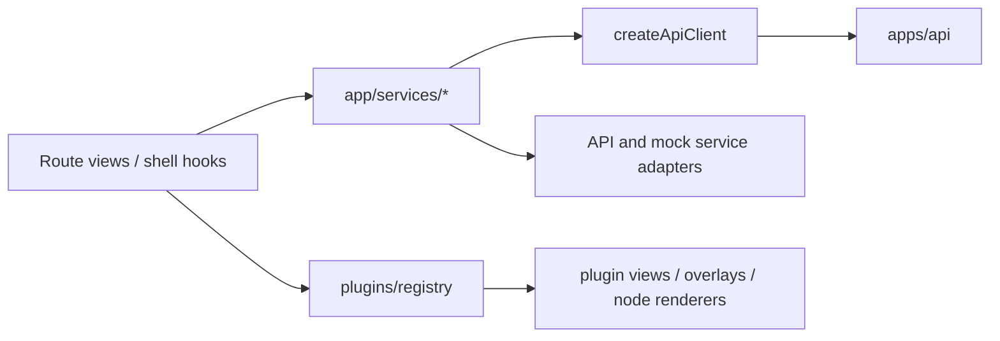

# @dvt/web Package Surface

`@dvt/web` is the package-level view of the `apps/web` workspace.

Use this page when the question is about module boundaries inside the frontend
package rather than the deployable shell as a whole.

## Current Responsibilities

- client-side API, runs, and workspace services;
- planner preview/import and plan-selection service composition;
- platform-health capability and related hooks;
- plugin registry, contributions, and route/view discovery;
- route-level views and the supporting state used by those views.

## Current Package Topology

## Current Code Anchors

- [createApiClient.ts](../../../../apps/web/src/app/services/api/createApiClient.ts)
- [plansService.ts](../../../../apps/web/src/app/services/plans/plansService.ts)
- [runsService.ts](../../../../apps/web/src/app/services/runs/runsService.ts)
- [workspaceService.ts](../../../../apps/web/src/app/services/workspace/workspaceService.ts)
- [registry.ts](../../../../apps/web/src/app/plugins/registry.ts)

## Library Direction

- React Flow for graph rendering adapters;
- TanStack Query for remote query orchestration;
- Zustand for focused local UI state;
- Radix/shadcn primitives for reusable accessible UI;
- TanStack Table, Monaco Editor, and xterm.js when the corresponding capability
  surfaces mature enough to justify them.

## Related Pages

- [apps/web](../web-app/index.md)
- [Frontend Architecture](../../frontend/index.md)
- [Library And Open-Source Reference Stack](../../frontend/library-and-open-source-reference-stack.md)
