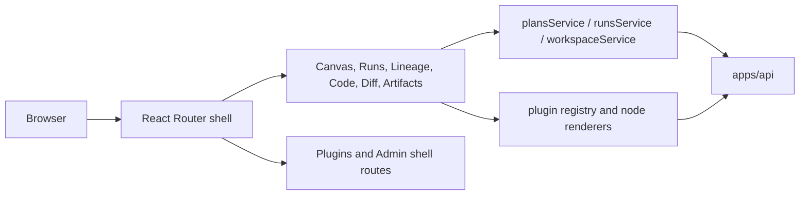

# web component

`web` is the canonical component home for the `apps/web` workspace.

It covers both the deployable browser shell and the public package-level
surface consumed inside that workspace. The old `web-app` alias has been moved
out of the active tree.

## Current Responsibilities

- bootstrap the browser application and persistent workbench shell;
- compose route views, plugin-contributed surfaces, and shell-owned routes;
- expose client services for plans, runs, and workspace state;
- map backend runtime and planning responses into operator-facing views.

## Public Operational Surface

- app bootstrap and shell wiring:
  [main.tsx](../../../../apps/web/src/main.tsx),
  [App.tsx](../../../../apps/web/src/app/App.tsx),
  [Root.tsx](../../../../apps/web/src/app/Root.tsx),
  [routes.ts](../../../../apps/web/src/app/routes.ts)
- route-level read and run inspection:
  [RunsView.tsx](../../../../apps/web/src/app/views/RunsView.tsx),
  [RunWorkspaceStateView.tsx](../../../../apps/web/src/app/views/runs/RunWorkspaceStateView.tsx)
- service factories and facades:
  [plansService.ts](../../../../apps/web/src/app/services/plans/plansService.ts),
  [runsService.ts](../../../../apps/web/src/app/services/runs/runsService.ts),
  [workspaceService.ts](../../../../apps/web/src/app/services/workspace/workspaceService.ts),
  [runWorkspaceFacade.ts](../../../../apps/web/src/app/services/runs/runWorkspaceFacade.ts)
- plugin and contribution boundary:
  [registry.ts](../../../../apps/web/src/app/plugins/registry.ts)

## Component Topology

## Current Route Inventory

| Route                   | Main responsibility                   |
| ----------------------- | ------------------------------------- |
| `/canvas`               | graph workbench and run-start flow    |
| `/runs`, `/runs/:runId` | run list and run detail inspection    |
| `/lineage`              | graph-derived lineage and impact      |
| `/code`                 | file and compiled-source inspection   |
| `/diff`                 | diff and review handoff surface       |
| `/artifacts`            | manifest import and artifact browsing |
| `/plugins`              | plugin management shell view          |
| `/admin`                | shell-owned administrative view       |

## Current Posture

This component is real product code. The remaining work is around tightening
service boundaries, removing mock-heavy paths, and aligning route-level flows
with the protected backend contracts.

## Related Pages

- [Frontend subsystem compatibility pack](../../frontend/index.md)
- [Read subsystem](../../subsystems/read/index.md)
- [DVT Component Map](../../component-map.md)
- [System Delivery Status](../../system-delivery-status.md)
