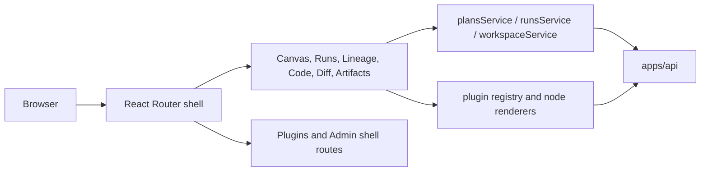

# web component

`web` is the canonical component home for the `apps/web` workspace.

It covers both the deployable browser shell and the public package-level
surface consumed inside that workspace. The old `web-app` alias has been moved
out of the active tree.

## Current Responsibilities

- bootstrap the browser application and persistent workbench shell;
- compose route views, plugin-contributed surfaces, and shell-owned routes;
- expose client services for plans, runs, and workspace state;
- map backend runtime and planning responses into operator-facing views.

## Component Decomposition

- shell and bootstrap:
  [Main workspace views and UX](./main-workspace-views-and-ux.md),
  [App bootstrap screen component](./app-bootstrap-screen-component.md),
  [App shell](./appshell/app-shell.md),
  [Data source service boundary](./appshell/data-source-service-boundary.md)
- graph and authoring surfaces:
  [Graph docs entrypoint](./graph/index.md),
  [Graph frontend architecture](./graph/graph-frontend-architecture.md),
  [Graph route bootstrap architecture](./graph/graph-route-bootstrap-architecture.md),
  [Graph canvas runtime model](./graph/graph-canvas-runtime-model.md),
  [Graph sequences and state machines](./graph/graph-sequences-and-state-machines.md),
  [Graph decision rationale and patterns](./graph/graph-decision-rationale-and-patterns.md),
  [Canvas controller current-to-target](./graph/canvas-controller-current-to-target-architecture.md)
- runtime and run-inspection surfaces:
  [Runs architecture](./runs/dvt-runs-frontend-architecture.md),
  [Frontend runtime contract technical manual](./runs/frontend-runtime-contract-technical-manual.md),
  [Frontend runtime contract user manual](./runs/frontend-runtime-contract-user-manual.md)
- cross-cutting UX:
  [UX implementation guide](./ux-implementation-guide.md),
  [Workbench UI contract and component inventory](./workbench-ui-contract-and-component-inventory.md),
  [Library and open-source reference stack](./library-and-open-source-reference-stack.md),
  [Plugin Contributions Developer Guide](./plugin-contributions-developer-guide.md)

## Public Operational Surface

- app bootstrap and shell wiring:
  [main.tsx](../../../../apps/web/src/main.tsx),
  [App.tsx](../../../../apps/web/src/app/App.tsx),
  [Root.tsx](../../../../apps/web/src/app/Root.tsx),
  [routes.ts](../../../../apps/web/src/app/routes.ts)
- route-level read and run inspection:
  [RunsView.tsx](../../../../apps/web/src/app/views/RunsView.tsx),
  [RunWorkspaceStateView.tsx](../../../../apps/web/src/app/views/runs/RunWorkspaceStateView.tsx)
- service factories and facades:
  [plansService.ts](../../../../apps/web/src/app/services/plans/plansService.ts),
  [runsService.ts](../../../../apps/web/src/app/services/runs/runsService.ts),
  [workspaceService.ts](../../../../apps/web/src/app/services/workspace/workspaceService.ts),
  [runWorkspaceFacade.ts](../../../../apps/web/src/app/services/runs/runWorkspaceFacade.ts)
- plugin and contribution boundary:
  [Plugin Contributions Developer Guide](./plugin-contributions-developer-guide.md),
  [registry.ts](../../../../apps/web/src/app/plugins/registry.ts)

## Component Topology

## Current Route Inventory

| Route                   | Main responsibility                   |
| ----------------------- | ------------------------------------- |
| `/canvas`               | graph workbench and run-start flow    |
| `/runs`, `/runs/:runId` | run list and run detail inspection    |
| `/lineage`              | graph-derived lineage and impact      |
| `/code`                 | file and compiled-source inspection   |
| `/diff`                 | diff and review handoff surface       |
| `/artifacts`            | manifest import and artifact browsing |
| `/plugins`              | plugin management shell view          |
| `/admin`                | shell-owned administrative view       |

## Current Posture

This component is real product code. The remaining work is around tightening
service boundaries, removing mock-heavy paths, and aligning route-level flows
with the protected backend contracts. Historical `apps/web/*.md` design and
planning packs have been archived so this page stays the canonical entry point.

## Related Pages

- [Read subsystem](../../system/subsystems/read/index.md)
- [Canonical run lifecycle subsystem](../../system/subsystems/canonical-run-lifecycle/index.md)
- [DVT Component Map](../../component-map.md)
- [System Delivery Status](../../system-delivery-status.md)
