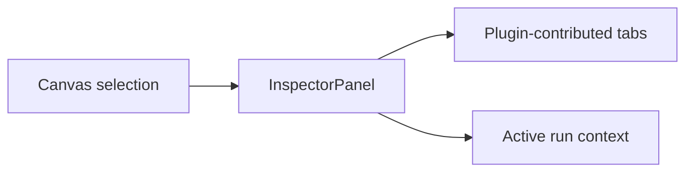

# Inspector

## Purpose

The Inspector is the contextual detail surface of the DVT workbench.

Today it is primarily a selection-driven analysis panel for graph nodes. Over
time it should evolve into a broader entity-detail system, but the current
documentation must reflect the implementation that exists now.

## Current Implementation

Primary code anchors:

- [InspectorPanel.tsx](../../../../../apps/web/src/app/components/InspectorPanel.tsx)
- [PluginRegistryContext.tsx](../../../../../apps/web/src/app/plugins/PluginRegistryContext.tsx)
- [registry.ts](../../../../../apps/web/src/app/plugins/registry.ts)
- [DbtNodeRenderer.tsx](../../../../../apps/web/src/app/plugins/dbt/DbtNodeRenderer.tsx)

Current mounting point:

- right-side panel in [CanvasShell.tsx](../../../../../apps/web/src/app/views/canvas/CanvasShell.tsx)

Current behavior:

- if no node is selected, it shows an explicit empty state;
- if a node is selected, it renders core node details first;
- plugin-registered inspector tabs are then shown for the selected node;
- today the strongest implementation is the dbt inspector contribution set.

## Relationship To The Workbench

Canvas owns selection. Inspector owns contextual rendering. Plugin panels own
specialized detail sections.

## UX Rules

- empty state must be explicit and calm;
- hiding the Inspector must not clear graph selection;
- inspector content should remain readable even for large SQL or metadata
  payloads;
- plugin tabs should extend the Inspector without replacing shell-owned section
  framing.

## Mature Libraries And References

- panel, tabs, and scroll primitives:
  [Radix Primitives](https://www.radix-ui.com/primitives)
- design-system composition:
  [shadcn/ui](https://ui.shadcn.com/)
- future code panes and diff views:
  [Monaco Editor](https://github.com/microsoft/monaco-editor)

## Current Constraints

- the current Inspector is node-centric, not yet a universal entity inspector;
- plugin tabs exist, but extension rules are still implicit in code rather than
  fully documented as contracts;
- editable flows are still weaker than read-heavy detail flows.

## Related Pages

- [Graph Frontend Architecture](../graph/graph-frontend-architecture.md)
- [UX Implementation Guide](../ux-implementation-guide.md)
- [Library And Open-Source Reference Stack](../library-and-open-source-reference-stack.md)
