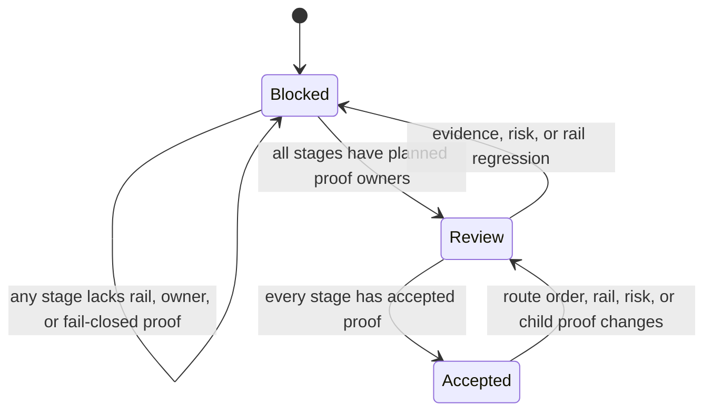
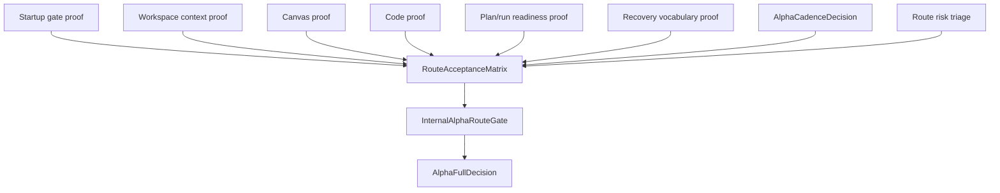

# Internal Alpha Route Gate Component

## Purpose

`InternalAlphaRouteGate` owns the internal alpha product-route decision. It
does not implement child-stage behavior. It decides whether the route can be
called alpha-full by consuming stage proof from startup, workspace context,
Canvas, Code, plan/run readiness, recovery, cadence, and risk triage.

The component prevents the anti-pattern where one closed child slice implies
route-level readiness. Child slices publish evidence; the route gate decides
whether the full route is accepted.

## Public API

| API                                 | Kind         | Owned concern                                                                                              |
| ----------------------------------- | ------------ | ---------------------------------------------------------------------------------------------------------- |
| `InternalAlphaRouteGate`            | route        | Owns alpha route sequencing, gate posture, and alpha-full decision semantics.                              |
| `RouteStageProof`                   | record       | Captures one stage rail, owner, happy proof, fail-closed proof, and risk.                                  |
| `AlphaFullDecision`                 | decision     | Returns `blocked`, `review`, or `accepted` from the full proof set.                                        |
| `AlphaCadenceDecision`              | decision     | Names tester audience, entry date, duration, exit owner, and extension rule.                               |
| `RouteRecoveryVocabulary`           | model        | Maps equivalent failures to source-owned recovery states.                                                  |
| `RouteAcceptanceMatrix`             | review       | Records the current stage acceptance table and alpha exit impact.                                          |
| `InternalAlphaCombinedRouteFixture` | test fixture | Exercises one ordered route proof across startup, context, Canvas, Code, plan/run readiness, and recovery. |

The API is documentary today. Executable child behavior must bind to the
command/query rail catalog before UI, adapter, or route-handler work starts.

## Invariants

- `F-27` is the only route-level alpha authority.
- Child slices cannot declare alpha full.
- Every user-visible stage must name a command/query rail or component owner.
- Every stage must have both happy-path and fail-closed proof before alpha full.
- The combined route fixture must traverse startup, workspace context, Canvas,
  Code, plan/run readiness, and recovery in that order.
- Canvas and Code fixture stages must preserve all owned rails instead of
  collapsing command/query authority into one local flag.
- Recovery and readiness copy must be source-owned, not duplicated free text.
- Risk triage and cadence are product inputs, not after-the-fact closeout notes.
- Local fixture state, localStorage, and mock-only flows are not product truth.

## State Transitions

- `blocked` stays `blocked` when a stage lacks owner, rail, or negative proof.
- `blocked` moves to `review` when all stages have owners and planned proofs.
- `review` returns to `blocked` when stage evidence or risk triage regresses.
- `review` moves to `accepted` only when every stage has accepted evidence.
- `accepted` returns to `review` when route order, rail, risk, or child proof
  changes.

## Consumers

| Consumer                     | Uses the gate for                                      |
| ---------------------------- | ------------------------------------------------------ |
| Product and Architecture     | Alpha entry, exit, cadence, and acceptance decisions.  |
| Lane E planning              | Route-level ownership and child-slice sequencing.      |
| Lane C runtime safety        | Protected runtime, admission, degraded-mode inputs.    |
| Frontend child slices        | Stage-specific UI proof without route-level authority. |
| PR reviewers and CI evidence | Checking that alpha-full is not declared prematurely.  |

## Command/Query Rails

| Rail                                | Type    | Route stage        |
| ----------------------------------- | ------- | ------------------ |
| `ObserveAppBootstrapRouteReadiness` | query   | Startup gate       |
| `ObserveWorkspaceContext`           | query   | Workspace context  |
| `GetWorkspaceGraphDraft`            | query   | Canvas workbench   |
| `SaveWorkspaceGraphDraft`           | command | Canvas workbench   |
| `ListWorkspaceFiles`                | query   | Code workbench     |
| `GetWorkspaceFileContent`           | query   | Code workbench     |
| `ObservePlanRunReadiness`           | query   | Plan/run readiness |
| `MapRouteRecoveryState`             | query   | Recovery states    |

## Cadence Contract

`AlphaCadenceDecision` is valid only when these fields are present and owned:

| Field           | Meaning                                           | Owner                  |
| --------------- | ------------------------------------------------- | ---------------------- |
| `audience`      | internal tester scope allowed for the route stage | Product                |
| `entryDate`     | date when stage enters alpha candidate posture    | Product + Frontend     |
| `duration`      | expected evaluation window before exit/review     | Product                |
| `exitOwner`     | accountable owner for alpha exit decision         | Product / Architecture |
| `extensionRule` | explicit condition that allows extending cadence  | Product / Architecture |

Cadence without `exitOwner` or `extensionRule` is automatically `blocked`.

## Architecture Diagram

## Architecture Guard

The guard lives in
`apps/web/src/app/routes/internalAlphaRouteGate.architecture.test.ts`. It proves
that the component guide, user stories, route plan, and route acceptance matrix
stay aligned around F-27 authority and rail-backed stage proof.

The combined fixture lives in
`apps/web/src/app/routes/internalAlphaRouteGate.test.fixtures.ts`. It is
test-only route proof: it does not create product authority, does not persist
route state, and must stay behind the F-27 gate.
