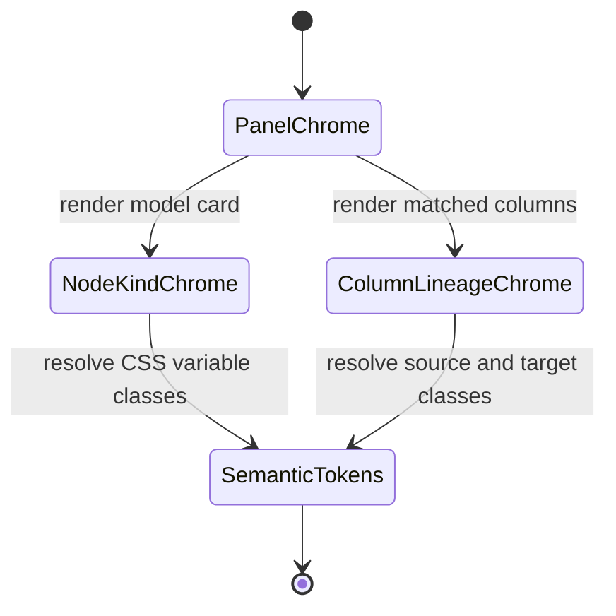

# Lineage Panel Token Component

## Purpose

This component owns Lineage route panel chrome classes. It keeps panel,
node-card, column-lineage, and muted text styling behind one Lineage-local token
API so route panels do not reintroduce `slate-*`, `blue-*`, `green-*`, or other
route-level Tailwind color families.

## Public API

| API                               | Owner         | Purpose                                                 |
| --------------------------------- | ------------- | ------------------------------------------------------- |
| `lineageChromeClasses`            | Lineage route | Stable classes for panel, nested panel, text, and focus |
| `resolveLineageNodeKindClassName` | Lineage route | Maps a node kind to semantic card chrome                |

## Invariants

- Lineage panels consume `lineageChromeClasses` instead of route-local color
  utility strings.
- Node-kind card chrome resolves through `resolveLineageNodeKindClassName`.
- `lineageModel.ts` may describe lineage semantics and labels, but it must not
  own presentation color classes.
- The token component only owns presentation chrome; it does not own graph
  traversal, route data loading, or React Flow projection.

## Transitions

## Consumers

| Consumer               | Usage                                            |
| ---------------------- | ------------------------------------------------ |
| `LineageGraphPanel`    | panel chrome, node-kind card chrome, focus badge |
| `LineageImpactSummary` | panel chrome and muted labels                    |
| `LineageColumnPanel`   | panel chrome, nested rows, source/target columns |
| Architecture guard     | prevents local color-family regression           |

## Drift Signals

- A Lineage panel contains `border-slate-*`, `bg-slate-*`, `text-slate-*`,
  `text-blue-*`, or `text-green-*`.
- `lineageModel.ts` returns visual classes instead of lineage labels or
  topology data.
- A new Lineage panel duplicates panel chrome without adding a token API entry.
