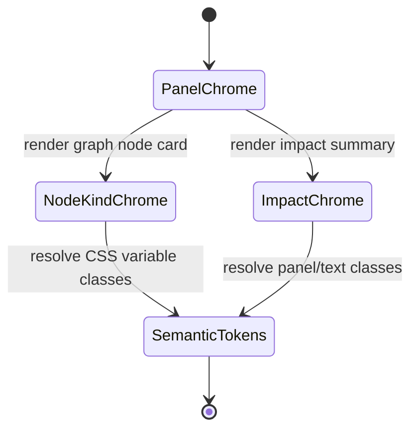

# Lineage Panel Token Component

## Purpose

This component owns chrome classes for the current graph-level Lineage route. It keeps graph panels, impact summaries, node-kind cards, muted text and focus treatment behind one Lineage-local token API so the route does not reintroduce route-level Tailwind color families.

Column-level lineage is **not** owned by this route. Field-lineage presentation belongs to the single Canvas projection and may render only from authoritative stable field references/semantic evidence. The former route-local matched-column panel was retired by #2953.

## Public API

| API                               | Owner         | Purpose                                       |
| --------------------------------- | ------------- | --------------------------------------------- |
| `lineageChromeClasses`            | Lineage route | Stable classes for graph/impact panel chrome  |
| `resolveLineageNodeKindClassName` | Lineage route | Maps a node kind to semantic node-card chrome |

## Invariants

- Lineage route graph/impact panels consume `lineageChromeClasses` instead of route-local color utility strings.
- Node-kind card chrome resolves through `resolveLineageNodeKindClassName`.
- `lineageModel.ts` owns graph traversal/labels only; it does not infer field lineage or own presentation color classes.
- The route does not recreate column lineage from names, types, ordinals or positions.
- Field-lineage identity is owned by the single Canvas semantic projection using stable references; names are presentation only.
- The token component owns presentation chrome only; it does not own graph traversal, route loading, Canvas semantic projection or React Flow field-lineage identity.

## Transitions

## Consumers

| Consumer               | Usage                                            |
| ---------------------- | ------------------------------------------------ |
| `LineageGraphPanel`    | panel chrome, node-kind card chrome, focus badge |
| `LineageImpactSummary` | panel chrome and muted labels                    |
| Architecture guard     | prevents local color-family/topology regression  |

## Explicit Non-owner

`apps/web/src/app/views/canvas/canvasColumnLineageProjection.ts` owns the surviving field-lineage projection used by the single Canvas. It is intentionally outside this route-token component and must not depend on route-local matched-column DTOs.

## Drift Signals

- A current Lineage route panel contains `border-slate-*`, `bg-slate-*`, `text-slate-*`, `text-blue-*`, or `text-green-*`.
- `lineageModel.ts` starts deriving field lineage from graph/column display metadata.
- A route-local column-lineage panel or `{from,to}` matched-column DTO is reintroduced.
- Current documentation names the retired `LineageColumnPanel` as a live consumer.
