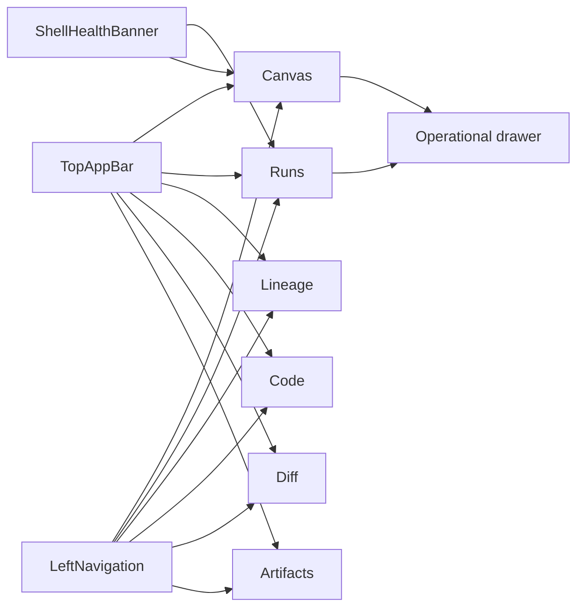
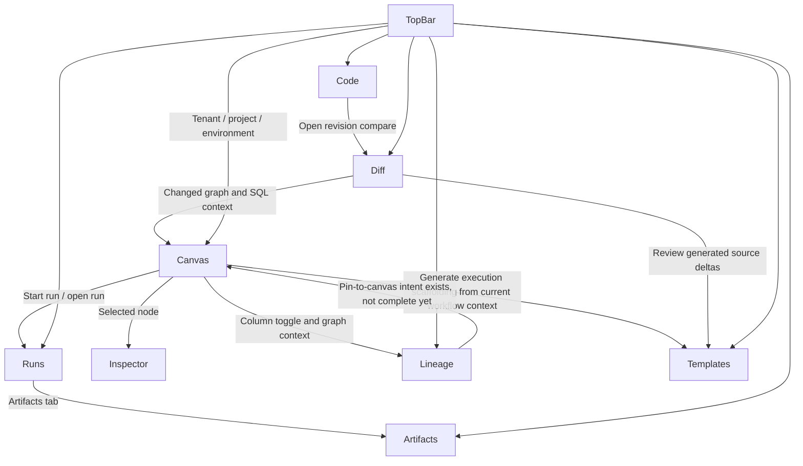

# Main Workspace Views And UX

This peer-route workbench inventory is retired. The active Process Map and
contextual-surface contract is
[Screen Manuals And User Stories](./screen-manuals-and-user-stories.md).

This page documents the real DVT frontend workbench as it exists today in
`apps/web`, plus the next missing route-level slice that should become a
first-class workbench.

It explains the current view inventory, how the views hand off context to each
other, and which UX states users should experience across the shell.

## Shell Composition

The current shell is composed from:

- a persistent top bar that keeps global chrome low-noise on workbench routes;
- a health banner that reports platform-health probe state;
- a `ShellMenu` fallback that exposes global navigation and read-only
  workspace context when the Canvas workbench hides the left rail;
- a `LeftNavigation` implementation that remains available for non-workbench
  global routes;
- a central route outlet where the active product view renders;
- an optional bottom Operational drawer;
- focus mode, explorer visibility, and inspector visibility controls stored in
  the shell app store.

## Main Product Views

### Canvas

Current route: `/canvas`

Current composition:

- route-local `CanvasToolbar` once a canvas document or graph-operable state
  exists
- optional `DbtExplorer` on the left
- `CanvasViewport` in the center
- optional `InspectorPanel` on the right
- `PlanPreviewModal`
- `SourceImportWizard`

Current user jobs:

- inspect workflow topology;
- drag dbt graph entities into the canvas;
- run auto-layout;
- toggle impact and column overlays;
- request plan;
- start a run;
- pivot to run detail when a run exists.

### Runs

Current routes: `/runs`, `/runs/:runId`

Current composition:

- run list state when no `runId` is present;
- `RunWorkspaceState` on detail route;
- snapshot card as primary authority view;
- timeline card with available, empty, or degraded states.

Current user jobs:

- find active or failed runs;
- inspect runtime snapshot truth for one run;
- inspect event timeline evidence when available;
- identify partial or degraded timeline without losing snapshot state.

### Lineage

Current route: `/lineage`

Current composition:

- search field;
- optional column-level lineage toggle;
- breadcrumb path;
- layered lineage cards for the focused node;
- impact summary cards.

### Code

Current route: `/code`

Current composition:

- file tree panel for workspace browsing;
- read-only Monaco source preview for the selected file;
- route-level loading and error states around file tree and file content.

Current user jobs:

- browse the workspace without leaving the main shell;
- inspect one file read-only;
- keep file context ready for future file-history review and revision handoff.

Target Git posture:

- `Code` owns selected-file context and recent history entry for that file;
- revision comparison hands off to `Diff`;
- `Code` does not become a full Git explorer or repository console.

### Diff

Current route: `/diff`

Current composition:

- compare mode selector;
- severity filters;
- summary cards;
- tabs for `Graph Diff`, `SQL Diff`, and `Catalog Diff`.

Target Monaco posture:

- Monaco `DiffEditor` for SQL review;
- Monaco-backed structured viewers for large text deltas;
- route ownership remains with `Diff`, not with Monaco.

### Artifacts

Current route: `/artifacts`

Current composition:

- local manifest import drop zone;
- artifact list cards;
- preview tabs for `manifest.json`, `run_results.json`, and `catalog.json`.

Target Monaco posture:

- Monaco read-only viewers for large JSON payloads;
- search and structured inspection without introducing editing semantics;
- route ownership remains with `Artifacts`, not with Monaco.

## Next Governed Workbench Slice

### Execution Templates And Source Generation

Current route: not wired yet

Planned composition:

- template catalog and provider-profile selector;
- schema-driven parameter form;
- Monaco-backed generated-source preview for task DDL, procedure bodies, and
  ETL scaffolds;
- diff or review pane before export or apply;
- explicit export, copy, or dispatch actions.

Current user jobs:

- choose an execution-template profile from workflow context;
- generate governed source for provider-facing execution artifacts;
- preview and review generated output before using it;
- move from workflow design to executable scaffolding without manual
  copy-paste.

## Monaco-Enabled Review Surfaces

Monaco belongs to review and generation routes, not to the shell itself.

Positioning rules:

- Canvas stays graph-first and non-Monaco-centric;
- Runs stays execution-first and non-Monaco-centric;
- `Diff` is the first Monaco route for SQL and structured-text comparison;
- `Artifacts` is the second Monaco route for read-only payload inspection;
- `Templates` is the long-term Monaco route for generated-source preview and
  before/after diff.

## View Relationships

## UX Baseline

### Shell UX

- the top bar is always visible;
- the health banner is visible when health is being checked, degraded, or
  offline;
- Canvas workbench must not render a fixed left navigation rail;
- route and command discovery should converge on the shell menu, command
  palette, and route-local workbench view strip;
- the bottom console is optional and should never hide the current route state.

### Canvas UX

- explorer and inspector can be hidden or restored from contextual reveal
  controls;
- graph operations live in the route-local toolbar, not in the global top bar;
- first-canvas selection does not show disabled Plan, Run, Export, or Import
  controls before a canvas document exists;
- planning and run actions belong to Canvas because they are graph-contextual;
- Add/create behavior is command-driven and unpinned by default;
- context labels remain reference indicators, not active workbench dropdowns;
- graph overlays must remain visual layers over canonical structure, not mutate
  graph truth.

### Runs UX

- `/runs` is the operational list entry point;
- `/runs/:runId` is the focused execution workspace;
- `POST /runs/start` is the start authority and `GET /runs/:runId` is the
  run-snapshot authority;
- timeline is supplemental and comes from `GET /runs/:runId/events`;
- the route does not fabricate step/artifact detail from snapshot-only payloads;
- empty state must send the operator back to Canvas to create meaningful work.

### Common States

| State     | Expected treatment                                                              |
| --------- | ------------------------------------------------------------------------------- |
| Loading   | keep shell frame visible and show local view loading                            |
| Empty     | explain why the view is empty and provide the next route or action              |
| Error     | keep context visible and show a retry path if meaningful                        |
| Degraded  | display staleness or source-quality signals instead of pretending data is fresh |
| Read-only | make it obvious that analysis is allowed but mutation is not                    |

## Current Constraints

- The shell already behaves like a workbench, and state ownership now starts
  from named slices. Route-level data contracts still need the same discipline.
- Canvas is the most mature workbench route. Code, Lineage, Diff, and Artifacts
  still need stronger data contracts and more consistent UX hardening.
- `Code` currently supports read-only browsing, but it still lacks governed
  per-file history review and handoff into `Diff`.
- There is a hidden `CostView` implementation in the codebase, but it is not an
  active shell route today. Observability is currently expressed through the
  shell health banner and the Runs detail surface instead.
- There is still no route-level workbench for execution-template creation and
  governed source generation, even though ETL and provider-oriented execution
  scaffolding are part of the intended product direction.

## Related Pages

- [UX Implementation Guide](./ux-implementation-guide.md)
- [Workbench UI Contract And Component Inventory](./workbench-ui-contract-and-component-inventory.md)
- [Frontend Runtime Contract Technical Manual](./runs/frontend-runtime-contract-technical-manual.md)
- [Frontend Runtime Contract User Manual](./runs/frontend-runtime-contract-user-manual.md)
- [Library And Open-Source Reference Stack](./library-and-open-source-reference-stack.md)
- [App Shell](./appshell/app-shell.md)
