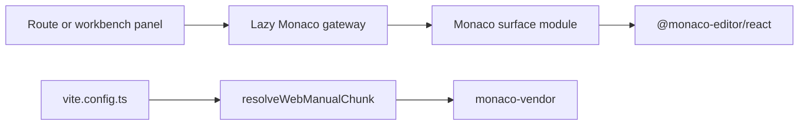

# Monaco Bundle Isolation Component

## Owned Concern

The Monaco bundle isolation component owns how the web build separates Monaco
vendor code from the normal route bundle. It does not own editor behavior,
route composition, Canvas layout, artifact semantics, diff semantics, or
template generation.

## Public API

| API                       | Path                                                                     | Role                           |
| ------------------------- | ------------------------------------------------------------------------ | ------------------------------ |
| `resolveWebManualChunk()` | `apps/web/vite.manualChunks.ts`                                          | Pure Vite chunk-name resolver. |
| `vite.config.ts`          | `apps/web/vite.config.ts`                                                | Build configuration consumer.  |
| Monaco lazy gateways      | `apps/web/src/app/components/monaco/*Viewer.tsx`, `MonacoCodeEditor.tsx` | Route-safe lazy entry points.  |

## Invariants

- Monaco vendor dependencies resolve to the `monaco-vendor` manual chunk.
- Terminal vendor dependencies continue to resolve to `terminal-vendor`.
- The resolver returns `undefined` for non-owned dependencies so Rollup can keep
  its default chunking behavior.
- Route modules consume lazy gateways, not `@monaco-editor/react`.
- `@monaco-editor/react` imports are limited to `MonacoCodeSurface` and
  `MonacoDiffSurface`.
- Canvas production modules must not import Monaco gateways or
  `@monaco-editor/react`.

## Flow

## Transitions

| Change                         | Required update                                               |
| ------------------------------ | ------------------------------------------------------------- |
| Add another Monaco surface     | Keep third-party import inside the surface module.            |
| Add another Monaco route panel | Use an existing lazy gateway or create a route-local adapter. |
| Change Vite chunk naming       | Update `resolveWebManualChunk()` tests and this guide.        |
| Add another heavy vendor       | Add a named resolver branch with an architecture test.        |

## Consumers

| Consumer     | Consumption posture                                            |
| ------------ | -------------------------------------------------------------- |
| Code         | Editable local buffer through `MonacoCodeEditor`.              |
| Diff         | Read-only comparison through `MonacoDiffViewer`.               |
| Artifacts    | Read-only payload inspection through `MonacoCodeViewer`.       |
| Templates    | Read-only generated-source preview through `MonacoCodeViewer`. |
| Vite build   | Calls `resolveWebManualChunk()` inside `manualChunks`.         |
| Test routing | Monaco focus suite owns the isolation guard.                   |

## Non-Goals

- No bundle-size budget in this slice.
- No persistence command.
- No provider contract changes.
- No Canvas Monaco hosting.
