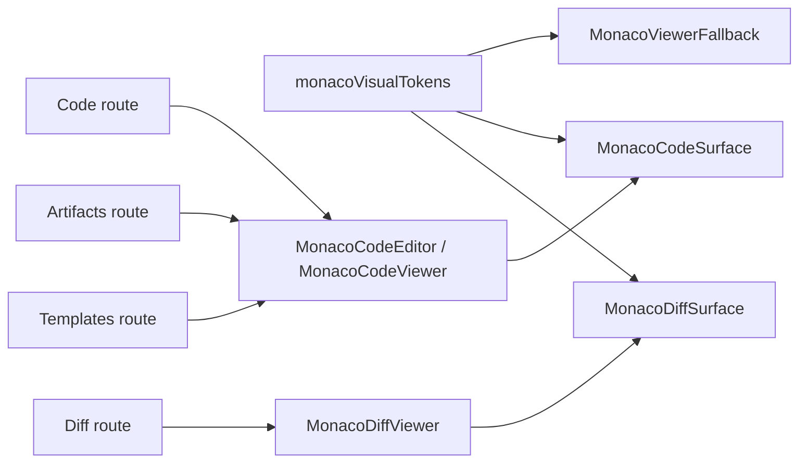

# Monaco Visual Token Component

## Owned Concern

The Monaco visual token component owns the shared presentation contract for
embedded Monaco code and diff surfaces. It does not own route composition,
editor persistence, Code route editing semantics, Diff review semantics,
Artifacts payload semantics, or Templates source-generation semantics.

## Public API

| API                         | Path                                                       | Role                                             |
| --------------------------- | ---------------------------------------------------------- | ------------------------------------------------ |
| `monacoVisualClasses`       | `apps/web/src/app/components/monaco/monacoVisualTokens.ts` | Shared surface and loading-shell class tokens.   |
| `monacoTheme`               | `apps/web/src/app/components/monaco/monacoVisualTokens.ts` | Single Monaco theme value for embedded surfaces. |
| `createMonacoCodeOptions()` | `apps/web/src/app/components/monaco/monacoVisualTokens.ts` | Code editor or viewer option preset.             |
| `createMonacoDiffOptions()` | `apps/web/src/app/components/monaco/monacoVisualTokens.ts` | Read-only diff option preset.                    |
| Monaco lazy gateways        | `apps/web/src/app/components/monaco/*Viewer.tsx`, `*.tsx`  | Consumer-facing route-safe Monaco entry points.  |
| Monaco surface modules      | `MonacoCodeSurface.tsx`, `MonacoDiffSurface.tsx`           | Only modules that bind `@monaco-editor/react`.   |

## Invariants

- Monaco container chrome is not owned by `RouteWorkbenchFrame`.
- Embedded Monaco surfaces use `monacoTheme`; they do not hardcode theme
  literals locally.
- Code and diff Monaco option presets are created by this component.
- Route consumers may pass a route-specific `containerClassName`, but the
  default container class stays in `monacoVisualClasses.surface`.
- `MonacoViewerFallback` uses the same container and muted text tokens as the
  loaded surface.
- Canvas production modules do not become Monaco hosts.

## Transitions

| Transition                   | Rule                                                                   |
| ---------------------------- | ---------------------------------------------------------------------- |
| Add a read-only code pane    | Use `MonacoCodeViewer` and the default visual token preset.            |
| Add an editable local buffer | Use `MonacoCodeEditor`; persistence remains route-owned.               |
| Add a diff pane              | Use `MonacoDiffViewer`; keep `createMonacoDiffOptions()` read-only.    |
| Change Monaco theme          | Change `monacoTheme` and run the architecture guard.                   |
| Change surface chrome        | Change `monacoVisualClasses.surface`; do not re-export from the frame. |

## Consumers

| Consumer  | Consumption posture                                                |
| --------- | ------------------------------------------------------------------ |
| Code      | Editable local buffer and read-only viewer through code gateway.   |
| Diff      | Read-only SQL and structured-text comparison through diff gateway. |
| Artifacts | Read-only payload inspection through code viewer gateway.          |
| Templates | Read-only generated-source preview through code viewer gateway.    |

## Architecture

## Guards

- `apps/web/src/app/components/monaco/monacoVisualTokens.architecture.test.ts`
  verifies that Monaco container classes, theme, and option presets stay behind
  the Monaco visual token component.
- Route-specific Monaco architecture tests continue to verify Code, Diff,
  Artifacts, and Templates ownership semantics.
