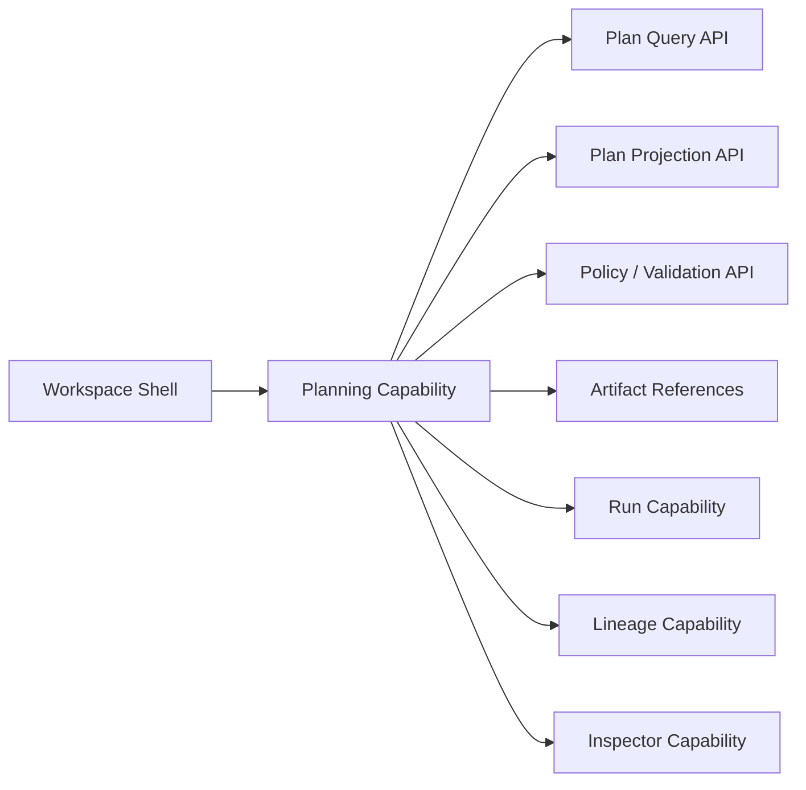
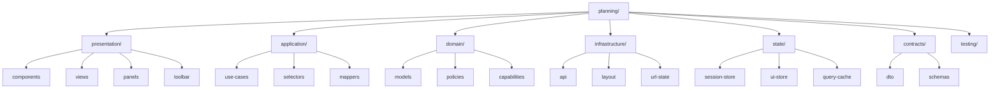
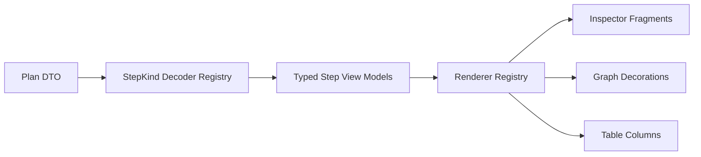
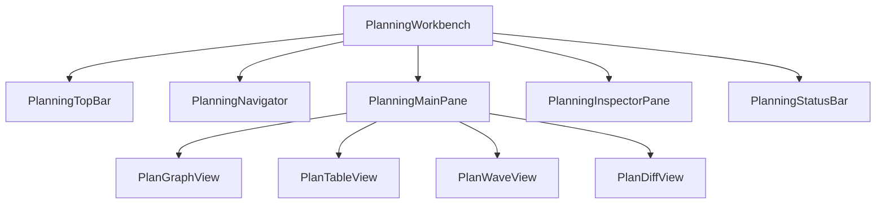
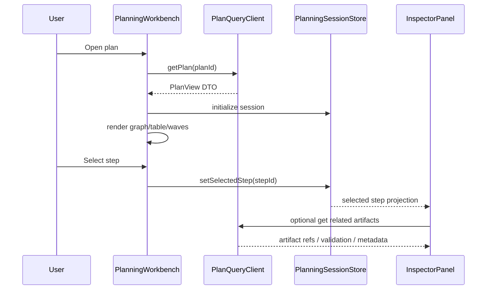
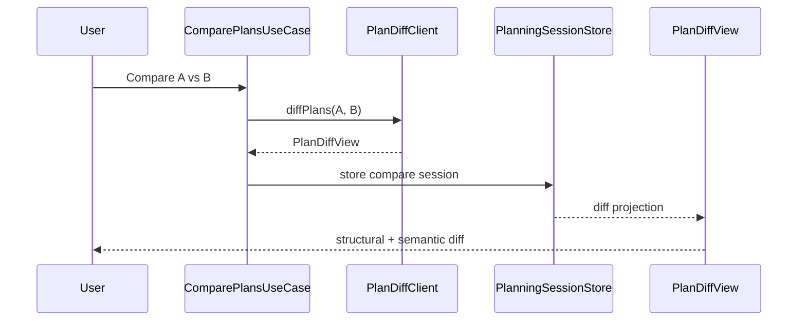
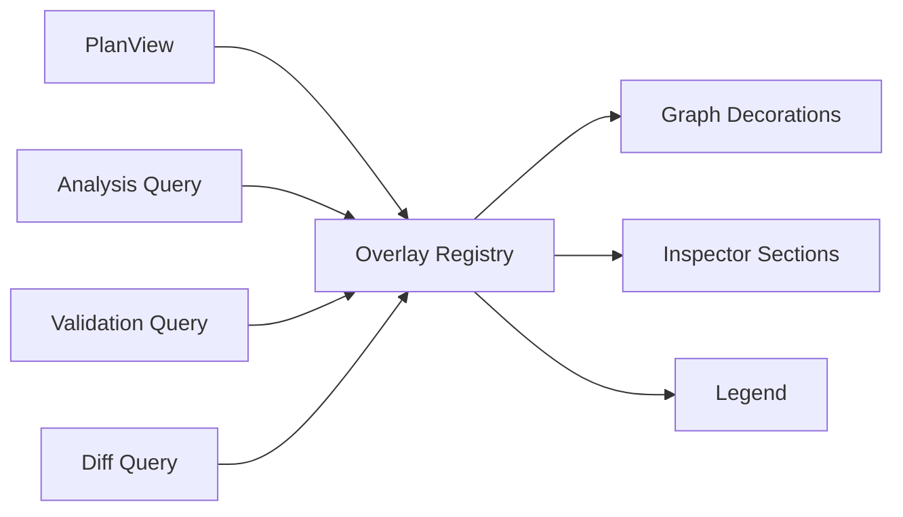
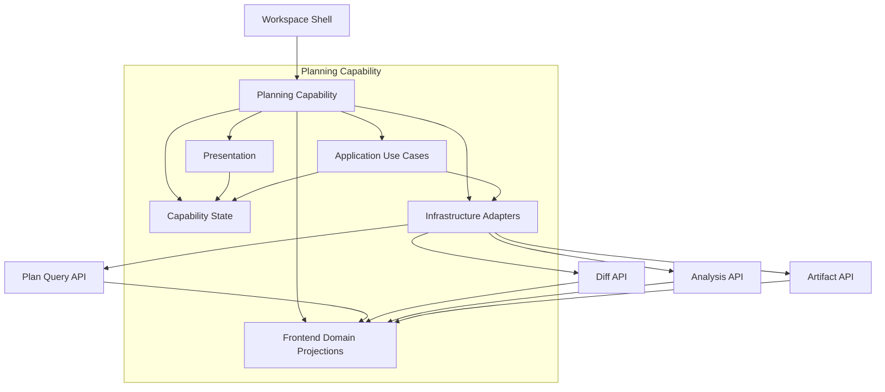

# Frontend Architecture — Planning Capability

## 1. Purpose

This document defines the **frontend architecture** for **Planning** as a **product capability** inside DVT+.  
The objective is not only to draw a graph or render a list of steps, but to provide a deterministic, inspectable, and auditable interface for how a workflow **will execute before execution starts**.

Planning in the frontend must answer five product questions:

1. **What is going to run**
2. **Why it will run in that order**
3. **What can run in parallel**
4. **What policy or constraints shaped the plan**
5. **What changed between one plan and another**

This capability is therefore not a visual convenience layer. It is a first-class product surface over the **ExecutionPlan** and its derived views.

---

## 2. Capability scope

## In scope

- Plan loading and visualization
- Step graph rendering
- Stage / batch / wave visualization
- Critical path and parallelism visualization
- Dependency inspection
- Policy and constraint inspection
- Plan diff
- Plan validation feedback
- Cost / impact / risk overlays
- Navigation from plan to lineage, code, run, artifacts
- Plan export and shareable references

## Out of scope

- Direct execution orchestration
- Runtime state ownership
- Persistence of canonical plan state in the frontend
- Planner decision logic
- Engine-level retry semantics
- Backend plan compilation

---

## 3. Product position of Planning

Planning sits between:

- **Design-time authoring** of workflow intent
- **Execution-time orchestration** of workflow runs

It is the capability that turns an internal compiled execution structure into a usable operator and developer surface.

A correct frontend architecture must therefore preserve this rule:

> **Frontend Planning explains and explores a plan. It does not decide or mutate the canonical plan semantics.**

The UI may request projections, filters, overlays, local layouts, comparisons, and annotations.  
It must not become an alternative planner.

---

## 4. Architectural drivers

The Planning capability must satisfy the following drivers:

| Driver                 | Why it matters                                                                       |
| ---------------------- | ------------------------------------------------------------------------------------ |
| Determinism            | Same plan must render consistently and remain traceable                              |
| Auditability           | Users must inspect why a plan exists and how it differs from another                 |
| Large graph handling   | Plans may be large and require progressive rendering                                 |
| Read-model orientation | Frontend should consume plan projections, not raw engine internals wherever possible |
| Strict contracts       | Avoid opaque frontend state drift caused by loosely typed step payloads              |
| Extensibility          | New step kinds and overlays must be pluggable                                        |
| Separation of concerns | Layout, selection, filtering, and plan semantics must remain separate                |
| Diffability            | Comparing plans is part of the product, not an afterthought                          |

---

## 5. Capability decomposition

Planning as a product capability should be split into the following sub-capabilities:

1. **Plan Explorer**  
   Base navigation across a plan graph, list, and structural metadata.

2. **Plan Inspector**  
   Detailed inspection of a selected node, edge, wave, policy, or decision trace.

3. **Plan Analysis**  
   Derived insights such as critical path, fan-in/fan-out, parallel waves, risk, impact, and bottlenecks.

4. **Plan Diff**  
   Structural and semantic comparison between two plans.

5. **Plan Validation Surface**  
   Warnings, unsupported step kinds, contract violations, policy conflicts, and unresolved dependencies.

6. **Plan Navigation Bridges**  
   Deep links to lineage, source code, artifacts, run history, and observability.

---

## 6. Bounded context view

Planning in the frontend should be implemented as its own bounded capability with clear edges.



### Boundary rule

Planning owns:

- local view state
- structural projections of a plan
- user navigation within the plan surface
- visual overlays
- selection model
- comparison sessions

Planning does **not** own:

- execution state truth
- planner compilation logic
- provider execution details
- canonical persistence

---

## 7. Capability responsibilities by layer

## 7.1 Presentation layer

Responsible for:

- graph canvas
- list/table views
- inspector panels
- diff panels
- badges, warnings, overlays
- keyboard navigation
- search, filter, grouping
- layout switching

Typical components:

- `PlanningWorkbench`
- `PlanGraphView`
- `PlanTimelineView`
- `PlanTableView`
- `PlanInspectorPanel`
- `PlanDiffPanel`
- `PlanOverlayToolbar`
- `PlanMiniMap`
- `PlanBreadcrumbs`

## 7.2 Application layer

Responsible for orchestration of UI use cases:

- load plan
- hydrate projections
- select node
- highlight dependencies
- compute local overlays from backend data
- open inspector
- diff two plans
- sync URL state
- request validation and analysis views

Typical services:

- `LoadPlanUseCase`
- `OpenPlanInspectorUseCase`
- `ComparePlansUseCase`
- `FocusSubgraphUseCase`
- `ApplyPlanOverlayUseCase`
- `ExportPlanViewUseCase`

## 7.3 Domain-facing frontend layer

This layer should define strict frontend-side domain models for plan visualization and inspection.

Example models:

- `PlanView`
- `PlanStepView`
- `PlanEdgeView`
- `PlanWaveView`
- `PlanOverlay`
- `PlanDiffView`
- `PlanValidationIssueView`

This is not the backend domain model.  
It is the **frontend projection model** with explicit semantics and no transport leakage.

## 7.4 Infrastructure layer

Responsible for:

- API adapters
- query caching
- websocket / polling integration if needed
- URL serialization
- graph layout adapters
- feature flag access
- artifact link resolution

Typical adapters:

- `HttpPlanQueryAdapter`
- `HttpPlanDiffAdapter`
- `ArtifactLinkResolver`
- `GraphLayoutAdapter`
- `PlanUrlStateAdapter`

---

## 8. Recommended module structure



Suggested repo shape:

```text
apps/web/src/capabilities/planning/
  application/
  contracts/
  domain/
  infrastructure/
  presentation/
  state/
  testing/
```

---

## 9. Frontend state model

Planning requires multiple state categories. Mixing them into one store will rot quickly.

## 9.1 State categories

| State type                  | Owner                    | Notes                                                             |
| --------------------------- | ------------------------ | ----------------------------------------------------------------- |
| Server state                | Query layer              | Plan payloads, projections, diff results, validation results      |
| Session state               | Capability session store | Current plan session, compared plans, active view mode            |
| UI state                    | Local/store              | panel open state, zoom, selected overlays, expanded sections      |
| Derived state               | Selectors                | critical path highlighting, dependency chains, filtered subgraphs |
| URL state                   | URL adapter              | selected node, view mode, compare target, overlay                 |
| Ephemeral interaction state | Component-local          | drag state, hover state, temporary selections                     |

## 9.2 Store split

Recommended split:

- **TanStack Query** for server state
- **Zustand** for Planning session and UI state
- pure selectors for derived projections
- URL adapter for durable navigation state

Do not place fetched server payloads as canonical data inside a generic global UI store.

---

## 10. Core frontend models

Example frontend projection types:

```ts
type PlanId = string;
type StepId = string;
type EdgeId = string;

interface PlanView {
  planId: PlanId;
  planVersion: string;
  workflowId: string;
  title: string;
  summary: PlanSummaryView;
  steps: readonly PlanStepView[];
  edges: readonly PlanEdgeView[];
  waves: readonly PlanWaveView[];
  validations: readonly PlanValidationIssueView[];
  overlaysAvailable: readonly PlanOverlayKind[];
}

interface PlanStepView {
  stepId: StepId;
  stepKind: string;
  label: string;
  status: 'ready' | 'warning' | 'invalid' | 'unsupported';
  waveIndex: number | null;
  estimatedCost?: number;
  estimatedDurationMs?: number;
  criticalPath?: boolean;
  metadata: Readonly<Record<string, unknown>>;
}

interface PlanEdgeView {
  edgeId: EdgeId;
  fromStepId: StepId;
  toStepId: StepId;
  dependencyType: 'hard' | 'soft' | 'conditional';
}

interface PlanWaveView {
  waveIndex: number;
  stepIds: readonly StepId[];
  maxParallelism: number;
}

interface PlanValidationIssueView {
  code: string;
  level: 'info' | 'warning' | 'error';
  message: string;
  relatedStepIds: readonly StepId[];
}
```

### Architectural warning

`metadata: Record<string, unknown>` is acceptable only as a last transport envelope at the boundary.  
It must not become the primary rendering contract. Step-specific renderers should consume typed decoded payloads per step kind.

---

## 11. Step-kind strategy on the frontend

Planning will fail structurally if all step kinds are rendered through generic opaque logic.

Recommended pattern:



## 11.1 Required contracts

For each supported `stepKind`, define:

- schema decoder
- label builder
- icon mapping
- inspector fragment
- overlay contributions
- diff strategy
- fallback behavior

## 11.2 Suggested interfaces

```ts
interface StepKindFrontendPlugin<TDecoded> {
  readonly stepKind: string;
  decode(input: unknown): TDecoded;
  getLabel(data: TDecoded): string;
  getBadges(data: TDecoded): readonly string[];
  renderInspector(data: TDecoded): unknown;
  diff?(left: TDecoded, right: TDecoded): PlanStepDiffView;
}
```

This prevents renderer drift and gives Planning a real extension surface.

---

## 12. View architecture

Planning should support multiple synchronized views over the same plan session.

## Required views

1. **Graph view**  
   Main dependency graph.

2. **Wave / stage view**  
   Groups steps by execution wave or stage.

3. **Table view**  
   Dense operator view for sort/filter/export.

4. **Diff view**  
   Compare plan A vs plan B.

5. **Inspector view**  
   Detailed right-panel or bottom-panel inspection.

## Synchronization rule

Selection must be shared across all views through a capability session model:

- selecting a node in graph highlights the row in table
- selecting a wave highlights all wave steps in graph
- selecting a validation issue focuses the related subgraph

---

## 13. UI composition



### Suggested shell composition

- top bar: plan identity, compare mode, export, overlays
- left navigator: filters, step kinds, validations, saved views
- main pane: graph / table / wave / diff
- right inspector: selected step / edge / wave / policy / issue
- bottom status bar: counts, hidden items, layout mode, last refresh

---

## 14. Query architecture

Planning should not request one oversized endpoint and then improvise every other view locally.

Recommended backend query families:

| Query                                | Purpose                                       |
| ------------------------------------ | --------------------------------------------- |
| `getPlan(planId)`                    | canonical plan projection for display         |
| `getPlanSummary(planId)`             | quick header statistics                       |
| `getPlanAnalysis(planId)`            | critical path, waves, fan-in/out, bottlenecks |
| `getPlanValidation(planId)`          | issues and policy conflicts                   |
| `diffPlans(leftPlanId, rightPlanId)` | structured plan diff                          |
| `getPlanArtifacts(planId)`           | code, manifest, docs, generated assets        |
| `getPlanRelatedRuns(planId)`         | plan-to-run navigation                        |

This keeps the frontend focused on composition and avoids excessive client recomputation.

---

## 15. Interaction flows

## 15.1 Load and inspect plan



## 15.2 Compare two plans



---

## 16. Diff as a first-class capability

Plan diff must not be reduced to a raw JSON diff.

The frontend should classify changes by meaning:

- added step
- removed step
- reordered dependency
- changed wave placement
- changed estimated cost
- changed policy outcome
- changed step configuration
- changed unsupported/invalid status

### Diff dimensions

| Dimension  | Example                                   |
| ---------- | ----------------------------------------- |
| Structural | node/edge added or removed                |
| Scheduling | wave or topological order changed         |
| Semantic   | configuration or compiled meaning changed |
| Policy     | allowed/blocked/modified by policy        |
| Risk       | cost, blast radius, critical path changed |

---

## 17. Overlay system

Planning becomes much more useful when overlays are formalized.

Examples:

- critical path
- high fan-out
- high estimated cost
- high duration
- unsupported step kinds
- validation errors
- changed since previous plan
- policy-modified steps
- lineage-impact hotspots

Recommended architecture:



Each overlay should define:

- eligibility
- data source
- legend
- graph decoration
- inspector explanation
- accessibility text

---

## 18. Performance architecture

Large plans will stress the frontend quickly.

## Required controls

- viewport-based rendering
- collapsed group nodes
- lazy inspector loading
- memoized selectors
- background layout computation
- subgraph focus mode
- progressive hydration of heavy analyses
- diff chunking for very large plans

## Non-negotiable constraints

- no full graph re-layout on every selection
- no global rerender of all nodes on minor panel changes
- no unbounded recomputation in component trees
- no parsing of step-kind payloads inside render loops

---

## 19. Layout strategy

Graph layout is infrastructure, not domain.

Supported layout modes should be treated as pluggable adapters:

- DAG hierarchical
- left-to-right execution
- wave/stage layout
- compact dependency layout
- diff layout

Suggested interface:

```ts
interface PlanningLayoutAdapter {
  layout(input: PlanGraphLayoutInput): Promise<PlanGraphLayoutOutput>;
}
```

The selected layout mode belongs to Planning session state, not canonical plan state.

---

## 20. URL and deep-linking strategy

Planning is a navigable analytical surface.  
It needs stable deep links.

Suggested URL state:

```text
/plans/:planId
/plans/:planId?view=graph
/plans/:planId?view=table&step=step_42
/plans/:planId?overlay=critical-path
/plans/compare/:leftPlanId/:rightPlanId
```

Recommended URL-owned state:

- current plan
- active view
- selected step
- compare target
- active overlay
- focus mode
- filter preset identifier

Do not store transient zoom or panel pixel widths in the URL unless explicitly needed.

---

## 21. Error and fallback model

Planning must degrade predictably.

## Error classes

| Error class               | UI behavior                                     |
| ------------------------- | ----------------------------------------------- |
| Plan not found            | dedicated empty/error state                     |
| Unsupported plan version  | version warning + safe fallback                 |
| Unsupported step kind     | partial render with explicit unsupported badge  |
| Analysis unavailable      | keep base plan view available                   |
| Validation unavailable    | keep plan view, show validation status degraded |
| Artifact link unavailable | disable action, keep inspector usable           |

### Key rule

Partial rendering is acceptable. Silent omission is not.

---

## 22. Security and permissions

Planning is read-heavy but still sensitive.

Frontend must assume permission-driven filtering can apply to:

- artifacts
- generated SQL
- step metadata
- environment-specific properties
- run links
- policy explanations

The UI must handle partially redacted plans without breaking structural navigation.

---

## 23. Recommended testing strategy

## Unit tests

- selectors
- view-model mappers
- step-kind decoders
- diff classifiers
- overlay builders

## Component tests

- graph selection sync
- inspector rendering
- error states
- diff panel scenarios
- accessibility states

## Integration tests

- load plan → inspect step → open artifact
- compare two plans
- unsupported step kind degradation
- redacted artifact permissions
- very large plan rendering

## Contract tests

Mandatory between frontend decoders and backend DTO schemas.

This is critical. Otherwise Planning will drift silently.

---

## 24. Anti-patterns to avoid

1. **Treating Planning as only a graph widget**  
   That reduces the capability to visualization and loses the analytical product value.

2. **Using raw backend DTOs directly in components**  
   This couples UI to transport and increases drift risk.

3. **Letting every component interpret `stepKind` ad hoc**  
   This produces inconsistent labels, badges, and diffs.

4. **Mixing session state and fetched state in one giant store**  
   This creates invalidation bugs and stale rendering.

5. **Recomputing analysis purely in the client for large plans**  
   This shifts planner/analysis responsibilities into the browser.

6. **No formal diff model**  
   Without semantic diff, plan comparison becomes noise.

7. **Hiding unsupported states**  
   Missing visibility breaks trust and auditability.

---

## 25. Recommended initial slice plan

## Slice P1 — Base Planning Session

Deliver:

- load plan
- graph view
- table view
- selection model
- right inspector
- URL deep links
- typed step-kind registry with fallback

## Slice P2 — Analysis overlays

Deliver:

- critical path
- waves
- validation issues
- unsupported step-kind overlay
- filter/search

## Slice P3 — Plan diff

Deliver:

- compare mode
- structural + semantic diff
- change summary
- diff inspector

## Slice P4 — Cross-capability bridges

Deliver:

- open related artifacts
- link to lineage
- link to runs
- environment-aware plan references

## Slice P5 — Scale hardening

Deliver:

- virtualization
- background layouts
- subgraph focus mode
- large-plan benchmarks

---

## 26. Suggested frontend public API

At capability level, expose a narrow API to the rest of the frontend:

```ts
interface PlanningCapabilityApi {
  openPlan(planId: string): void;
  comparePlans(leftPlanId: string, rightPlanId: string): void;
  focusStep(stepId: string): void;
  applyOverlay(overlay: PlanOverlayKind): void;
}
```

Avoid leaking internal stores or transport DTOs outside the capability boundary.

---

## 27. Reference architecture summary



---

## 28. Concrete recommendation

For DVT+, Planning should be implemented as a **dedicated frontend capability module** with:

- its own domain projection models
- strict step-kind registry
- query-driven read models
- separated server/session/UI state
- semantic diff support
- overlay architecture
- deep-linkable inspector workflows

That is the stable path.

A weaker design based on “one graph component plus some panels” will work only for demos and small plans.  
It will not survive scale, extensibility, audit demands, or multi-capability integration.

---

## 29. Internal reference points

These are the architectural references this frontend capability should align with:

- `ExecutionPlanV2`
- planner determinism and plan identity rules
- read-model/CQRS separation
- capability split already discussed for:
  - workspace
  - app shell
  - graph
  - lineage
  - inspector
  - runs
  - artifacts
  - observability
  - git

Suggested related internal docs:

- `docs/architecture/components/web/appshell/app-shell.md`
- `docs/architecture/components/web/workspace/workspace-domain-specification.md`
- `docs/architecture/components/web/graph/graph-frontend-architecture.md`
- `docs/architecture/components/web/inspector/inspector-frontend-architecture.md`
- `docs/architecture/components/web/runs/dvt-runs-frontend-architecture.md`
- `docs/architecture/components/web/artifacts/front-artifacts.md`
- `docs/architecture/components/web/lineage/dvt-frontend-lineage.md`
- `docs/architecture/components/web/observability/front-observability-architecture-dvt.md`
- `docs/architecture/components/web/git/git-mode-architecture.md`

---

## 30. Next recommended document

The next useful artifact after this one is:

**`planning-session.md`**  
with the detailed state model, store contracts, URL contract, selectors, and event flows.
