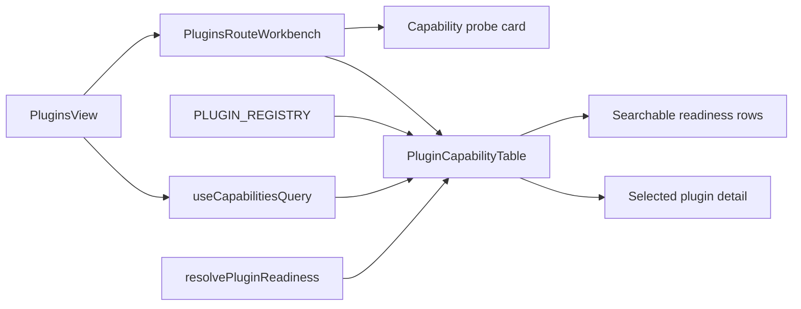

# Plugin Capability Table Component

## Owned Concern

The plugin capability table owns the dense Plugins route catalog surface:
search, backend-readiness filtering, row selection, and selected-plugin detail.
It does not own plugin registration, backend capability fetching, shell
navigation, Canvas plugin docking, or plugin execution authority.

## Public API

| API                          | Path                                                       | Role                                                |
| ---------------------------- | ---------------------------------------------------------- | --------------------------------------------------- |
| `PluginCapabilityTable`      | `apps/web/src/app/views/plugins/PluginCapabilityTable.tsx` | Dense catalog and detail component.                 |
| `PluginCapabilitiesSnapshot` | `apps/web/src/app/views/plugins/pluginsViewModel.ts`       | Capability DTO slice consumed by the presentation.  |
| `resolvePluginReadiness()`   | `apps/web/src/app/views/plugins/pluginsViewModel.ts`       | Readiness projection used by table rows and detail. |
| `pluginsViewCopy`            | `apps/web/src/app/views/plugins/pluginsViewModel.ts`       | Stable Plugins route copy keys.                     |

## Invariants

- `PluginsView` owns data fetching and route-frame composition only.
- `PluginsRouteWorkbench` composes route slots and delegates dense catalog UX to
  `PluginCapabilityTable`.
- `PluginCapabilityTable` does not call `useCapabilitiesQuery`.
- Search and backend-state filtering operate on the same readiness projection
  shown in the selected detail.
- Backend blocked, degraded, pending, available, and not-required states remain
  explicit.
- The component uses route workbench tokens and does not introduce plugin-local
  shell chrome.

## Transitions

| Transition                         | Required action                                                        |
| ---------------------------------- | ---------------------------------------------------------------------- |
| Add a plugin readiness state       | Update `resolvePluginReadiness()`, table filter mapping, and tests.    |
| Add a new plugin catalog column    | Add it to `PluginCapabilityTable`; keep route query ownership outside. |
| Add a new plugin contribution dock | Update the plugin UX contract before adding table presentation.        |
| Change backend capability shape    | Update `PluginCapabilitiesSnapshot` and readiness tests first.         |

## Consumers

| Consumer                | Consumption posture                                      |
| ----------------------- | -------------------------------------------------------- |
| `PluginsRouteWorkbench` | Embeds the table as the primary registry surface.        |
| `PluginsView`           | Supplies capability query state through the workbench.   |
| Frontend maintainers    | Use the table to inspect declared and runtime readiness. |
| Plugin authors          | Use the table to understand contribution visibility.     |

## Architecture

## Guards

- `PluginsView.test.tsx` verifies search, backend filtering, blocked reasons,
  and route frame adoption.
- `pluginsCapabilityTable.architecture.test.ts` verifies component ownership,
  documentation closure, and query separation.
