# Plugin Capability Table Component

## Owned Concern

The plugin capability table owns the dense Plugins route catalog surface:
search, explicit frontend/backend filtering, row selection, and selected-plugin
detail. DB catalog rows control product membership. A local contribution can
enrich an exact catalog match, but it cannot create a catalog row.

The table does not own plugin registration, catalog reconciliation, backend
capability fetching, shell navigation, Canvas plugin docking, or plugin
execution authority.

## Public API

| API                          | Path                                                            | Role                                                |
| ---------------------------- | --------------------------------------------------------------- | --------------------------------------------------- |
| `PluginCapabilityTable`      | `apps/web/src/app/views/plugins/PluginCapabilityTable.tsx`      | Dense catalog and detail component.                 |
| `reconcilePluginCatalog()`   | `apps/web/src/app/views/plugins/pluginCatalogReconciliation.ts` | DB-authoritative catalog reconciliation.            |
| `PluginCapabilitiesSnapshot` | `apps/web/src/app/views/plugins/pluginsViewModel.ts`            | Capability DTO slice consumed by the presentation.  |
| `resolvePluginReadiness()`   | `apps/web/src/app/views/plugins/pluginsViewModel.ts`            | Readiness projection used by table rows and detail. |
| `resolvePluginsViewCopy()`   | `apps/web/src/app/views/plugins/pluginsViewCopy.ts`             | Locale-aware Plugins route copy.                    |

## Invariants

- `PluginsView` owns data fetching and route-frame composition only.
- `PluginsRouteWorkbench` composes route slots and delegates dense catalog UX to
  `PluginCapabilityTable`.
- `PluginCapabilityTable` does not call `useCapabilitiesQuery`.
- Only DB catalog entries become table rows.
- A matching local contribution may provide frontend node kinds and routes;
  unmatched local contributions remain a visible diagnostic outside the table.
- Search and frontend/backend filtering operate on the same structured
  readiness projection shown in the selected detail, never on translated text.
- Backend blocked, degraded, pending, available, and not-required states remain
  explicit.
- Backend-only and unbound rows never claim a frontend contribution is loaded.
- The component uses route workbench tokens and does not introduce plugin-local
  shell chrome.

## Transitions

| Transition                         | Required action                                                        |
| ---------------------------------- | ---------------------------------------------------------------------- |
| Add a plugin readiness state       | Update `resolvePluginReadiness()`, table filter mapping, and tests.    |
| Add a new plugin catalog column    | Add it to `PluginCapabilityTable`; keep route query ownership outside. |
| Add a new plugin contribution dock | Update the plugin UX contract before adding table presentation.        |
| Change backend capability shape    | Update `PluginCapabilitiesSnapshot` and readiness tests first.         |

## Consumers

| Consumer                | Consumption posture                                      |
| ----------------------- | -------------------------------------------------------- |
| `PluginsRouteWorkbench` | Embeds the table as the primary registry surface.        |
| `PluginsView`           | Supplies capability query state through the workbench.   |
| Frontend maintainers    | Use the table to inspect declared and runtime readiness. |
| Plugin authors          | Use the table to understand contribution visibility.     |

## Architecture

```mermaid
flowchart LR
  Catalog["ListWorkspacePlugins"] --> View["PluginsView"]
  Registry["PLUGIN_REGISTRY"] --> Reconcile["reconcilePluginCatalog"]
  View --> Reconcile
  View --> Query["useCapabilitiesQuery"]
  View --> Workbench["PluginsRouteWorkbench"]
  Workbench --> Probe["Capability probe card"]
  Workbench --> Table["PluginCapabilityTable"]
  Reconcile --> Table
  Reconcile --> Diagnostic["Local-only diagnostic"]
  Query --> Table
  Model["resolvePluginReadiness"] --> Table
  Table --> Rows["Searchable readiness rows"]
  Table --> Detail["Selected plugin detail"]
```

## Guards

- `PluginsView.test.tsx` verifies search, backend filtering, blocked reasons,
  and route frame adoption.
- `PluginsView.reconciliation.test.tsx` verifies backend-only, unbound,
  local-only, exact-match, version, and frontend-filter semantics.
- `pluginCatalogReconciliation.test.ts` proves DB membership authority and
  runtime-shape classification.
- `pluginsCapabilityTable.architecture.test.ts` verifies component ownership,
  documentation closure, and query separation.
