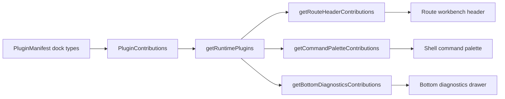
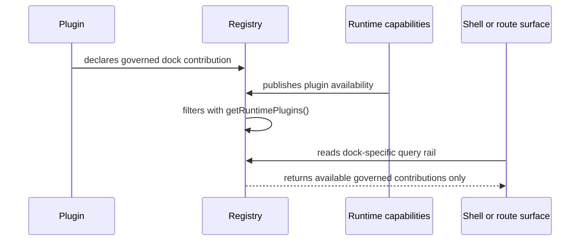

# Plugin UX Integration Contract

## Owned Concern

The plugin UX integration contract owns the governed plugin docks that can
extend the shell and route workbenches without creating plugin-local chrome.
It does not own plugin execution, backend plugin authority, Canvas mutation, or
route-specific rendering.

## Public API

| API                                   | Path                                                   | Role                                                    |
| ------------------------------------- | ------------------------------------------------------ | ------------------------------------------------------- |
| `RouteHeaderContribution`             | `apps/web/src/app/plugins/contracts/PluginManifest.ts` | Route-local header action or status contribution.       |
| `CommandPaletteContribution`          | `apps/web/src/app/plugins/contracts/PluginManifest.ts` | Discoverable command-palette contribution.              |
| `BottomDiagnosticsContribution`       | `apps/web/src/app/plugins/contracts/PluginManifest.ts` | Route or shell diagnostics tab contribution.            |
| `getRouteHeaderContributions()`       | `apps/web/src/app/plugins/registry.ts`                 | Runtime-filtered route-header contribution query.       |
| `getCommandPaletteContributions()`    | `apps/web/src/app/plugins/registry.ts`                 | Runtime-filtered command-palette contribution query.    |
| `getBottomDiagnosticsContributions()` | `apps/web/src/app/plugins/registry.ts`                 | Runtime-filtered bottom-diagnostics contribution query. |

## Invariants

- Plugins adapt to governed shell and route docks; the shell does not deform
  around plugin-specific chrome.
- Route-header contributions stay route-local and cannot replace the global top
  bar.
- Command-palette contributions are discovery entries, not shadow navigation or
  execution bypasses.
- Bottom-diagnostics contributions are dense diagnostic surfaces attached to a
  route or shell context, not standalone floating consoles.
- All dock query rails use `getRuntimePlugins()` so backend-disabled plugins are
  filtered out exactly like views, overlays, node badges, and port maps.
- Availability remains explicit through `PluginContributionAvailability`
  instead of being inferred from hidden UI booleans.

## Transitions

| Transition                              | Required action                                                                 |
| --------------------------------------- | ------------------------------------------------------------------------------- |
| Add a new dock family                   | Update this contract, `PluginManifest.ts`, registry query rail, and guards.     |
| Add a plugin contribution to a dock     | Declare it in the plugin contribution module and keep runtime filtering intact. |
| Add UI rendering for a dock             | Render from the registry query rail; do not scan plugin modules directly.       |
| Change availability semantics           | Update `PluginContributionAvailability` and negative runtime projection tests.  |
| Move a local route action into a plugin | First classify whether it is header, palette, diagnostics, inspector, or route. |

## Consumers

| Consumer                   | Consumption posture                                                       |
| -------------------------- | ------------------------------------------------------------------------- |
| Shell command discovery    | Reads `getCommandPaletteContributions()` when command palette UI exists.  |
| Route workbench headers    | Reads `getRouteHeaderContributions()` for route-local actions and status. |
| Bottom console diagnostics | Reads `getBottomDiagnosticsContributions()` for governed diagnostic tabs. |
| Plugin authors             | Declare dock contributions through `PluginContributions`.                 |
| Architecture tests         | Guard explicit rails, docs, and runtime filtering.                        |

## Architecture

## Fowler Notes

This contract applies Replace Primitive With Explicit Type and Published
Interface to plugin docking. It prevents Shotgun Surgery by routing each dock
through a named query rail instead of letting future surfaces scan the static
plugin registry directly. It also avoids Speculative Generality by limiting the
contract to the three F-25 docks that were still missing: route header,
command palette, and bottom diagnostics.
