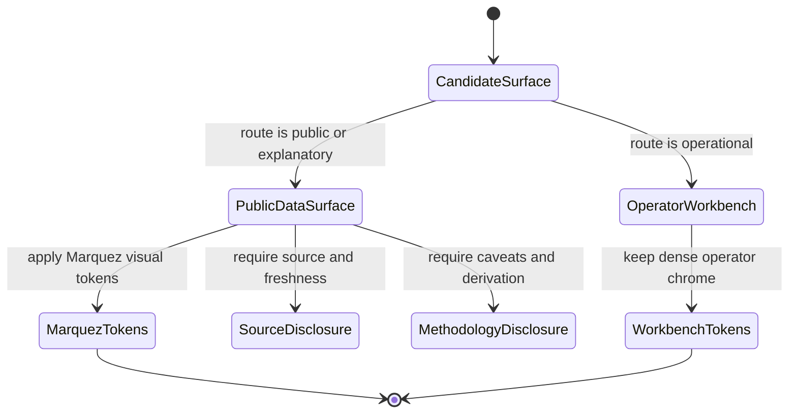
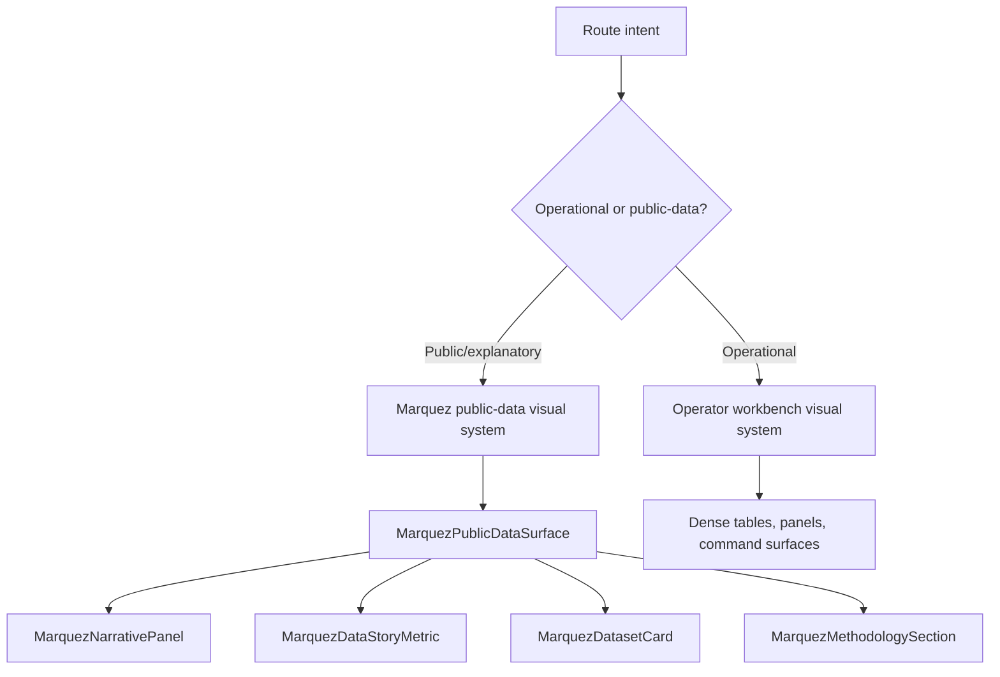

# Marquez Public-Data Visual System Component

## Purpose

This component owns the Marquez visual system for public-data surfaces. In this
frontend context, `Marquez` is a named visual and narrative direction for
open-data explanation. It is not the OpenLineage backend product, not a runtime
dependency, and not the default styling for the operator workbench.

The concern is semantic encapsulation: public or explanatory views may adopt an
editorial, curated, civic data presentation language while operational routes
continue to use dense, quiet workbench chrome.

## Public API

| API                         | Type              | Purpose                                                                      |
| --------------------------- | ----------------- | ---------------------------------------------------------------------------- |
| `marquezVisualTokens`       | design-token set  | Names public-data color, typography, density, motion, and illustration rules |
| `MarquezPublicDataSurface`  | component pattern | Defines page composition for explanatory public-data pages                   |
| `MarquezNarrativePanel`     | component pattern | Defines source, method, caveat, and evidence panels                          |
| `MarquezDataStoryMetric`    | component pattern | Defines high-level explanatory statistics without dashboard density          |
| `MarquezDatasetCard`        | component pattern | Defines dataset, provenance, license, and update cadence cards               |
| `MarquezMethodologySection` | component pattern | Defines how data was derived, transformed, or filtered                       |

## Visual Tokens

`marquezVisualTokens` is a documented token set until a concrete public-data
route needs code-level extraction. It carries these owned decisions:

| Token group   | Rule                                                                 |
| ------------- | -------------------------------------------------------------------- |
| Palette       | editorial neutrals, civic accent, evidence accent, caution accent    |
| Typography    | readable explanatory hierarchy; no IDE-scale monospace dominance     |
| Density       | more narrative spacing than operator tables; still scan-friendly     |
| Data emphasis | clear source labels, caveats, update cadence, and provenance chips   |
| Interaction   | guided drill-downs and anchored sections instead of command palettes |
| Illustration  | real dataset maps, charts, or diagrams; no abstract decorative blobs |

## Invariants

- Marquez applies only to public-data surfaces, civic/open-data explainers, or
  explicitly approved external narrative pages.
- Marquez must not be applied to operator workbench routes such as Canvas,
  Runs, Code, Diff, Artifacts, Templates, Plugins, Admin, or Cost.
- operator workbench routes must not import or copy Marquez public-data token
  rules.
- Public-data views may reuse shell primitives, Radix/shadcn primitives,
  charts, and route frame constraints, but they must not inherit dense
  workbench tables by default.
- Every Marquez surface must show source, freshness, methodology, and caveat
  affordances when it presents data-derived conclusions.
- Marquez is not a dependency, package, adapter, plugin runtime, or OpenLineage
  integration contract.

## Transitions

## Consumers

| Consumer                                      | Usage                                                             |
| --------------------------------------------- | ----------------------------------------------------------------- |
| Future public-data routes                     | Adopt the Marquez token set and component patterns                |
| `ux-implementation-guide.md`                  | Routes frontend slices toward public-data versus operator posture |
| `library-and-open-source-reference-stack.md`  | Classifies Marquez as a design reference, not a dependency        |
| `screen-manuals-and-user-stories.md`          | Names F-19 as the public-data acceptance direction                |
| `publicDataVisualSystem.architecture.test.ts` | Guards semantic separation and documentation completeness         |
| Lane E planning state                         | Tracks F-19 closure evidence                                      |

## Component Topology

## Drift Signals

- A workbench route document describes Marquez as its visual system.
- A public-data proposal lacks source, freshness, methodology, or caveat
  disclosure.
- A runtime integration document treats Marquez as a frontend dependency.
- A future public-data route copies dense operator-table layouts as its primary
  first-viewport pattern.
