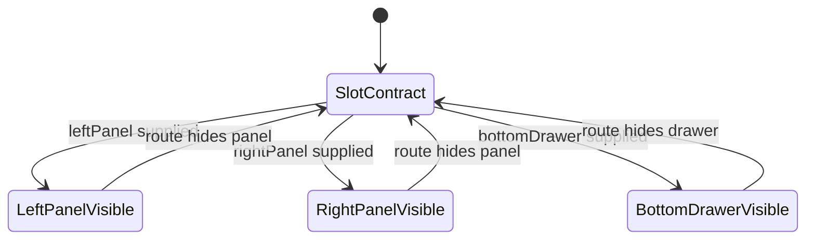
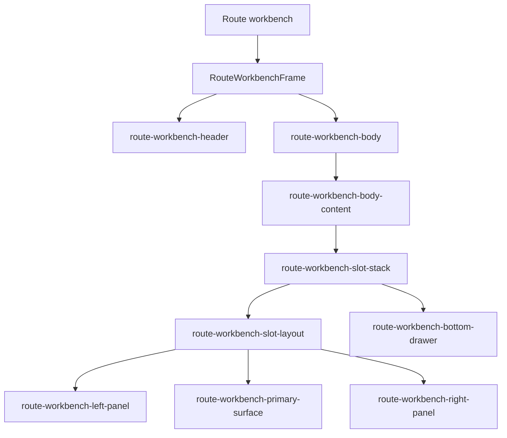

# Route Workbench Frame Component

## Purpose

`RouteWorkbenchFrame` is the shared presentation primitive for route-level
workbenches in `apps/web`. It keeps the shell contract explicit without making
the shell own route domain behavior.

## Public API

```ts
export type RouteWorkbenchFrameSlots = Readonly<{
  leftPanel?: ReactNode;
  primarySurface: ReactNode;
  rightPanel?: ReactNode;
  bottomDrawer?: ReactNode;
}>;
```

`RouteWorkbenchFrame` accepts:

- `header`: route-owned header stack rendered outside the route body scroll.
- `slots`: semantic route body contract for left context, primary surface,
  right context, and route supporting drawer.
- `scroll`: whether the frame owns body scrolling.
- `bodyClassName` and `bodyContainerClassName`: route-level layout overrides.

## Invariants

- The top application shell remains outside this component.
- `header` is never nested inside the scroll body.
- `primarySurface` is required when `slots` are used.
- `leftPanel`, `rightPanel`, and `bottomDrawer` are optional contextual support
  surfaces.
- Anonymous route body `children` are not supported; every direct consumer must
  name its body through `RouteWorkbenchFrameSlots`.
- The frame owns presentation layout only; it does not own route commands,
  queries, loaders, API calls, or domain state.

## Transitions



## Consumers

Current and expected consumers:

- `CodeView`, the first adopter of `RouteWorkbenchFrameSlots`
- `DiffView`
- `ArtifactsView`
- `LineageView`
- `PluginsView`
- `AdminView`
- future route workbenches such as `Templates`

`CodeView` maps its file explorer to `leftPanel` and its local-buffer banner
plus Monaco file preview to `primarySurface`. It does not provide `rightPanel`
or `bottomDrawer` yet.

Canvas can continue using its specialized shell while adopting the same slot
vocabulary through future component extraction.

## Component Diagram



## Command And Query Rail Posture

No new command or query rail is introduced. This component is an internal
presentation primitive. Route commands and queries remain owned by their
bounded contexts.

## Local Traceability

- Task: `F-15`
- Analysis:
  `buzon/20260521-codex-fowler-route-workbench-frame-analysis-and-remediation.md`
- Stories:
  `docs/architecture/components/web/route-workbench-frame-user-stories.md`
- Source:
  `apps/web/src/app/components/workbench/RouteWorkbenchFrame.tsx`
- Tests:
  `apps/web/src/app/components/workbench/RouteWorkbenchFrame.test.tsx`
  `apps/web/src/app/components/workbench/routeWorkbenchFrame.architecture.test.ts`
