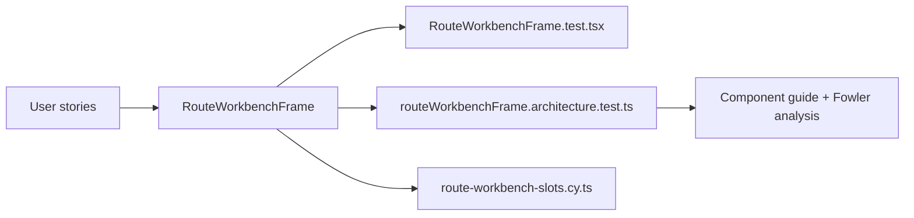

# Route Workbench Frame User Stories

## User Stories

### US-ROUTE-WORKBENCH-FRAME-001

As an operator using a route workbench, I need the primary surface to remain the
center of attention so that supporting panels do not become hidden applications.

Acceptance:

- the route can provide `primarySurface`;
- the primary surface renders in `route-workbench-primary-surface`;
- contextual panels render beside it only when supplied.

### US-ROUTE-WORKBENCH-FRAME-002

As an operator inspecting context, I need left and right panels to have stable
placement so that explorer and inspector behavior is predictable across routes.

Acceptance:

- `leftPanel` renders in `route-workbench-left-panel`;
- `rightPanel` renders in `route-workbench-right-panel`;
- omitting a panel does not create empty chrome.

### US-ROUTE-WORKBENCH-FRAME-003

As an operator reviewing supporting detail, I need a route-level bottom drawer
that stays subordinate to the active route surface.

Acceptance:

- `bottomDrawer` renders in `route-workbench-bottom-drawer`;
- the shell console drawer remains owned by `AppShellFrame`;
- the route drawer does not replace route navigation.

### US-ROUTE-WORKBENCH-FRAME-004

As a maintainer finishing F-15, I need direct route workbench consumers to use
semantic slots only.

Acceptance:

- direct `RouteWorkbenchFrame` route consumers pass `slots`;
- anonymous route body `children` are not part of the public frame API;
- architecture tests fail when a direct route consumer drifts back to anonymous
  body content.

## Scenario Matrix

| Scenario                                         | Expected result                                                             | Coverage                                   |
| ------------------------------------------------ | --------------------------------------------------------------------------- | ------------------------------------------ |
| Direct route passes anonymous body content       | Architecture guard fails until the route uses `slots.primarySurface`        | `routeWorkbenchFrame.architecture.test.ts` |
| Route passes all slots                           | left, primary, right, and bottom drawer slots render with stable data slots | `RouteWorkbenchFrame.test.tsx`             |
| Route omits side panels                          | no empty left or right panel chrome appears                                 | future route adoption tests                |
| Architecture drift removes docs or owned concern | architecture test fails                                                     | `routeWorkbenchFrame.architecture.test.ts` |

## Acceptance Coverage

## Out Of Scope

- Implementing resizable `ContextPanel`.
- Changing shell-level `AppShellFrame` bottom console behavior.
- Adding a new route command or query rail.
