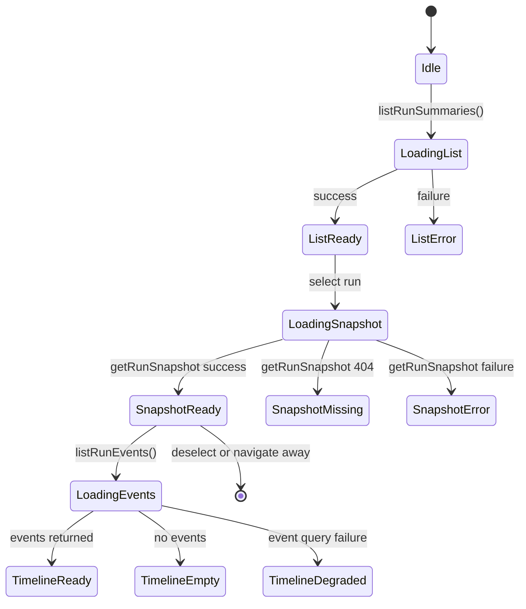
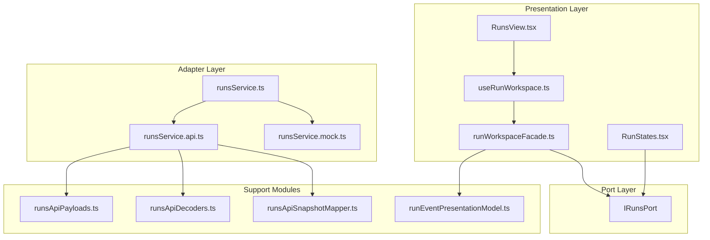

# Runs Component - Local Guide

This page is the local component guide for the Runs domain in `apps/web`. It
describes the public `IRunsPort` API, invariants, state transitions, consumers,
and adapter boundaries.

Use this guide with:

- [Runs Frontend Architecture](./dvt-runs-frontend-architecture.md)
- [Frontend Runtime Contract Technical Manual](./frontend-runtime-contract-technical-manual.md)
- [Web DDD Structure](../web-ddd.md)
- [Web Functionalities](../web-functional.md)
- [Command Query Rail Governance](../../../command-query-rail-governance.md)

Canonical local paths:

- [ports/runs.ts](../../../../../apps/web/src/app/ports/runs.ts)
- [runsService.ts](../../../../../apps/web/src/app/services/runs/runsService.ts)
- [runsService.api.ts](../../../../../apps/web/src/app/services/runs/runsService.api.ts)
- [runsService.mock.ts](../../../../../apps/web/src/app/services/runs/runsService.mock.ts)
- [runsApiPayloads.ts](../../../../../apps/web/src/app/services/runs/runsApiPayloads.ts)
- [runsApiDecoders.ts](../../../../../apps/web/src/app/services/runs/runsApiDecoders.ts)
- [runsApiSnapshotMapper.ts](../../../../../apps/web/src/app/services/runs/runsApiSnapshotMapper.ts)
- [runWorkspaceFacade.ts](../../../../../apps/web/src/app/services/runs/runWorkspaceFacade.ts)
- [runEventPresentationModel.ts](../../../../../apps/web/src/app/services/runs/runEventPresentationModel.ts)

## Public API

`IRunsPort` is defined in [ports/runs.ts](../../../../../apps/web/src/app/ports/runs.ts).

```typescript
export interface IRunsPort {
  listRunSummaries: () => Promise<RunSummaryItem[]>;
  getRunSnapshot: (runId: string) => Promise<RunSnapshot | null>;
  startRun: (input: StartRunInput) => Promise<RunStartReceipt>;
  listRunEvents: (runId: string, afterSeq?: number) => Promise<RunEventTimelinePage>;
}
```

### Method Semantics

| Method             | Rail type | Idempotent | Runtime surface           | Description                                                              |
| ------------------ | --------- | ---------- | ------------------------- | ------------------------------------------------------------------------ |
| `listRunSummaries` | Query     | Yes        | `GET /runs`               | Returns runs visible to the current tenant/project/environment scope.    |
| `getRunSnapshot`   | Query     | Yes        | `GET /runs/:runId`        | Returns one run snapshot by ID, or `null` when the API returns HTTP 404. |
| `startRun`         | Command   | No         | `POST /runs/start`        | Submits a run request; the API owns admission and run identity.          |
| `listRunEvents`    | Query     | Yes        | `GET /runs/:runId/events` | Returns an ordered page of run events, optionally after a sequence.      |

### DTO Vocabulary

All presentation DTOs are defined locally in
[ports/runs.ts](../../../../../apps/web/src/app/ports/runs.ts). They are not
wire contracts and are not re-exported from `@dvt/contracts`.

| DTO                    | Purpose                                               |
| ---------------------- | ----------------------------------------------------- |
| `StartRunInput`        | Command input: `PlanRef`, `WorkspaceScope`, selection |
| `RunStartReceipt`      | Command result: server-owned run ID and admission     |
| `UiRunStatus`          | Presentation-level run status union                   |
| `RunSummaryItem`       | List item projection with `startedAt` authority       |
| `RunSnapshot`          | Run lifecycle snapshot and optional evidence fields   |
| `RunEventTimelinePage` | Paginated event feed                                  |

## Invariants

1. `IRunsPort` has four public methods. Views, hooks, and facades consume the
   interface instead of importing adapter implementations directly.
2. `startRun` sends `planRef`, `workspaceScope`, and `selection`. The web client
   does not send a canonical `runId`; the API returns the run identity.
3. `getRunSnapshot` maps HTTP 404 to `null`. Other API failures propagate to
   the caller.
4. `listRunSummaries` includes tenant, project, and environment scope query
   parameters through the API adapter.
5. `getRunSnapshot` and `listRunEvents` include tenant scope query parameters
   through the API adapter.
6. Mock and API implementations satisfy the same `IRunsPort` interface, so route
   code does not branch on `DataSourceMode`.

## State Transitions

The Runs domain has no durable frontend-owned run state. Route state is derived
from backend reads and service facades. The route workbench state model is
documented in [dvt-runs-frontend-architecture.md](./dvt-runs-frontend-architecture.md).



## Consumers

| Consumer             | File                                                                                         | How it uses the port                           |
| -------------------- | -------------------------------------------------------------------------------------------- | ---------------------------------------------- |
| `runWorkspaceFacade` | [runWorkspaceFacade.ts](../../../../../apps/web/src/app/services/runs/runWorkspaceFacade.ts) | Composes snapshot and timeline into view model |
| `RunsView`           | [RunsView.tsx](../../../../../apps/web/src/app/views/RunsView.tsx)                           | Renders run list and run detail workspace      |
| `useRunWorkspace`    | [useRunWorkspace.ts](../../../../../apps/web/src/app/views/runs/useRunWorkspace.ts)          | Subscribes to scope and reloads run workspace  |
| `RunStates`          | [RunStates.tsx](../../../../../apps/web/src/app/views/runs/RunStates.tsx)                    | Renders route states from workbench model      |
| service tests        | [runsService.test.ts](../../../../../apps/web/src/app/services/runs/runsService.test.ts)     | Verifies route calls, parsing, and rejections  |

## Architecture Diagram



Dependency direction:

```text
views -> hooks/facades -> ports <- adapters <- transport/support
```

Ports never import adapters. Adapters implement ports. Views do not import
`createApiClient` or `runsService.api.ts` directly.

## Related Pages

- [Runs Frontend Architecture](./dvt-runs-frontend-architecture.md)
- [Frontend Runtime Contract Technical Manual](./frontend-runtime-contract-technical-manual.md)
- [Frontend Runtime Contract User Manual](./frontend-runtime-contract-user-manual.md)
- [Start Run Client Identity Boundary](./start-run-client-identity-boundary.md)
- [Web DDD Structure](../web-ddd.md)
- [Web Functionalities](../web-functional.md)
- [Web Store Domain Ownership Component](../web-store-domain-ownership-component.md)
