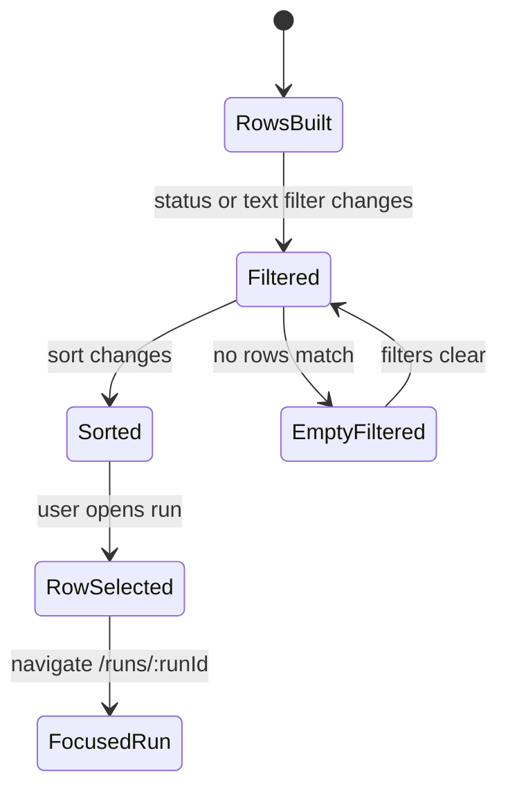
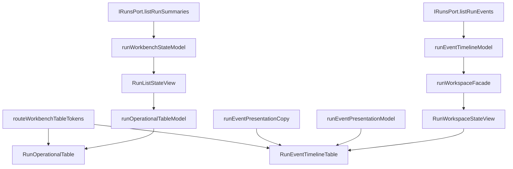

# Runs Dense Operational Tables Component

This local component owns table-oriented presentation semantics for Runs and
run event chronology. It does not own runtime authority, event fetching, run
start admission, or shell console streaming.

## Public API

| API                         | Kind         | Owner                   | Contract                                                           |
| --------------------------- | ------------ | ----------------------- | ------------------------------------------------------------------ |
| `buildRunOperationalRows`   | query helper | Run table model         | Maps `RunSummaryItem[]` into dense table rows                      |
| `filterRunOperationalRows`  | query helper | Run table model         | Applies status and text filters without mutating source rows       |
| `sortRunOperationalRows`    | query helper | Run table model         | Applies stable route-owned sort semantics                          |
| `buildRunEventTableRows`    | query helper | Event table model       | Maps shared event presentation models into dense timeline rows     |
| `RunOperationalTable`       | view         | Runs list               | Renders sortable/filterable run rows and route navigation          |
| `RunEventTimelineTable`     | view         | Runs detail             | Renders event chronology as dense rows from shared event semantics |
| `routeWorkbenchTableTokens` | token object | Workbench visual system | Provides semantic dense table field, text, and status tone classes |

## Invariants

1. Dense tables consume `IRunsPort` read models; they do not call adapters.
2. Table row IDs remain backend-owned run IDs or event IDs.
3. Sort and filter state is presentation state; it does not mutate runtime
   snapshots or event chronology.
4. Run status filtering is explicit and URL-stable on `/runs`.
5. Event table rows use `runEventPresentationModel` and
   `runEventPresentationCopy`, so console and detail route semantics do not
   drift.
6. TanStack Table is a rendering primitive only; DVT owns column names,
   filters, routes, and row semantics.
7. Dense table visual states use the local visual-token component instead of
   route-level Tailwind color families.

## State Transitions

## Consumer Diagram

## Consumers

| Consumer               | File                                                                  | Responsibility                                           |
| ---------------------- | --------------------------------------------------------------------- | -------------------------------------------------------- |
| Runs list route        | `apps/web/src/app/views/runs/RunListStateView.tsx`                    | Hosts filter state and route navigation                  |
| Run table model        | `apps/web/src/app/views/runs/runOperationalTableModel.ts`             | Owns row, filter, and sort semantics                     |
| Event table model      | `apps/web/src/app/views/runs/runEventTableModel.ts`                   | Owns event row mapping from shared timeline presentation |
| Run table view         | `apps/web/src/app/views/runs/RunOperationalTable.tsx`                 | Renders dense rows via TanStack Table                    |
| Timeline table view    | `apps/web/src/app/views/runs/RunEventTimelineTable.tsx`               | Renders event rows from shared event presentation        |
| Visual token component | `apps/web/src/app/components/workbench/routeWorkbenchTableTokens.ts`  | Owns dense table visual token classes                    |
| Architecture guard     | `apps/web/src/app/views/runs/runsDomainBoundary.architecture.test.ts` | Prevents non-table dense timeline regressions            |

Local visual-token guide:
[Runs Dense Table Visual Tokens Component](./runs-dense-table-visual-tokens-component.md).

## Mature-System Comparison

Temporal UI and GitHub Actions use tables for run selection and history.
Grafana and Datadog use dense log/event tables with filters and sortable
columns. F-16 follows that model while keeping DVT-specific authority in
`IRunsPort` and DVT-specific row semantics in local view models.
