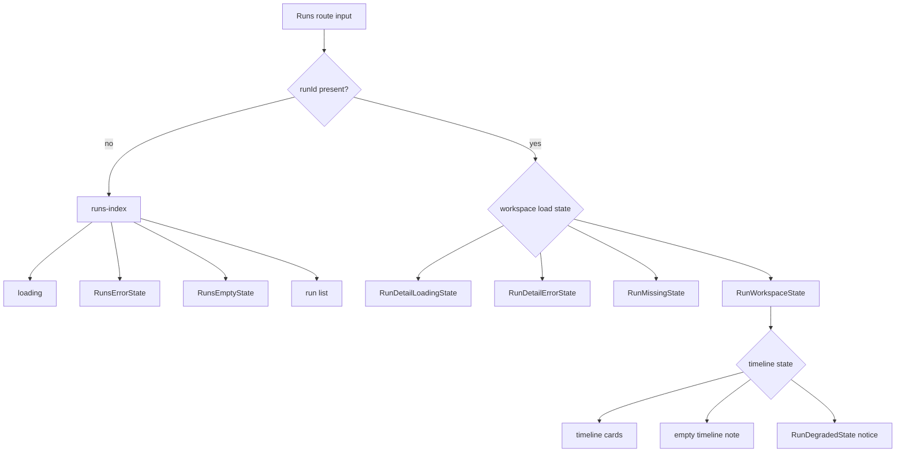
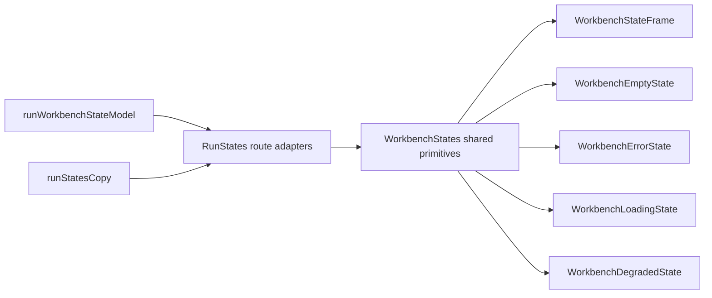

# Runs

## Purpose

The Runs surface is the operational execution workbench of the DVT frontend.

It exists to let operators and authors move from graph intent to execution
evidence without mixing execution truth into the Canvas.

## Current Implementation

Primary code anchors:

- [RunsView.tsx](../../../../../apps/web/src/app/views/RunsView.tsx)
- [RunStates.tsx](../../../../../apps/web/src/app/views/runs/RunStates.tsx)
- [WorkbenchStates.tsx](../../../../../apps/web/src/app/components/workbench/state/WorkbenchStates.tsx)
- [runWorkbenchStateModel.ts](../../../../../apps/web/src/app/views/runs/runWorkbenchStateModel.ts)
- [runWorkspaceFacade.ts](../../../../../apps/web/src/app/services/runs/runWorkspaceFacade.ts)
- [runsService.ts](../../../../../apps/web/src/app/services/runs/runsService.ts)

Current routes:

- `/runs`
- `/runs/:runId`

Current composition:

- list state when no `runId` is selected;
- workspace detail state when a run is selected;
- snapshot card is always present;
- timeline card is available, empty, or degraded based on runtime events.

## Runs Workbench State Contract

The current workbench state model now formalizes one explicit state contract for
`/runs` and `/runs/:runId` so route composition does not keep deciding state ad
hoc inside multiple components.

Current state split:

- `runs-index` owns loading, error, empty, and populated list behavior for `/runs`;
- `run-loading` owns focused-route loading treatment for `/runs/:runId`;
- `run-missing` owns the governed run-not-found treatment;
- `run-error` owns snapshot load failure treatment;
- `run-workspace` owns the focused snapshot-plus-timeline workspace;
- `run-degraded` remains a workspace-level state inside the focused run, not a
  second route root, because snapshot truth is still available even when the
  timeline feed is stale or partially unavailable.

Rationale:

- the list route and focused run route are different workbench states, not one
  oversized component with inline conditions;
- missing and degraded are different product truths:
  - missing means the route cannot identify a run workspace at all;
  - degraded means snapshot truth exists, but event chronology is partial or
    temporarily unavailable;
- empty list state must keep guiding the operator back to Canvas instead of
  presenting `/runs` as a dead end.

## Shared Workbench State Primitives

`Runs` no longer owns all of its state chrome directly.

The route now seeds shared workbench state primitives while keeping
route-specific copy, actions, and state selection local.

Rules:

1. shared primitives own layout and state chrome only;
2. `Runs` still owns state selection and route-specific copy;
3. cross-route reuse should adopt these primitives before inventing more
   route-local empty or error cards;
4. `ReadOnlyState` remains a future primitive until there is a real governed
   consumer.

## UX Rules

- `/runs` is the operational landing state;
- `/runs/:runId` is the focused execution workspace;
- empty state must send the user back to Canvas to create meaningful work;
- the route must never fabricate step/artifact detail from snapshot-only data.

## Mature Libraries And References

- operational grids and dense event tables:
  [TanStack Table](https://tanstack.com/table/latest)
- state and polling:
  TanStack Query
- metrics and dashboard patterns:
  [Grafana](https://github.com/grafana/grafana)

## Current Constraints

- the Runs route is useful but still lighter than a full operational table and
  diagnostics workbench;
- the frontend contract around run start and richer diagnostics still needs
  tightening with the protected API route map;
- the shell drawer may mirror active run events, but the Runs route remains the
  durable authority for snapshot plus timeline monitoring.

## Runtime Contract Baseline (F-07)

The route-level runtime drift addressed by `F-07` is now fixed in the service
layer:

- frontend runtime routes now align to protected route truth:
  - `POST /runs/start`
  - `GET /runs`
  - `GET /runs/:runId`
  - `GET /runs/:runId/events`

Current residual constraint after that fix:

- `/runs/:runId` is backed by runtime snapshot authority, not by a full
  event-enriched and step-enriched run aggregate;
- timeline is route-composed when available, but step/artifact/node detail
  still need the later `F-09` through `F-11` convergence work.

Canonical runtime contract baseline docs:

- [Frontend Runtime Contract Technical Manual](./frontend-runtime-contract-technical-manual.md)
- [Frontend Runtime Contract User Manual](./frontend-runtime-contract-user-manual.md)
- [Frontend Fowler Implementation Pattern](../frontend-fowler-implementation-pattern.md)
- [F-07 Frontend Runtime Contract Baseline Plan](../../../../planning/proposals/mandatory/runtime-and-contracts/f-07-frontend-runtime-contract-baseline-plan-20260404.md)

## Related Pages

- [Frontend Observability Architecture](../observability/front-observability-architecture-dvt.md)
- [UX Implementation Guide](../ux-implementation-guide.md)
- [Library And Open-Source Reference Stack](../library-and-open-source-reference-stack.md)
