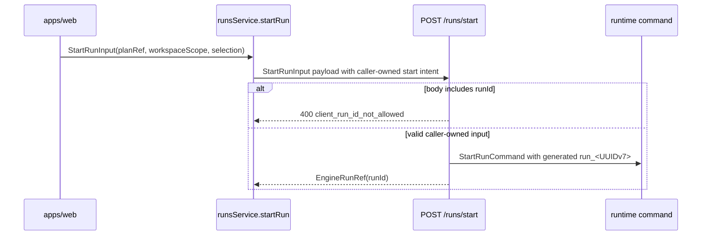
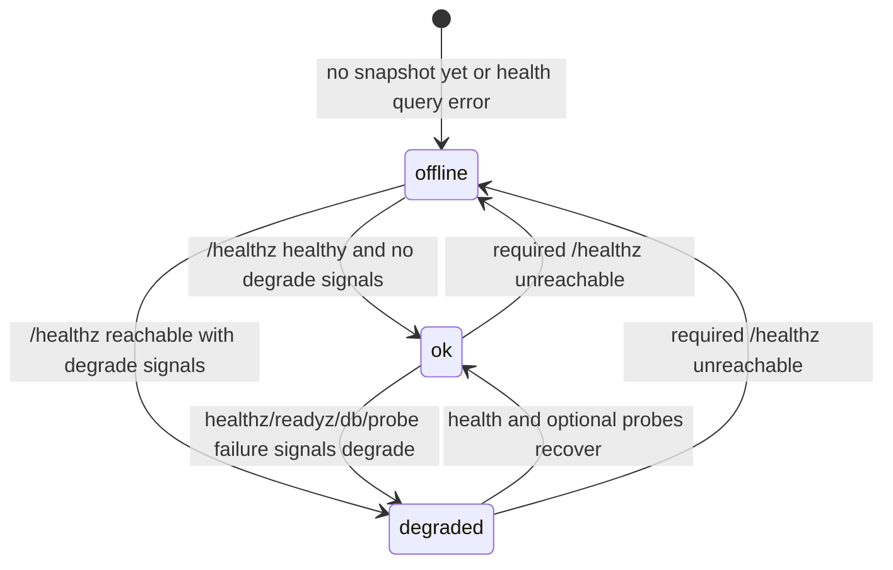

---
title: Frontend-Facing Backend MVP Contract (MVP-E1)
status: Review
owner: Frontend / API / Architecture
last_reviewed: 2026-04-23
domain: frontend
lane: E
task_id: MVP-E1
---

# Frontend-Facing Backend MVP Contract (MVP-E1)

## Purpose

Define the backend surface that `apps/web` is allowed to rely on today.
This contract is route-truth only. It does not introduce new backend behavior.

## Governing Sources

- `docs/planning/status/governance-document-rule-inventory.md`
- `docs/guides/ai-work-protocol.md`
- `docs/planning/state/planning-control-tower.md`
- `docs/planning/state/github-mvp-issue-workflow.md`
- `docs/planning/proposals/superseded/runtime-and-contracts/mvp-a1-backend-contractual-inventory-20260329.md`
- `docs/architecture/components/web/runs/frontend-runtime-contract-technical-manual.md`
- `docs/architecture/components/web/runs/start-run-client-identity-boundary.md`
- `docs/adr/adr-0050-platform-owned-start-run-identity.md`
- `apps/api/src/app.ts`
- `apps/api/src/entrypoints/http/runtimeRoutes.constants.ts`
- `apps/api/src/routes/health.ts`
- `apps/api/src/entrypoints/http/httpErrorContract.ts`
- `apps/web/src/app/services/runs/runsService.ts`
- `apps/web/src/capabilities/platform-health/domain/platformHealthTypes.ts`
- `apps/web/src/capabilities/platform-health/domain/platformHealthSelectors.ts`
- `apps/web/src/capabilities/platform-health/presentation/usePlatformHealthSnapshotQuery.ts`
- `apps/web/src/app/components/ShellHealthBanner.tsx`

## Contractual Route Inventory

### Protected runtime routes (OIDC-gated)

| Method | Path                  | Frontend intent          | Auth posture                                                         | Request shape (frontend-consumed)                                                    | Success shape (frontend-consumed)                                                    | Error envelope                                                             |
| ------ | --------------------- | ------------------------ | -------------------------------------------------------------------- | ------------------------------------------------------------------------------------ | ------------------------------------------------------------------------------------ | -------------------------------------------------------------------------- |
| `POST` | `/plans/preview`      | preview and persist plan | authenticated + action `run:start`                                   | `PlanPreviewInput` via `plansService.previewPlan`                                    | `{ plan, planRef, planSummary?, persisted?, provenance? }` mapped to `ExecutionPlan` | `HttpErrorEnvelope` (`error.type`, `reason`, optional `target`, `details`) |
| `POST` | `/plans/import`       | import persisted plan    | authenticated + action `run:start`                                   | `{ planRef, context }` via `plansService.importPlan`                                 | `{ plan, planRef }` mapped to `ExecutionPlan`                                        | `HttpErrorEnvelope`                                                        |
| `POST` | `/runs/start`         | start run                | authenticated + action `run:start`                                   | `StartRunInput` via `runsService.startRun`                                           | `EngineRunRef` (`runId`)                                                             | `HttpErrorEnvelope`                                                        |
| `GET`  | `/runs`               | list run summaries       | authenticated + action `run:list`                                    | query: `tenantId` required; `projectId`, `environmentId`, `limit`, `cursor` optional | list payload mapped to `RunSummaryItem[]`                                            | `HttpErrorEnvelope`                                                        |
| `GET`  | `/runs/:runId`        | fetch run snapshot       | authenticated + action `run:view`                                    | query: `tenantId` required; `enriched` optional                                      | snapshot payload mapped to `RunSnapshot` \| `null`                                   | `HttpErrorEnvelope`                                                        |
| `GET`  | `/runs/:runId/events` | fetch run timeline page  | authenticated + action `run:logs:view`                               | query: `tenantId` required; `afterSeq`, `limit` optional                             | payload mapped to `RunEventTimelinePage` (`events`, `nextAfterSeq`)                  | `HttpErrorEnvelope`                                                        |
| `POST` | `/runs/:runId/signal` | send run signal          | authenticated + action by signal type (`run:signal` or `run:cancel`) | body: `tenantId`, `signalType`, optional `reason`                                    | command acceptance or runtime command outcome                                        | `HttpErrorEnvelope`                                                        |
| `POST` | `/runs/:runId/cancel` | cancel run               | authenticated + action `run:cancel`                                  | body: `tenantId`; non-empty `reason` is rejected on the native cancel route          | command acceptance or runtime command outcome                                        | `HttpErrorEnvelope`                                                        |

Preview-route rule:

- `/plans/preview` accepts only the shared `planner-generic-v1` profile
- DVT authoring is projected through the canonical Substrait boundary and does
  not publish a SQL-shaped preview profile
- frontend callers must fail closed when the active runtime has no registered
  executable strategy

### Public operational routes (shell health contract)

| Method | Path        | Frontend intent                           | Auth posture        | Request shape | Success shape (frontend-consumed) | Degraded or unavailable semantics                                            |
| ------ | ----------- | ----------------------------------------- | ------------------- | ------------- | --------------------------------- | ---------------------------------------------------------------------------- |
| `GET`  | `/healthz`  | required liveness + component state probe | public              | none          | `PlatformHealthInfo`              | required endpoint; transport/protocol failure means `offline` in shell       |
| `GET`  | `/readyz`   | optional readiness probe                  | public when enabled | none          | `PlatformReadinessInfo`           | `403/404/405` treated as `not_enabled`; `ok:false` contributes `degraded`    |
| `GET`  | `/version`  | optional version metadata probe           | public when enabled | none          | `PlatformVersionInfo`             | `403/404/405` treated as `not_enabled`; probe failure contributes `degraded` |
| `GET`  | `/db/ready` | optional database readiness probe         | public when enabled | none          | `PlatformDatabaseReadiness`       | `403/404/405` treated as `not_enabled`; `ok:false` contributes `degraded`    |

## Authentication and Authorization Matrix

| Route                      | Access class                      | Required token | Required authorization action                              |
| -------------------------- | --------------------------------- | -------------- | ---------------------------------------------------------- |
| `POST /plans/preview`      | role-scoped protected runtime     | yes            | `run:start`                                                |
| `POST /plans/import`       | role-scoped protected runtime     | yes            | `run:start`                                                |
| `POST /runs/start`         | role-scoped protected runtime     | yes            | `run:start`                                                |
| `GET /runs`                | role-scoped protected runtime     | yes            | `run:list`                                                 |
| `GET /runs/:runId`         | role-scoped protected runtime     | yes            | `run:view`                                                 |
| `GET /runs/:runId/events`  | role-scoped protected runtime     | yes            | `run:logs:view`                                            |
| `POST /runs/:runId/signal` | role-scoped protected runtime     | yes            | `run:signal` (`PAUSE`/`RESUME`) or `run:cancel` (`CANCEL`) |
| `POST /runs/:runId/cancel` | role-scoped protected runtime     | yes            | `run:cancel`                                               |
| `GET /healthz`             | public                            | no             | none                                                       |
| `GET /readyz`              | public endpoint, deployment-gated | no             | none                                                       |
| `GET /version`             | public endpoint, deployment-gated | no             | none                                                       |
| `GET /db/ready`            | public endpoint, deployment-gated | no             | none                                                       |

Forbidden or failure expectations for protected routes:

- missing or invalid token -> `401`
- authenticated but missing scope -> `403`
- invalid route/body/query parsing -> `400` or `422`
- command conflict or invalid transition -> `409`
- backend/runtime unavailability -> `503` or `5xx`

## PlanRef handoff contract

In `api` mode, `ExecutionPlan.planRef` is backend-owned.

- `POST /plans/preview` must return `{ plan, planRef }` when preview and
  persistence succeed.
- `POST /plans/import` must return `{ plan, planRef }` when the referenced plan
  is readable inside the authorized scope.
- `apps/web` maps `planRef` directly from those payloads and must fail closed
  if the envelope omits it.
- `POST /runs/start` remains the only start authority and consumes that same
  immutable `PlanRef`.
- frontend callers send scope and selection, but the API owns canonical
  execution `run_<UUIDv7>` generation and rejects client-supplied `runId`.
- frontend callers must treat returned `EngineRunRef.runId` as opaque. The
  UUIDv7 timestamp bits are not a frontend ordering, retry, or lifecycle
  contract.

Use the local component guide for API/Web ownership, invariants, transitions,
and semantic fitness tests:

- [Start-run client identity boundary](./start-run-client-identity-boundary.md)

### Start-run identity transition



## Run provenance linkage contract

`GET /runs/:runId` may expose one caller-visible provenance object in addition
to snapshot outcome fields:

- `provenance.persistedPlan.planRecordId`
- `provenance.persistedPlan.planVersion`
- `provenance.persistedPlan.sourceRef`
- `provenance.persistedPlan.canonicalPlanSha256`
- `provenance.authoring.graphArtifact`
- `provenance.authoring.sqlArtifact`

Rules:

- persisted-plan provenance comes from the stored immutable plan record
- authoring provenance is optional and only present when preview-time SQL-first
  capture wrote it into the persisted canonical plan
- timeline artifact refs from `GET /runs/:runId/events` remain execution-time
  evidence, not authoring truth

## Run diagnostics contract

`GET /runs/:runId` may expose a `diagnostics` object for the caller-visible run
detail page:

- `diagnostics.runId`
- `diagnostics.planId`
- `diagnostics.planSha`
- `diagnostics.stepId`
- `diagnostics.attemptId`
- `diagnostics.adapter`
- `diagnostics.durationMs`
- `diagnostics.status`
- `diagnostics.errorCode`
- `diagnostics.pointers[]` with `kind = trace | log`, `label`, and `value`

Rules:

- diagnostics come from the runtime read model, persisted plan metadata, and
  latest logical attempt evidence
- trace and log pointers are provider-neutral query strings, not proof that a
  dashboard route exists
- `planSha`, `runId`, `stepId`, `attemptId`, and similar high-cardinality
  identifiers must remain trace/log context and must not become metric labels

## Canonical Envelope Examples

Success example (`POST /runs/start`):

```json
{
  "runId": "run_0196454a-f0c8-7d37-a8e8-8a7f9afac0f1"
}
```

Error example (`HttpErrorEnvelope`):

```json
{
  "error": {
    "type": "forbidden",
    "reason": "missing_required_scope",
    "target": "tenantId",
    "details": {
      "action": "run:view"
    }
  }
}
```

## Explicit Non-Promises

The frontend must not promise any of the following as current behavior:

- `POST /runs` as start-run authority (replaced by `POST /runs/start`)
- `GET /runs/:runId/status` as a supported route
- mandatory availability of `/readyz`, `/version`, or `/db/ready`
- a full step/artifact-rich run aggregate from `GET /runs/:runId`
- admin routes as part of frontend runtime authority (`/admin/runs/:runId/rebuild-snapshot`)
- frontend-owned retries that bypass platform-health capability policy

## Health State Semantics Consumed By F-03

Shell health state is derived from platform-health capability selectors:

- `ok`: `/healthz` healthy and no degrading readiness/db/probe failures.
- `degraded`: `/healthz` degraded, or `/readyz`/`/db/ready` report not-ready,
  or optional probe failures are present.
- `offline`: no snapshot or query-level failure against required `/healthz`.

### Canonical state machine (F-03-A)



Deterministic transition rules:

| Current    | Condition                                      | Next       |
| ---------- | ---------------------------------------------- | ---------- |
| `offline`  | query error is true OR snapshot missing        | `offline`  |
| `offline`  | snapshot exists and any degrade signal is true | `degraded` |
| `offline`  | snapshot exists and no degrade signal is true  | `ok`       |
| `ok`       | required `/healthz` request fails              | `offline`  |
| `ok`       | any degrade signal becomes true                | `degraded` |
| `degraded` | required `/healthz` request fails              | `offline`  |
| `degraded` | all degrade signals clear                      | `ok`       |

Degrade signals are exactly:

- `/healthz` reports `status: degraded`
- `/readyz` is available and reports `ok: false`
- `/db/ready` is available and reports `ok: false`
- optional probe error present on `/readyz`, `/version`, or `/db/ready`

Banner behavior contract in shell:

- show persistent banner for `degraded` and `offline`
- show retry action (`Retry now`) wired to query `refetch`
- show auto-refresh countdown tied to query interval

### Single presenter seam contract (F-03-C)

Top bar and banner must consume the same derived shell-health model from one
composition seam:

- `RootShell` is the composition owner for shell-health presentation.
- `buildShellHealthPresentationModel(...)` is the only presenter-level mapper
  used to project query state into shell UX state.
- `TopAppBar` receives `connectionStateOverride`, `connectionDetail`, and
  `isConnectionChecking` from that presenter model.
- `ShellHealthBanner` receives `connectionState`, `detailMessage`, polling
  cadence, and retry action from that same presenter model.
- `TopAppBar` and `ShellHealthBanner` must not call platform-health query hooks
  or selectors directly.

Implementation anchors:

- `apps/web/src/app/Root.tsx`
- `apps/web/src/capabilities/platform-health/presentation/platformHealthStatus.ts`
- `apps/web/src/app/components/TopAppBar.tsx`
- `apps/web/src/app/components/ShellHealthBanner.tsx`

Retry/backoff contract:

- base polling:
  - `ok`: `15_000ms`
  - `degraded`: exponential from `15_000ms`
  - `offline`: exponential from `5_000ms`
- retry envelope:
  - query retries per failed fetch cycle: `1`
  - max backoff cap: `60_000ms`
  - formula: `min(base * 2^(attempt-1), 60_000)`
- deterministic reset rules:
  - manual retry (`Retry now`) always triggers immediate `refetch`
  - successful settled fetch returns polling to `15_000ms`
  - pending first check keeps shell in checking posture (no false offline)
- cancellation rules:
  - banner countdown timer runs only in `degraded` or `offline`
  - timer is cleared when connection returns to `ok` or shell is unmounted
  - no additional route-local retry loop is allowed outside the health capability/query seam

## Out Of Scope For MVP-E1

- adding new backend routes
- changing OIDC model, token model, or authorization policy model
- redefining backend status semantics beyond current route contracts
- claiming route-level frontend capabilities that do not exist in `apps/api`

## Traceability

- planning source:
  `docs/planning/proposals/nice-to-have/frontend-and-ux/mvp-e1-f03-frontend-backend-contract-and-health-plan-20260404.md`
- delivery tracking: governing GitHub MVP issue and linked pull request
- runtime route source: `apps/api/src/entrypoints/http/runtimeRoutes.constants.ts`
- shell health wiring source: `apps/web/src/app/Root.tsx`,
  `apps/web/src/app/components/ShellHealthBanner.tsx`
