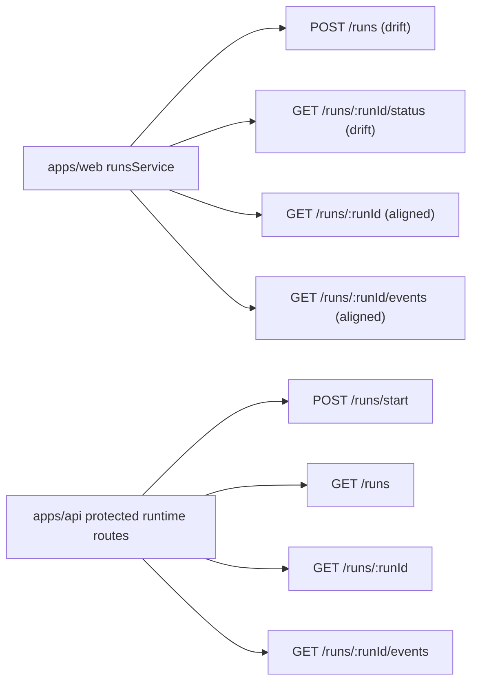
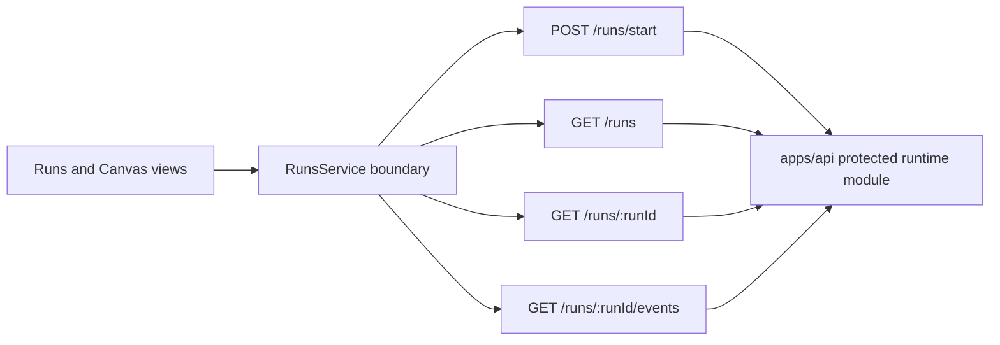
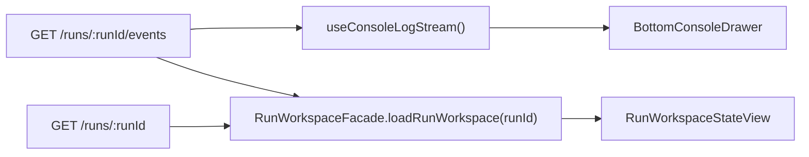
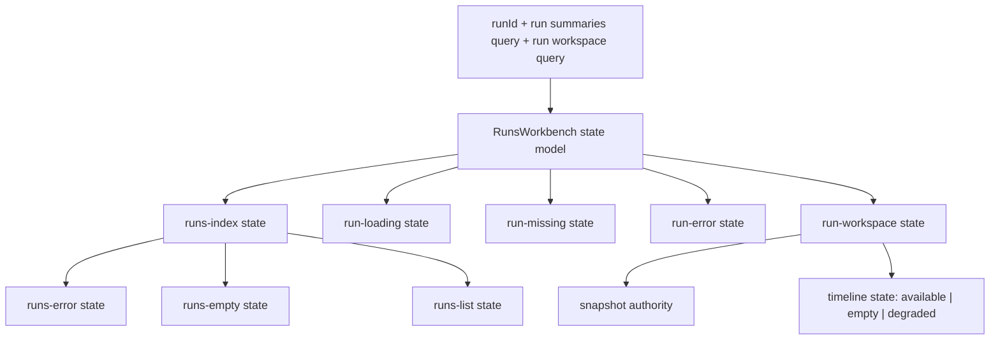
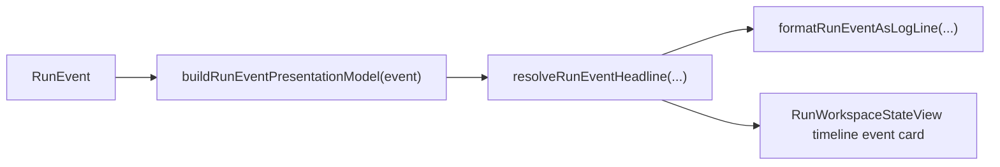
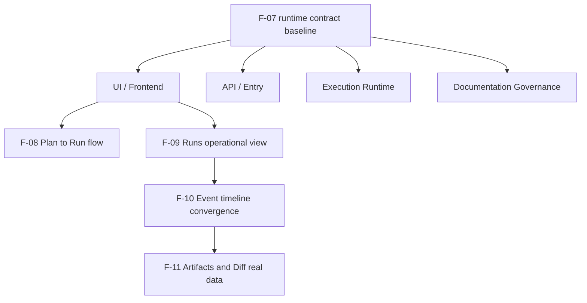
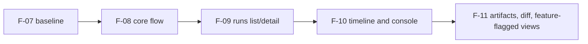

# Frontend Runtime Contract Technical Manual

## Subsystem In DVT Context

This manual defines the runtime contract boundary between `apps/web` and
`apps/api` for run orchestration and run monitoring.

Vertical impact:

- primary: UI / Frontend
- secondary: API / Entry
- tertiary: Execution Runtime
- supporting: Documentation Governance

## Historical Route Drift That F-07 Corrects

Before the current F-07 implementation, frontend runtime service behavior in
[runsService.ts](../../../../../apps/web/src/app/services/runs/runsService.ts):

- `startRun` posts to `POST /runs`
- `getRunStatus` reads `GET /runs/:runId/status`
- `getRun` reads `GET /runs/:runId`
- `listRunEvents` reads `GET /runs/:runId/events`

Protected runtime route map in
[runtimeRoutes.constants.ts](../../../../../apps/api/src/entrypoints/http/runtimeRoutes.constants.ts):

- `POST /runs/start`
- `GET /runs`
- `GET /runs/:runId`
- `GET /runs/:runId/events`

### Historical Drift Map

## Implemented Runtime Route Baseline

Frontend runtime contract now aligns to protected runtime route truth:

- start authority: `POST /runs/start`
- list authority: `GET /runs`
- run snapshot authority: `GET /runs/:runId`
- event timeline authority: `GET /runs/:runId/events`

`GET /runs/:runId/status` is removed from frontend runtime authority.
Status and lifecycle snapshot are read from `GET /runs/:runId`.

## Fowler Boundary Applied In F-07

Active route consumers now use explicit read models and a route-level facade:

- `listRunSummaries(): Promise<RunSummaryItem[]>`
- `getRunSnapshot(runId): Promise<RunSnapshot | null>`
- `listRunEvents(runId, afterSeq?): Promise<RunEventTimelinePage>`
- `startRun(input): Promise<EngineRunRef>`
- `loadRunWorkspace(runId): Promise<RunWorkspaceViewModel | null>`

Retired from active route consumers:

- `listRuns(): Promise<Run[]>`
- `getRun(runId): Promise<Run | null>`
- `getRunStatus(runId): Promise<RunStatusSnapshot>`

No compatibility mapping is allowed from snapshot payloads to a fake full
`Run` aggregate in the active Runs route.

### Implemented Route Contract Map

## Communication Matrix

| Frontend runtime intent | Runtime endpoint          | Authority   | Notes                                |
| ----------------------- | ------------------------- | ----------- | ------------------------------------ |
| start run               | `POST /runs/start`        | API / Entry | command route, auth and admission    |
| list runs               | `GET /runs`               | API / Entry | list/read route                      |
| fetch run snapshot      | `GET /runs/:runId`        | API / Entry | status truth and detail truth        |
| list run events         | `GET /runs/:runId/events` | API / Entry | ordered timeline feed for monitoring |

## Runs Versus Bottom Console Drawer

`GET /runs/:runId/events` now has two governed frontend consumers, but they do
not own the same product responsibility:

- `RunWorkspaceFacade` composes snapshot plus timeline into the durable
  run-detail workbench;
- `useConsoleLogStream()` mirrors the active run as a shell-level live stream
  companion;
- only the Runs workspace combines timeline with snapshot authority;
- the shell drawer must not present itself as the authoritative run-detail
  surface.

Current consumer split:

Authority rules:

1. `BottomConsoleDrawer` may show ordered live lines for the active run.
2. `BottomConsoleDrawer` must not derive snapshot truth, failure diagnostics,
   or result evidence on its own.
3. `RunWorkspaceStateView` owns snapshot truth and timeline degradation
   semantics for `/runs/:runId`.
4. Future convergence of logs, timeline, and terminal-grade streaming belongs
   to `F-10` and `F-18`, not to ad hoc shell copy drift.

## Runs Workbench State Ownership

`RunsView` is still the route compositor, but the route now has one governed
state contract that separates route-root state from workspace-inner state.

Rules:

1. Route-root state chooses between list, loading, missing, error, and focused
   workspace.
2. `/runs` must render a governed list-error state when `GET /runs` fails and
   no authoritative list data is available.
3. Degraded timeline treatment is not a route-root error state because the run
   snapshot is still authoritative and renderable.
4. The focused workspace may carry `snapshot-only` detail truth while still
   rendering a degraded or empty timeline notice honestly.
5. The route must never collapse `run-missing` and `run-degraded` into the same
   user treatment.

Primary anchors:

- [RunsView.tsx](../../../../../apps/web/src/app/views/RunsView.tsx)
- [runWorkbenchStateModel.ts](../../../../../apps/web/src/app/views/runs/runWorkbenchStateModel.ts)
- [WorkbenchStates.tsx](../../../../../apps/web/src/app/components/workbench/state/WorkbenchStates.tsx)
- [RunDetailStateViews.tsx](../../../../../apps/web/src/app/views/runs/RunDetailStateViews.tsx)
- [RunWorkspaceStateView.tsx](../../../../../apps/web/src/app/views/runs/RunWorkspaceStateView.tsx)

The runtime contract does not change because of this extraction. Shared
workbench state primitives now own the repeated route-state chrome, while
`Runs` continues to own route-specific copy and state selection.

## Shared Run Event Presentation Model

The shell drawer and the Runs route now share one event-presentation seam
before they render their different surfaces:

The shared model owns:

- event level (`INFO`, `WARN`, `ERROR`, `SUCCESS`);
- headline key;
- optional detail copied from runtime event payload message when present;
- step identity when the event belongs to one step.

The shared copy resolver owns:

- the governed human-readable headline text used by both drawer and timeline
  surfaces.

It does not change authority:

- `BottomConsoleDrawer` still renders a shell-level companion stream;
- `BottomConsoleDrawer` still owns terminal-style log-line composition;
- `RunWorkspaceStateView` still owns durable timeline interpretation;
- snapshot truth, failure diagnostics, and result evidence remain outside the
  shared event-presentation seam.

## PlanRef handoff prerequisite

The start-run contract is now preceded by backend-owned plan handoff routes:

- `POST /plans/preview` returns `{ plan, planRef }` when a valid preview is
  persisted.
- `POST /plans/import` returns `{ plan, planRef }` for a readable persisted
  plan inside the authorized scope.
- `apps/web/src/app/services/plans/plansService.api.ts` parses `planRef`
  directly from the payload and rejects envelopes that omit it.

This keeps the runtime boundary consistent:

1. preview or import returns a backend-authored `PlanRef`;
2. `useCanvasExecutionActions` fails closed if `currentPlan.planRef` is absent;
3. `runsService.startRun()` remains `PlanRef`-driven through `POST /runs/start`.

## Current Consumer Gap

The route baseline is now correct. Current limitation is explicit and truthful:

- `GET /runs/:runId` returns a runtime snapshot, not a full event-enriched run
  aggregate;
- the frontend must not present snapshot-only payloads as if they already carry
  step, timeline, artifact, or node-history detail;
- that richer operational detail remains a follow-on convergence slice for
  `F-09` through `F-11`.

## Vertical Impact Map

## Opportunity Register

1. Contract truth for UX state handling (loading, auth, not-found, conflict).
2. Clearer runtime error semantics at service level (`401/403/404/409/422/5xx`).
3. Lower rework risk for `F-08` through `F-11`.
4. Better service-level testability and deterministic route coverage.

## Consequences

- positive: route ownership and error posture become explicit
- positive: docs and code evolve against one runtime route baseline
- cost: strict migration work in service tests and route consumers
- cost: short-term refactor overhead while preserving mock mode behavior

## Handoff Chain

## Canonical References

- [Frontend Fowler Implementation Pattern](../frontend-fowler-implementation-pattern.md)
- [Runs Frontend Architecture](./dvt-runs-frontend-architecture.md)
- [Frontend Runtime Contract User Manual](./frontend-runtime-contract-user-manual.md)
- [F-07 Frontend Runtime Contract Baseline Plan](../../../../planning/proposals/mandatory/runtime-and-contracts/f-07-frontend-runtime-contract-baseline-plan-20260404.md)
