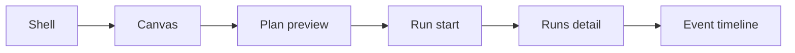

# Frontend Runtime Contract User Manual

## Purpose

This manual explains what users and operators should expect from the Runs and
execution flow once frontend runtime contract alignment is applied.

## Runtime Authority Rules

- run start is executed through `POST /runs/start`
- run detail and status truth come from `GET /runs/:runId` (snapshot authority)
- event timeline comes from `GET /runs/:runId/events`
- legacy `GET /runs/:runId/status` is not part of supported user behavior
- the run-detail route uses one composed workspace model, not a fake full
  aggregate

## User Journey (To-Be)

## Route-Level Behavior

### Canvas -> Run Start

- when start succeeds, the UI transitions to the selected run detail state
- conflict responses (`409`) are shown as actionable operator feedback
- permission failures (`401/403`) are shown as authorization issues, not as
  generic runtime failures

### Runs List (`/runs`)

- source of truth is runtime list endpoint
- empty state means no runs are available in current scope
- loading state means route is waiting for runtime list response

### Run Detail (`/runs/:runId`)

- single snapshot authority is `GET /runs/:runId`
- the same snapshot may carry persisted plan identity and authoring provenance
  for the run
- when only snapshot data is available, the UI shows a runtime snapshot state;
- when events are available, timeline appears in the same run workspace context;
- the route never invents step, artifact, or metrics detail from empty
  placeholders
- if not found (`404`), the UI must show run-not-found semantics
- server failures (`5xx`) are treated as runtime availability issues

### Event Timeline

- source of truth is `GET /runs/:runId/events`
- timeline is treated as supplemental run evidence, not as run-status authority
- the dedicated timeline workbench remains a later convergence slice beyond the
  snapshot baseline

### Shell Drawer Versus Runs Detail

- the shell drawer is a quick live companion for the currently active run
  stream;
- the Runs detail route is the durable monitoring workspace for one run;
- the shell drawer does not replace runtime snapshot, degraded timeline, or
  failure-diagnostics treatment from `/runs/:runId`;
- if an operator needs authoritative run explanation, they should use the Runs
  workspace rather than the shell drawer.

## Failure Semantics For Operators

| Status class | User meaning                            | UX posture                                |
| ------------ | --------------------------------------- | ----------------------------------------- |
| `401`        | session is not authenticated            | sign-in or session recovery path          |
| `403`        | authenticated but not authorized        | permission denial message                 |
| `404`        | run or route target not found           | not-found state, offer return to list     |
| `409`        | command conflict or invalid transition  | conflict guidance and retry constraints   |
| `422`        | invalid payload or request constraints  | validation feedback and correction action |
| `5xx`        | runtime service unavailable or degraded | service degradation message and retry     |

## Mock And API Modes

- API mode uses governed runtime contract routes.
- Mock mode remains available for local development.
- mode selection is an implementation concern; users interact with one run flow
  model and one route grammar.

## What Users Gain

1. predictable run-start behavior
2. one consistent run detail authority
3. caller-visible linkage from authoring artifacts to persisted plan to outcome
4. explicit separation between run snapshot and event timeline
5. fewer ambiguous error messages during execution monitoring
6. no fake detail panels that imply data the backend has not provided

## Related Pages

- [Frontend Fowler Implementation Pattern](../frontend-fowler-implementation-pattern.md)
- [Runs Frontend Architecture](./dvt-runs-frontend-architecture.md)
- [Frontend Runtime Contract Technical Manual](./frontend-runtime-contract-technical-manual.md)
- [Frontend Data-Boundary Architecture](../frontend-data-boundary-architecture.md)
