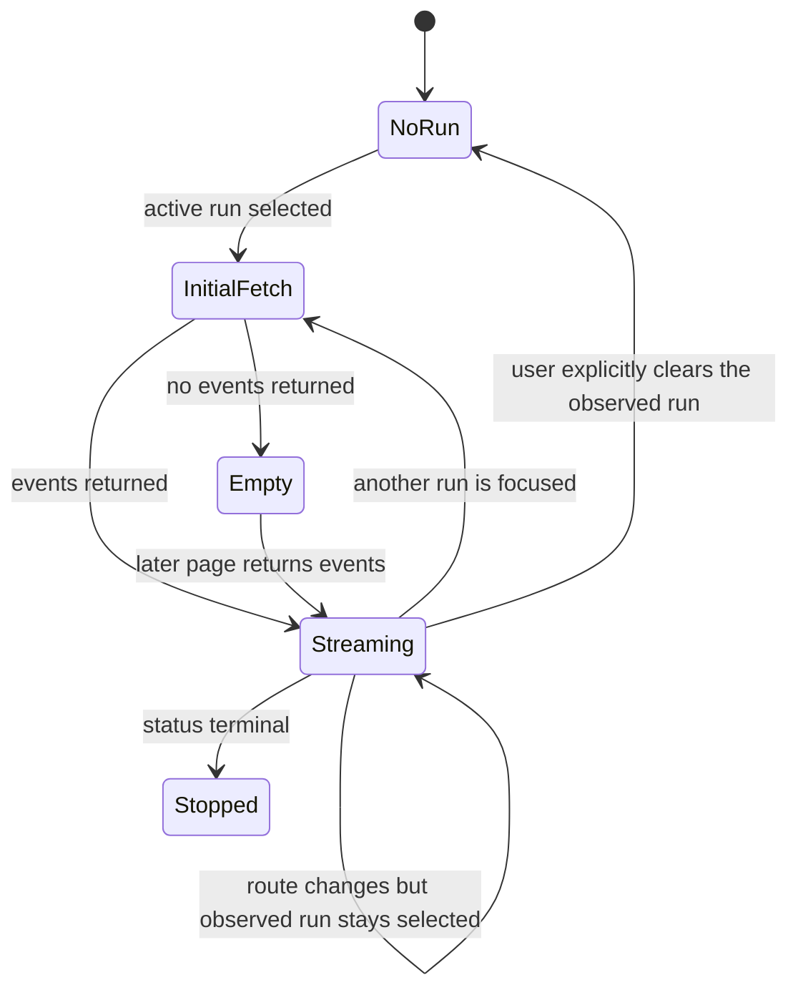
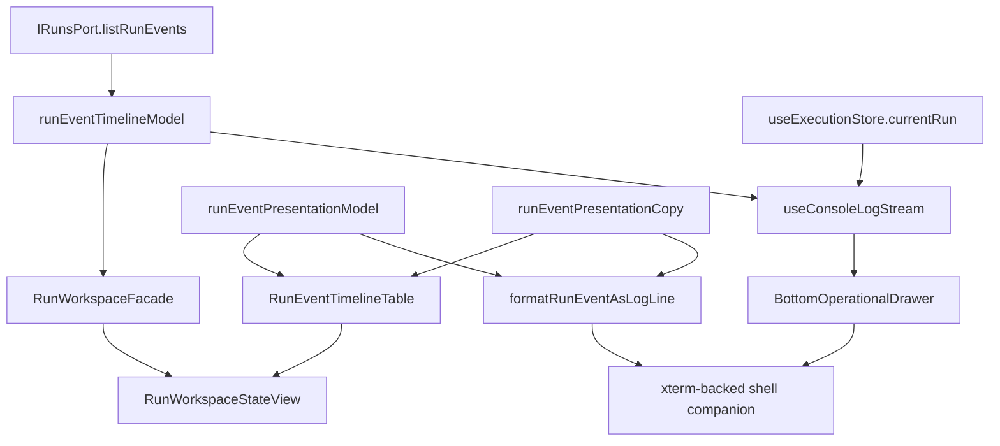

# Run Event Timeline Component

This local component owns frontend semantics for run event chronology across
the durable Runs workspace and the shell console companion.

It does not own runtime snapshot truth, result evidence, failure diagnostics,
or artifact authority. Those remain snapshot and workspace concerns.

## Public API

| API                               | Kind               | Owner                        | Contract                                                               |
| --------------------------------- | ------------------ | ---------------------------- | ---------------------------------------------------------------------- |
| `RUN_EVENT_LIVE_POLL_INTERVAL_MS` | constant           | Run event timeline model     | Shared polling interval for active event streams                       |
| `isRunEventStreamLiveStatus`      | query helper       | Run event timeline model     | Returns `true` for `pending` and `running` run statuses only           |
| `normalizeRunEventTimelinePage`   | query helper       | Run event timeline model     | Orders and deduplicates one event page while preserving `nextAfterSeq` |
| `mergeRunEventTimelinePage`       | query helper       | Run event timeline model     | Merges a new page into existing timeline state by event identity       |
| `buildRunEventPresentationModel`  | presentation model | Run event presentation model | Maps a raw event into level, headline key, detail, and step identity   |
| `resolveRunEventHeadline`         | copy resolver      | Run event presentation copy  | Resolves human-readable event headline copy                            |
| `formatRunEventAsLogLine`         | terminal renderer  | Shell log event rendering    | Formats shared event semantics as one terminal-style line              |
| `XtermConsole`                    | terminal view      | Shell log event rendering    | Renders formatted event lines as the xterm-backed shell companion      |
| `RunEventTimelineTable`           | structured view    | Runs workspace timeline      | Renders shared event semantics as durable dense timeline rows          |

## Invariants

1. `IRunsPort.listRunEvents` is the only frontend event chronology query rail.
2. Event stream order is by `runSeq`, then `emittedAt`, then `eventId`.
3. Duplicate `eventId` values collapse to one visible event.
4. `nextAfterSeq` is preserved when supplied by the adapter.
5. Active event streams poll only while the run status is `pending` or
   `running`.
6. The shell operational drawer keeps the last focused run as an observation cursor across
   Canvas and Runs list route navigation.
7. Operational log lines and Runs timeline rows share event severity and headline
   semantics.
8. Timeline events must not infer snapshot status, materialization evidence,
   failed step diagnostics, or authoring provenance.
9. A detail route for a different `runId` clears the previous observed run
   while its workspace is loading, missing, or errored, so the shell operational drawer does
   not poll stale run evidence for the active route.

## Transitions

## Consumer Diagram

## Consumers

| Consumer                  | File                                                                                                                          | Responsibility                                           |
| ------------------------- | ----------------------------------------------------------------------------------------------------------------------------- | -------------------------------------------------------- |
| `RunWorkspaceFacade`      | [runWorkspaceFacade.ts](../../../../../apps/web/src/app/services/runs/runWorkspaceFacade.ts)                                  | Builds durable snapshot-plus-timeline workspace state    |
| `useConsoleLogStream`     | [useConsoleLogStream.ts](../../../../../apps/web/src/app/components/console/useConsoleLogStream.ts)                           | Mirrors the shell-observed run into the operational log  |
| `XtermConsole`            | [XtermConsole.tsx](../../../../../apps/web/src/app/components/console/XtermConsole.tsx)                                       | Renders terminal-grade live companion lines              |
| `RunEventTimelineTable`   | [RunEventTimelineTable.tsx](../../../../../apps/web/src/app/views/runs/RunEventTimelineTable.tsx)                             | Renders dense event rows from shared event semantics     |
| `BottomOperationalDrawer` | [BottomOperationalDrawer.tsx](../../../../../apps/web/src/app/components/shell/BottomOperationalDrawer.tsx)                   | Renders operational drawer log state                     |
| `RunWorkspaceStateView`   | [RunWorkspaceStateView.tsx](../../../../../apps/web/src/app/views/runs/RunWorkspaceStateView.tsx)                             | Renders durable run workspace using dense event rows     |
| Architecture guard        | [runsDomainBoundary.architecture.test.ts](../../../../../apps/web/src/app/views/runs/runsDomainBoundary.architecture.test.ts) | Validates semantic convergence, docs, and owned concerns |

## Mature-System Comparison

Mature log and workflow systems separate transport, stream state, and rendering:

- Temporal UI keeps workflow history ordering separate from detail panels.
- Grafana Explore separates log query, cursor, labels, and row rendering.
- Datadog Logs separates ingestion identity from display rows and facets.
- VS Code keeps terminal lines separate from problem diagnostics.

This component follows the same split: one stream model owns chronology; the
shell store owns the observation cursor; each surface renders the chronology in
its own visual language.
