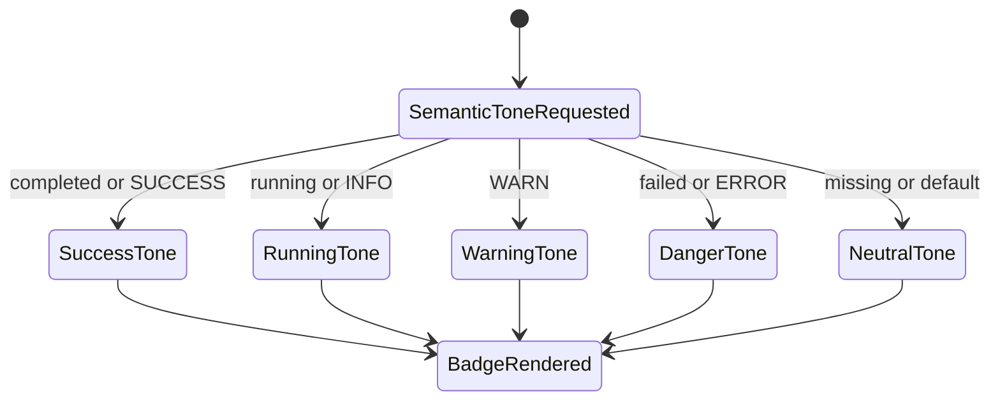
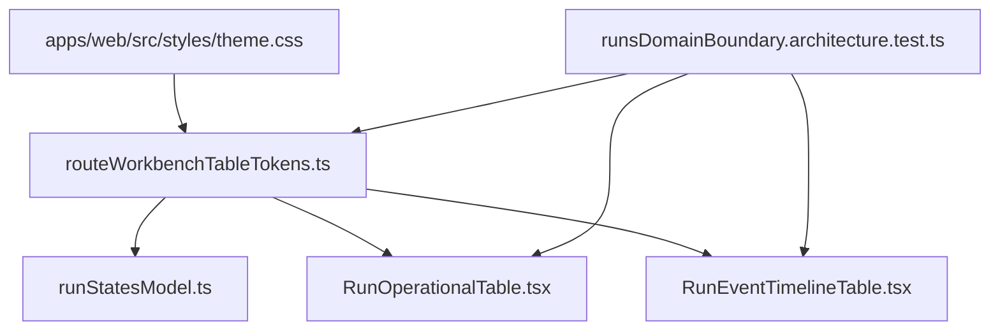

# Runs Dense Table Visual Tokens Component

## Purpose

This component owns the visual-token boundary for dense Runs tables. It keeps
Runs list and event chronology tables aligned with the operator-workbench visual
system without giving route components authority over raw color families.

Owned concern: dense table views consume named table tokens; `theme.css` owns
raw semantic values.

## Public API

| API                                          | Kind         | Contract                                                                          |
| -------------------------------------------- | ------------ | --------------------------------------------------------------------------------- |
| `routeWorkbenchDenseTableClasses`            | constant     | Shared dense table field, muted text, subtle text, empty cell, and layout classes |
| `routeWorkbenchStatusToneClasses`            | constant     | Semantic status badge classes for run status and event level tones                |
| `getRouteWorkbenchStatusToneClassName(kind)` | query helper | Returns the badge class for a known semantic status tone                          |

## Invariants

1. The component composes semantic CSS variables such as `--surface-app`,
   `--border-default`, `--text-muted`, and `--status-*`.
2. Runs table view modules do not use `slate-*`, `bg-red-*`, `bg-blue-*`,
   `bg-yellow-*`, `bg-green-*`, or raw hex color classes.
3. The token component does not own row identity, route navigation, filter
   state, sorting, API calls, or event interpretation.
4. Status colors are semantic, not decorative. Run status and event level tones
   must resolve through the same token surface.

## Transitions

## Consumer Diagram

## Consumers

| Consumer                                  | Responsibility                                                  |
| ----------------------------------------- | --------------------------------------------------------------- |
| `RunOperationalTable`                     | Uses dense field, muted, and empty-cell classes                 |
| `RunEventTimelineTable`                   | Uses event level badge tones and subtle text classes            |
| `runStatesModel`                          | Maps run statuses to semantic badge tone classes                |
| `runsDomainBoundary.architecture.test.ts` | Prevents route-level dense-table color hardcodes from returning |

## Negative Rules

- Do not add raw Tailwind color families to Runs dense table view modules.
- Do not add a second status-tone function inside table views.
- Do not move API, query, or event authority into this token module.
- Do not use this component as a global design-system rewrite; it is a narrow
  F-24 convergence point for dense workbench tables.
