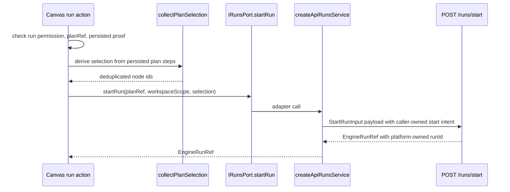
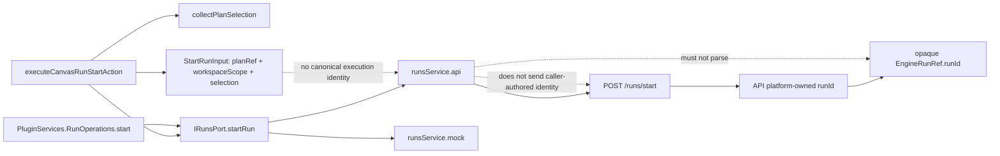
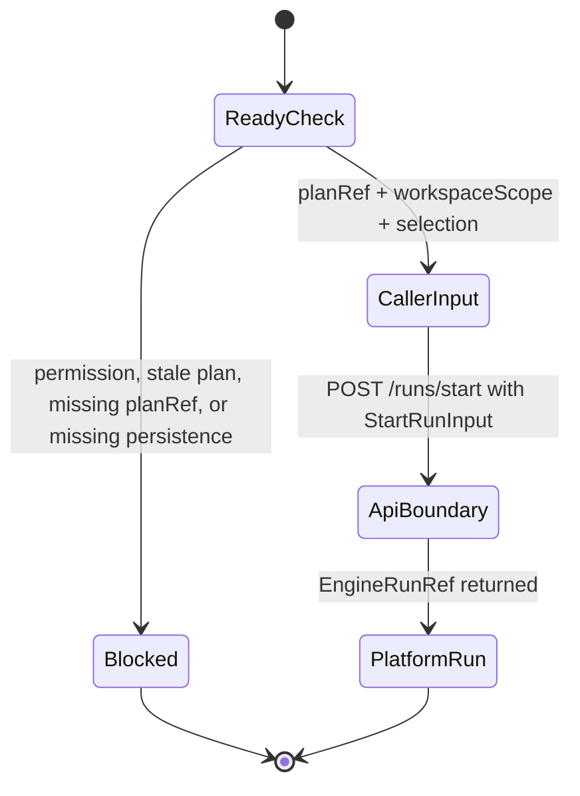

# Start-run Client Identity Boundary

This local component guide documents the `apps/web` side of the start-run
identity boundary.

The component answers one question:

> What can the client contribute to `POST /runs/start`, and what must remain
> platform-owned?

The answer is intentionally narrow. Web can contribute plan intent, workspace
scope, and canonical execution selection only. Web cannot author canonical
execution identity.

Use this guide with:

- [Start-run HTTP entrypoint component](../../../../../apps/api/docs/start-run-http-entrypoint-component.md)
- [Start-run platform identity component](../../../../../apps/api/docs/start-run-platform-identity-component.md)
- [Canvas execution selection component](../graph/canvas-execution-selection-component.md)
- [Frontend-facing backend MVP contract](./frontend-backend-mvp-contract.md)
- [ADR-0050 platform-owned start-run identity](../../../../adr/adr-0050-platform-owned-start-run-identity.md)
- [Fowler analysis mailbox](../../../../../buzon/20260423-codex-fowler-tenant-run-identity-analysis-and-remediation.md)

## Owned Concern

The component owns exactly one concern:

- adapt Canvas and plugin-facing start-run intent into a caller-owned
  `StartRunInput` without creating, guessing, or preserving canonical runtime
  `runId`

It does **not** own:

- runtime execution identity
- duplicate-run semantics
- engine lifecycle state
- provider workflow identity
- retry idempotency
- `runId` format interpretation, timestamp parsing, or local ordering rules

## Public API

- `StartRunInput`
  Presentation-facing DTO with `planRef`, `workspaceScope`, and `selection`.
- `IRunsPort.startRun(input)`
  Web port for starting a run from presentation code.
- `createApiRunsService(...).startRun(input)`
  HTTP adapter that flattens workspace scope into the `/runs/start` request and
  omits `runId`.
- `createMockRunsService(...).startRun(input)`
  Local/mock adapter that returns generated mock refs while preserving the
  same caller-owned input shape.
- `createRunsService(mode, apiClient, dependencies)`
  Composition seam that selects API or mock adapter without changing the
  caller-owned `IRunsPort` contract.
- `executeCanvasRunStartAction(...)`
  Canvas action that checks readiness and delegates to `IRunsPort.startRun`.
- `collectPlanSelection(plan)`
  Semantic seam that derives caller-owned plan-node selection from the
  persisted plan view.
- `RunOperations.start(input)`
  Plugin-facing optional run-start operation using the same caller-owned
  `StartRunInput` shape.

## Invariants

- `StartRunInput` is the complete client-authored start-run request contract.
- Canvas run start builds `StartRunInput` from plan reference, workspace scope,
  and canonical execution selection only.
- The `/runs/start` HTTP payload carries caller-owned start intent only; it
  does not carry canonical execution identity.
- `workspaceScope` is caller-owned scope context, not runtime identity.
- `selection` is derived from plan nodes and is deduplicated in plan order.
- API response `EngineRunRef.runId` is the first authoritative run identity the
  client can observe.
- Observed `EngineRunRef.runId` values are opaque. The current API allocator
  emits `run_<UUIDv7>` for platform locality and collision resistance, but web
  code must not parse or depend on the UUID timestamp bits.
- Mock mode can generate local `run_mock_*` refs only as adapter output, never
  as request input.

## Transitions

## Component Map

## State Boundary

## Consumers

- [runs.ts](../../../../../apps/web/src/app/ports/runs.ts)
- [runsService.api.ts](../../../../../apps/web/src/app/services/runs/runsService.api.ts)
- [runsService.mock.ts](../../../../../apps/web/src/app/services/runs/runsService.mock.ts)
- [runsService.ts](../../../../../apps/web/src/app/services/runs/runsService.ts)
- [canvasRunStartAction.ts](../../../../../apps/web/src/app/views/canvas/canvasRunStartAction.ts)
- [canvasRunSelection.ts](../../../../../apps/web/src/app/views/canvas/canvasRunSelection.ts)
- [PluginServices.ts](../../../../../apps/web/src/app/plugins/contracts/PluginServices.ts)
- [canvasRunStartIdentity.architecture.test.ts](../../../../../apps/web/src/app/views/canvas/canvasRunStartIdentity.architecture.test.ts)

## Fitness Function

The component is guarded by
`apps/web/src/app/views/canvas/canvasRunStartIdentity.architecture.test.ts`.

That test validates semantics, not barrel thinness:

- selection derivation is a named seam with an owned concern
- start-run action imports the selection seam instead of carrying duplicate
  selection traversal
- start-run action calls `IRunsPort.startRun(...)` with the complete
  `StartRunInput` shape: `planRef`, `workspaceScope`, and `selection`
- `StartRunInput` exposes no canonical execution identity field
- `collectPlanSelection(...)` preserves plan order while deduplicating node ids

## Extension Rules

- Add new caller-owned request fields to `StartRunInput` only when the backend
  route contract already owns and validates them.
- Do not add `runId`, `workflowId`, provider ids, or retry keys to
  `StartRunInput` without a new ADR.
- Preview/import context remains a separate plan-preview contract. It is not
  part of `StartRunInput`.
- Treat returned `EngineRunRef.runId` as a string key only. Sorting,
  idempotency, retries, and lifecycle decisions belong to backend/runtime
  contracts, not to frontend UUID interpretation.
