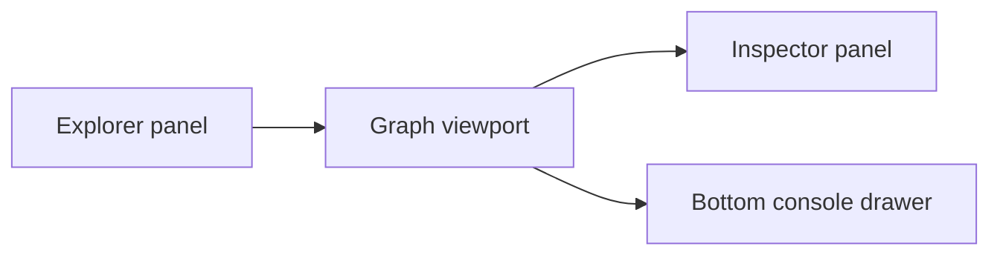
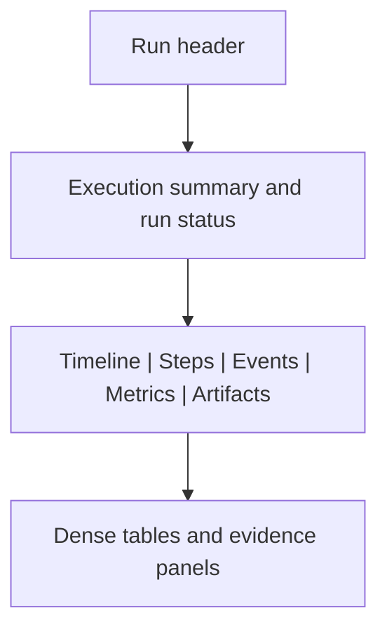
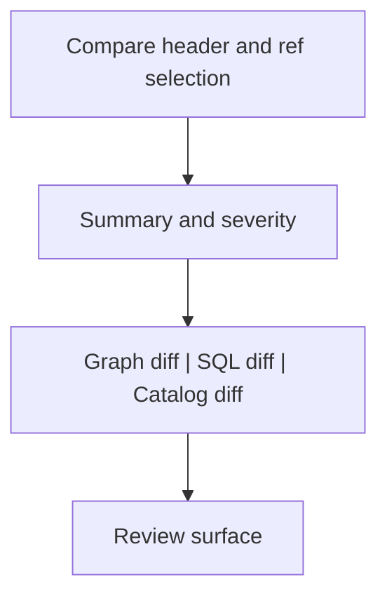
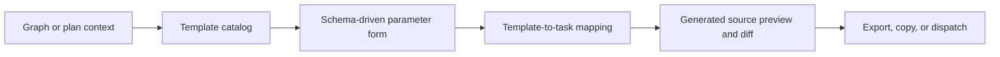

# Screen Layout And Cross-Surface Behavior Rules

## Purpose

This document fixes the intended behavior of each main workbench screen and the
rules for how those screens relate to each other.

It exists to answer questions that the UI inventory alone does not answer:

1. when two surfaces should coexist side by side;
2. when a user should move to another route instead;
3. how Git review, graph context, templates, metrics, and telemetry fit
   together;
4. what the operator should see in each screen at a mature product state.

Use it with:

- [Workbench UI Contract And Component Inventory](./workbench-ui-contract-and-component-inventory.md)
- [Iconography And Design Tokens Contract](./iconography-and-design-tokens-contract.md)
- [Main Workspace Views And UX](./main-workspace-views-and-ux.md)
- [UX Implementation Guide](./ux-implementation-guide.md)
- [Git Mode Architecture](./git/git-mode-architecture.md)
- [Frontend Observability Architecture](./observability/front-observability-architecture-dvt.md)

## Global Visual Direction

Every main route should feel like the same operator workbench, but not like the
same screen repeated.

Shared rules:

- persistent shell and left navigation;
- one route owns the center at a time;
- route-local toolbar below the shell header;
- side panels for context and secondary detail;
- bottom drawer for supporting execution evidence;
- high information density with strong visual hierarchy;
- no route should mix authoring, review, operations, and generation into one
  overloaded surface.

Visual tone:

- dark, low-glare control-room palette;
- restrained accent color usage for status and priority;
- icon plus label in primary navigation and actions;
- cards used sparingly for summary, not as the main grammar everywhere;
- large central surfaces for graph, tables, diff, and preview panes.

## Screen Ownership Matrix

| Screen      | Primary job                                       | Secondary context allowed in the same route                          | What should move to another route                                      |
| ----------- | ------------------------------------------------- | -------------------------------------------------------------------- | ---------------------------------------------------------------------- |
| `Canvas`    | graph authoring and graph-context actions         | inspector, explorer, read-only SQL preview, runtime overlays         | full SQL review, full Git review, artifacts browser, source generation |
| `Runs`      | execution operations and run evidence             | metrics, events, artifacts for the active run, worker or lag signals | graph editing, template generation                                     |
| `Lineage`   | dependency and impact analysis                    | breadcrumb, impact summary, optional column lineage                  | graph authoring, Git review                                            |
| `Code`      | read-only file browsing and selected-file history | file tree, source preview, selected-file metadata                    | repository compare ownership, staging, shell-level Git navigation      |
| `Diff`      | repository-aware structural and SQL review        | graph diff, SQL diff, catalog diff, compare controls                 | graph editing, task generation                                         |
| `Artifacts` | immutable artifact browsing                       | manifest, run results, catalog preview, import flows                 | graph authoring, execution operations                                  |
| `Templates` | source generation and provider task scaffolding   | template selection, parameter form, preview, diff, export            | graph editing, full run monitoring                                     |

## Canvas Rules

### Primary layout

Canvas is graph-first.

That means:

- the graph owns the center;
- explorer is a source browser, not a second navigation system;
- inspector is selection-driven, not a generic detail dashboard;
- toolbar actions stay graph-contextual (`layout`, `impact`, `columns`,
  `plan`, `run`);
- metrics and runtime information stay lightweight and contextual.

### Graph and SQL coexistence

Graph can coexist with SQL, but only as contextual support.

Rules:

- SQL may appear in the inspector or bottom drawer as a read-only preview for
  the selected node;
- SQL preview in `Canvas` is for orientation, not for full review;
- large SQL comparison, structured review, and generated-source diff move to
  `Diff` or `Templates`;
- Monaco does not become a permanent equal primary surface next to the graph in
  the normal `Canvas` workbench.

Decision:

- allow `graph + SQL preview`;
- do not design `Canvas` as `graph + full SQL editor` by default.

### Canvas and templates

Canvas can originate template generation intent, but it does not own generation
UI.

Rules:

- selected graph nodes or plan context may launch `Templates`;
- Canvas passes workflow context and selection, not provider code-generation
  semantics;
- the toolbar must not grow into a template catalog or parameter form.

## Runs Rules

### Primary layout

Runs is the operational workbench and is the best home for a dashboard-like
visual density.

Rules:

- this is where tables, KPIs, lag indicators, and operational summaries belong;
- a run detail page should feel like one workspace for one run;
- metrics, logs, artifacts, and status are all evidence of the same execution,
  not separate mini-apps;
- if a card layout stops scaling, move to dense tables rather than stacking more
  cards.

## Lineage Rules

Lineage is read-only analysis, not authoring.

Rules:

- search or focused node selection starts the journey;
- center surface shows impact structure, not the full editing graph grammar;
- column lineage is optional and only appears when metadata exists;
- `Pin to Canvas` is a handoff action, not a mode switch that turns Lineage into
  Canvas.

## Code Rules

Code is the file-browsing workbench, not a browser Git client.

Rules:

- `Code` owns the selected file, file tree, and read-only preview;
- file-history review is scoped to the selected file only;
- `Code` may expose revision entry actions, but revision comparison itself moves
  to `Diff`;
- `Code` must not introduce branch management, staging, commit creation, or
  conflict resolution in this slice.

## Diff And Git Rules

### Git handling model

Git is handled as a governed review surface, not as a generic Git client.

Rules:

- repository context such as branch, compare refs, or active repo may appear in
  the shell top bar and in the Diff route header;
- `Diff` owns compare mode, severity filters, and review tabs;
- `Diff` is where `Git SHA diff`, `run diff`, graph delta review, SQL diff, and
  catalog diff belong;
- staging, conflict resolution, and full repository management are not required
  in the current product direction.

Decision:

- DVT should expose domain-aware Git review;
- DVT should not attempt to replicate a full desktop Git client in the browser.

### Diff primary layout

Rules:

- summary comes before raw diff detail;
- SQL review is a Monaco-backed primary surface here, not in Canvas;
- graph diff can reference topology without becoming a live editable graph;
- if a graph change needs authoring follow-up, hand the user back to `Canvas`.

## Artifacts Rules

Artifacts is an immutable inspection route.

Rules:

- use it for manifest, run results, and catalog browsing;
- local imports are explicit and reversible;
- payload viewing can become Monaco-backed, but remains read-only;
- Artifacts may show Git or run provenance, but it does not become a run
  workspace or code editor.

## Templates Rules

### Templates and generated tasks

Templates is the future generation workbench.

Its job is not to let users type provider tasks freehand. Its job is to turn
workflow context into governed provider-facing artifacts.

Relationship rules:

- a template represents a governed generation profile;
- templates are selected based on workflow context, provider profile, and task
  intent;
- a template may generate one or more provider tasks or execution artifacts from
  one selected workflow context;
- task generation belongs to template semantics and backend contracts, not to
  ad hoc string building in React components;
- the result must carry provenance: template id, version, provider profile, and
  source workflow context.

Practical example:

- select one graph node or a plan subset in `Canvas`;
- open `Templates` with that context;
- choose `Snowflake task`, `stored procedure`, or ETL scaffold profile;
- fill governed parameters;
- preview generated SQL or task definitions;
- diff before export or dispatch.

### Templates primary layout

| Area                | Responsibility                             |
| ------------------- | ------------------------------------------ |
| Left panel          | template catalog and provider profile      |
| Center              | parameter form and generation controls     |
| Right or split pane | generated source preview and diff          |
| Bottom drawer       | generation logs, validation, or provenance |

## Metrics And Telemetry Rules

Observability is distributed on purpose.

Rules:

- shell-level platform health stays in the shell;
- run telemetry and execution evidence live in `Runs`;
- lightweight runtime overlays or cost hints may appear in `Canvas` only when
  they support graph decisions;
- there is no requirement for a separate top-level metrics dashboard route today;
- telemetry must be operational and evidence-oriented, not generic browser
  analytics.

### Where each signal belongs

| Signal                                         | Home surface                                          |
| ---------------------------------------------- | ----------------------------------------------------- |
| platform health, degraded backend state        | shell top bar and health banner                       |
| run progress, step status, event stream        | `Runs`                                                |
| run metrics and charts                         | `Runs`                                                |
| worker lag, outbox lag, backlog hints          | `Runs` and shell-level degraded signals when critical |
| node runtime or cost overlays                  | `Canvas` contextual overlays                          |
| recent failures and operational summaries      | `Runs`                                                |
| selected-file history entry                    | `Code`                                                |
| repository diff severity                       | `Diff`                                                |
| template validation and generation diagnostics | `Templates`                                           |

## Cross-Screen Handoffs

| From      | To          | Trigger                            | Rule                                                      |
| --------- | ----------- | ---------------------------------- | --------------------------------------------------------- |
| `Canvas`  | `Runs`      | `Run` started                      | explicit route navigation                                 |
| `Canvas`  | `Diff`      | need full SQL or structural review | hand off review, do not overload Canvas                   |
| `Canvas`  | `Templates` | need provider task generation      | pass workflow context only                                |
| `Lineage` | `Canvas`    | pin or follow-up authoring         | return to authoring route                                 |
| `Code`    | `Diff`      | open revision compare              | keep history entry in `Code`, compare ownership in `Diff` |
| `Runs`    | `Artifacts` | inspect payload or outputs         | artifact-specific inspection route or tab                 |
| `Diff`    | `Templates` | review generated source deltas     | keep review and generation close but still route-owned    |

## Immediate Design Decisions Locked By This Document

1. `Canvas` stays graph-first and only supports read-only SQL context, not full
   SQL review as a co-equal primary surface.
2. `Code` owns read-only file browsing and selected-file history entry.
3. Full SQL diff and Git-aware revision comparison belong to `Diff`.
4. Git is modeled as a domain-aware review experience, not a full browser Git
   client.
5. `Templates` owns governed task generation from templates, profiles, and
   workflow context.
6. Metrics and telemetry are distributed across shell and `Runs`, with only
   contextual overlays in `Canvas`.
7. No single route should try to combine graph authoring, Git review, run ops,
   artifact browsing, and source generation at once.
