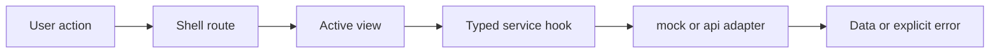
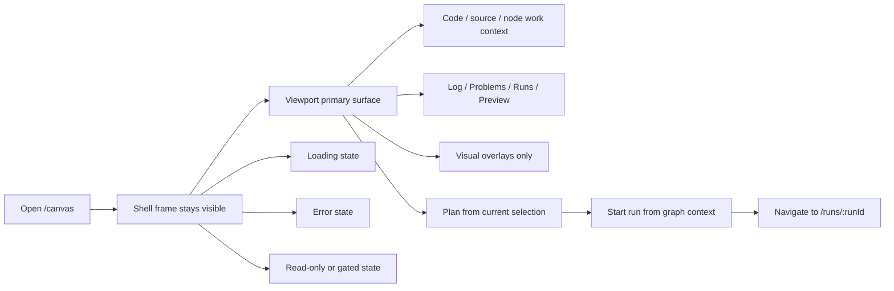
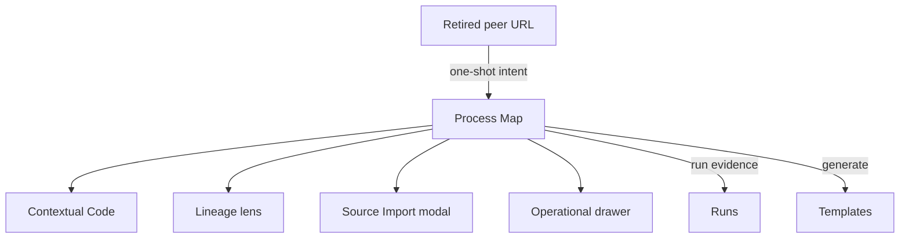

# Screen Manuals And User Stories

This document defines what each main frontend screen is expected to do from a
user perspective.

It works as a lightweight user manual plus a story inventory for the current
frontend surfaces and the next governed route-level slice that still needs
delivery.

## Shell

### User expectation

The user always understands:

- where they are;
- which tenant, project, and environment are active;
- whether the platform is healthy;
- how to reach the main route-level workbenches.
- how to identify and, when another grant is available, change the active
  project without guessing that the workspace context is interactive;
- how to change the application language from the View menu, with visible and
  accessible copy updating immediately.

### Primary user stories

- As an operator, I want to see platform health without leaving my current
  screen so I can react to degraded backend conditions quickly.
- As a user, I want tenant, project, and environment to stay visible so I do
  not act in the wrong context.
- As a user, I want a stable shell while moving across screens so the product
  feels like one tool.

### Expected states

- Loading: shell frame visible while route content loads.
- Degraded: health banner explains degraded or offline state.
- Error: route-level errors do not destroy the shell frame.
- One granted project: the current project control remains visible and explains
  that no alternative project is available in this session.
- Multiple granted projects: the same control exposes the authorized choices,
  clearly marks the active one, and moves focus predictably after selection.
- Language changed: shell, active route, menus, tooltips, and open contextual
  surfaces use the selected language without a page reload.

### F-04 Data source behavior

- Users should not see route-specific wiring differences between `mock` and
  `api`.
- `api` is the canonical product runtime; `mock` remains an explicit isolated
  test/demo posture and is not accepted as product evidence.
- Source Import uses protected API rails for connection list/create/test,
  provider-neutral object discovery, and registration. Backend rejection is
  surfaced without silent fallback behavior.
- The console no longer pretends mock log lines are real in `api` mode.
- In `api` mode, the console empty state uses product wording about run events
  and explicitly states that live log streaming is not yet available.

## Canvas

### User expectation

Canvas is the primary Process Map and authoring workspace for heterogeneous
DVT+ graphs. dbt is the current native transformation vertical, not the whole
product ontology.

The user expects to:

- inspect the graph;
- open Code, source import, project exploration, and node detail contextually
  without replacing the Process Map;
- request plan;
- start a run;
- understand visual overlays without changing graph truth accidentally.
- follow dependency direction from a visible arrow, including selected and
  dimmed graph states;
- distinguish “selected for execution” from “currently running” through paired
  labels and play/pause-style state iconography;
- add a component from grouped categories without horizontal scrolling.

### Current user journey

The Canvas route behaves as one contextual graph workbench with:

- the Process Map as the persistent primary surface;
- Code and node details opened contextually while the graph remains visible;
- Source Import and project exploration opened on demand rather than as fixed
  resource rails;
- Log, Problems, Runs, and Preview retained in the bottom operational drawer;
- Preview and run-start actions tied to the same authoritative persisted
  preview and immutable `PlanRef`.

This is the route model delivered by
[US-F10.1](https://github.com/dunay2/dvt/issues/2102). Legacy peer workbench
routes may preserve deep-link intent, but they do not own additional permanent
work surfaces or a second graph model.

### Primary user stories

- As an author, I want to inspect graph topology in one primary surface so I can
  reason about the workflow.
- As an author, I want explorer and inspector panels to be optional so I can
  focus on the graph when needed.
- As an author, I want plan and run actions to stay near the graph so the
  authoring flow is coherent.

### Expected states

- Empty: explain that no graph content is loaded yet.
- Loading: graph load keeps the shell and route frame stable while local canvas
  state resolves.
- Error: keep shell and route context visible, with safe canvas state and retry
  if meaningful.
- Read-only: overlays and inspection remain available while mutation is gated by
  an explicit route-local banner.
- Code open: project and node code use a movable contextual workbench, preserve
  the Process Map, and show the complete authoritative workspace file.
- Component catalog open: categories are named, items remain fully visible, and
  search keeps category context.

### Hardening direction

This route is moving toward a stricter controller boundary with these
user-facing guarantees:

- graph load state must not make layout persistence behave unpredictably during
  hydration or query startup;
- overlay toggles stay visual projections only and do not rewrite graph truth;
- plan and run actions remain graph-contextual and close to the graph surface;
- route-side navigation after run start remains explicit instead of being hidden
  inside unrelated graph state updates.

### Explicit non-promises

This remediation does not promise:

- new canvas features;
- a new route or panel;
- console or live-log convergence;
- a visible workflow change for planning or run-start beyond more deterministic
  route behavior.

## Runs List

### User expectation

The runs landing screen shows past and current executions and acts as the entry
point for execution investigation.

Contract authority:

- list source: `GET /runs`
- run start source: `POST /runs/start`

### Primary user stories

- As an operator, I want to find a failed or active run quickly so I can inspect
  it.
- As an operator, I want the list to scale beyond cards when data density
  increases.
- As an operator, I want an empty state to tell me how to create work instead of
  leaving me with a dead screen.

### Expected states

- Empty: send the user back to Canvas to plan and start a run.
- Loading: route frame remains stable while runs load.
- Error: explain that run data could not be loaded and offer retry.

## Run Detail

### User expectation

Run detail behaves like one operational workspace, not several unrelated tabs.

The user expects:

- a stable run workspace state;
- truthful snapshot authority;
- timeline evidence when available;
- explicit partial or degraded signaling when detail is missing.

Contract authority:

- run snapshot source: `GET /runs/:runId`
- event timeline source: `GET /runs/:runId/events`

### Primary user stories

- As an operator, I want to understand where a run is or failed without
  reconstructing execution state myself.
- As an operator, I want snapshot and timeline to stay tied to the same run
  context.
- As an operator, I want degraded or partial data to be obvious so I do not
  mistake stale state for canonical truth.

### Expected states

- Loading: preserve route frame while detail loads.
- Missing: explicit run-not-found state.
- Snapshot-only: route remains operational without fake step or artifact detail.
- Degraded: timeline failure does not erase a valid snapshot state.

## Lineage Lens

### User expectation

Lineage is a read-only dependency and impact-analysis lens over the Process
Map. It is not a peer route or a second graph model.

The user expects:

- search or focus-driven entry;
- bounded upstream and downstream scope;
- impact summary before deep detail.

### Primary user stories

- As an analyst, I want to see what a node depends on and what it affects so I
  can understand change impact.
- As an analyst, I want column lineage only when metadata exists so the screen
  does not pretend to know more than it does.

### Expected states

- Empty: explain that no lineage focus is available.
- Loading: preserve route frame.
- Missing metadata: explain why column lineage is unavailable.

## Contextual Code Workbench

### User expectation

Code is the contextual workspace file editor for the active project or selected
node. It keeps the Process Map visible and automatically synchronizes edits
through the revision-guarded `SaveWorkspaceFileContent` command.

The user expects:

- one selected file at a time;
- a stable file tree and editable Monaco surface;
- explicit modified, syncing, synchronized, conflict, failed, and read-only
  states without a second Save lifecycle;
- contextual file history attached to the selected file.
- a movable workbench with an explicit drag handle that never depends on a
  hidden gesture;
- permanent header copy limited to identity and status; explanatory guidance is
  available on hover and keyboard focus through localized accessible help;
- the selected node's code command to resolve the complete authoritative file,
  not a generated excerpt or reconstructed snippet.

### Primary user stories

- As an operator, I want to browse workspace files inside the main shell so I
  can inspect source without leaving the product.
- As an author, I want edits to synchronize through compare-and-swap so a stale
  browser cannot overwrite newer project content.
- As a reviewer, I want selected-file history to stay attached to the current
  file without requiring a permanent peer route.

### Expected states

- Empty: explain that no file is selected or no workspace files are available.
- Loading: keep the Process Map visible while file tree or content resolves.
- Error: preserve selected-file context and explain which file surface failed.
- Modified/syncing/synchronized: report working-tree persistence without
  claiming a Git commit or push.
- Conflict: retain the current file and require reconciliation with the
  authoritative revision.
- Read-only: make it clear that browsing is allowed but editing is not.

## Startup, Onboarding, And Safe Dismissal

### User expectation

Startup and first-use screens feel like the same mature operator workbench as
the protected routes. Neutral ink and steel surfaces establish hierarchy; blue
is reserved for focus, information, and primary action rather than filling the
screen. IBM Plex Sans governs UI copy and IBM Plex Mono governs code and
identifiers at the canonical type scale.

Every temporary surface answers three questions without experimentation:

1. What will this action do?
2. Will closing it discard work or cancel domain execution?
3. How can it be dismissed with mouse and keyboard?

`Close` dismisses a surface. `Cancel` abandons a pending local operation.
`Discard` is used only when unsaved user input will be lost. `Cancel run`
dispatches the governed `CancelRun` command and must never be used as generic
dialog dismissal.

### Expected states

- Loading and bootstrap: stable typography, explicit status, no layout jump,
  and no decorative saturated-blue field competing with the status.
- Onboarding: one primary next action, ordered supporting information, and an
  explicit way back or out whenever the user is not yet committed.
- Dialog open: focus enters the surface, a visible localized close/cancel action
  exists, Escape follows the documented dismissal rule, and focus returns to the
  invoker.
- Unsaved work: closing either synchronizes safely or asks for an explicit
  discard decision; it never silently loses edits.

## WUX1 Demanding-User Manual

This checklist is the acceptance script for a person who has never used DVT.
Run it in Spanish and English, first at a desktop viewport and then at a narrow
viewport, with mouse and keyboard. Record the first point of confusion instead
of compensating with product knowledge.

1. Start the application and explain, in one sentence, what it is waiting for.
   Reject childish or oversized typography, saturated-blue dominance, clipped
   status text, or unexplained animation.
2. Identify the active tenant, project, and environment. Open the project
   control and state whether another authorized project can be selected. Reject
   a hidden control or a silent absence of alternatives.
3. Open View, switch to Spanish, inspect the shell, Canvas menus, tooltips, open
   workbench, and dialogs; repeat in English. Reject mixed-language content or a
   change that requires reload.
4. Open project code, move the workbench, browse the file tree, and verify the
   complete file. Close it using mouse, Escape, and keyboard focus. Reject fixed
   panels, permanent instructional prose, clipped code, or ambiguous data loss.
5. Select a node, open its code, and confirm the target file belongs to that
   node. Reject generated excerpts presented as file authority.
6. Select and deselect a node for execution. Explain the icon and label in both
   states. Reject a play icon that still implies “start” when the command removes
   the node from the selection.
7. Trace a dependency from source to target at default, selected, and dimmed
   states. Reject a line whose direction cannot be identified.
8. Open Add component, name each group, search for an item, and add it at both
   viewport widths. Reject horizontal scrolling, clipped descriptions, or a
   flat repeated list.
9. Open each active route and its primary overlay: Canvas, Runs list/detail,
   Templates, Plugins, Admin, and available contextual workbenches. Reject
   missing focus indicators, inaccessible names, low-contrast text, content
   outside the viewport, repeated navigation, or a surface that cannot be
   cancelled or closed safely.
10. Submit a critical report with severity, exact reproduction, expected and
    actual result, accessibility/visibility impact, and screenshot or DOM/test
    evidence. The implementation author may not mark this check passed without
    an independent review against the committed head.

## Retired Diff And Artifacts Peer Routes

### User expectation

`/canvas/diff` and `/canvas/artifacts` are retired peer workbench routes. Their
deep links redirect to the Process Map with an explicit unavailable intent;
they do not render a second graph, fixed panel, or replacement read model.

Current behavior:

- the redirect preserves the fact that a retired surface was requested;
- Canvas explains that no equivalent permanent surface is available;
- Code and file history retain their existing contextual owners;
- a future comparison capability requires its own GitHub issue and must reuse
  the authoritative workspace-file rails.

### Primary user stories

- As a reviewer, I want retired deep links to preserve intent and explain the
  supported alternative rather than fail silently.
- As a maintainer, I want comparison and artifact review to gain one canonical
  owner before they become visible product surfaces.

### Expected states

- Redirected: return to Canvas and publish the unavailable retired-surface
  intent.
- Unknown retired surface: fail closed with generic unavailable guidance.

## Execution Templates And Source Generation

### User expectation

This future workbench should let users move from workflow intent to governed
execution scaffolding.

The user expects to:

- pick a template or provider profile;
- provide parameters without editing raw boilerplate first;
- preview generated source through a Monaco-backed review surface before
  exporting or dispatching it;
- generate artifacts such as Snowflake tasks, procedures, or ETL scaffolds
  without losing traceability to the workflow context.

### Primary user stories

- As a data engineer, I want to generate Snowflake tasks and procedures from a
  governed template so I do not handcraft repetitive execution code each time.
- As an ETL designer, I want a code-generation surface tied to the workflow
  context so I can move from design to executable scaffolding without manual
  copy-paste.
- As a reviewer, I want to diff generated source before export or apply so I
  can validate what the template produced.

### Expected states

- Empty: explain that no template profile or workflow context is selected yet.
- Loading: preserve route frame while template catalog or generation preview is
  resolving.
- Validation error: explain which parameters are missing or invalid.
- Preview ready: generated source is visible and clearly marked with template
  provenance and target profile.
- Read-only: allow review and export while mutation or dispatch is gated.

## Surface Acceptance Matrix

This matrix is the active acceptance baseline. It distinguishes routes from
contextual surfaces so a capability cannot accidentally create a peer graph or
duplicate command/query owner.

| Surface                    | Placement            | Primary job                                   | Required acceptance states                         |
| -------------------------- | -------------------- | --------------------------------------------- | -------------------------------------------------- |
| Process Map                | `/canvas` route      | graph authoring, Preview, and run handoff     | loading, empty, error, degraded, read-only         |
| Code                       | contextual workbench | revision-guarded project and node file edits  | loading, empty, modified, syncing, conflict, error |
| Lineage                    | Canvas lens          | dependency and impact projection              | empty, loading, missing metadata                   |
| Source Import              | contextual modal     | discover and register governed source objects | loading, empty, rejected, completed                |
| Log/Problems/Runs/Preview  | operational drawer   | operational evidence and readiness            | collapsed, loading, blocked, active, terminal      |
| Runs list/detail           | `/runs` routes       | execution evidence                            | loading, empty, error, degraded, missing run       |
| Templates                  | `/templates` route   | governed source generation                    | loading, empty, validation error, preview ready    |
| retired Diff/Artifacts URL | redirect intent only | explain unavailable superseded surface        | redirected, unavailable                            |

## Tracking Stories As Work

Unimplemented behavior from these manuals must be represented by one
[GitHub Issue](https://github.com/dunay2/dvt/issues) before implementation.
Planning DB records architecture components, relationships, capabilities,
rails, and evidence; it does not own or mirror issue lifecycle.

Runtime contract baseline references:

- [Frontend Runtime Contract Technical Manual](./runs/frontend-runtime-contract-technical-manual.md)
- [Frontend Runtime Contract User Manual](./runs/frontend-runtime-contract-user-manual.md)
