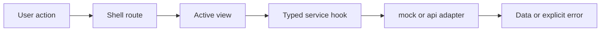
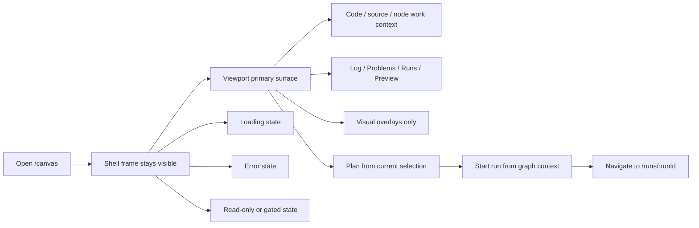
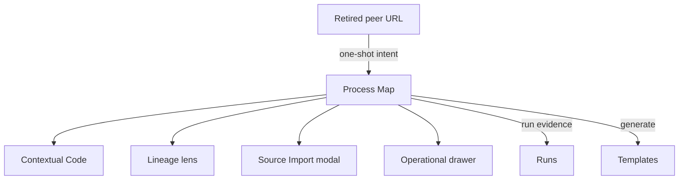

# Screen Manuals And User Stories

This document defines what each main frontend screen is expected to do from a
user perspective.

It works as a lightweight user manual plus a story inventory for the current
frontend surfaces and the next governed route-level slice that still needs
delivery.

## Shell

### User expectation

The user always understands:

- where they are;
- which tenant, project, and environment are active;
- whether the platform is healthy;
- how to reach the main route-level workbenches.
- how to identify and, when another grant is available, change the active
  project without guessing that the workspace context is interactive;
- how to change the application language from the View menu, with visible and
  accessible copy updating immediately.

### Primary user stories

- As an operator, I want to see platform health without leaving my current
  screen so I can react to degraded backend conditions quickly.
- As a user, I want tenant, project, and environment to stay visible so I do
  not act in the wrong context.
- As a user, I want a stable shell while moving across screens so the product
  feels like one tool.

### Expected states

- Loading: shell frame visible while route content loads.
- Degraded: health banner explains degraded or offline state.
- Error: route-level errors do not destroy the shell frame.
- One granted project: the current project control remains visible and explains
  that no alternative project is available in this session.
- Multiple granted projects: the same control exposes the authorized choices,
  clearly marks the active one, and moves focus predictably after selection.
- Language changed: shell, active route, menus, tooltips, and open contextual
  surfaces use the selected language without a page reload.

### F-04 Data source behavior

- Users should not see route-specific wiring differences between `mock` and
  `api`.
- `api` is the canonical product runtime; `mock` remains an explicit isolated
  test/demo posture and is not accepted as product evidence.
- Source Import uses protected API rails for connection list/create/test,
  provider-neutral object discovery, and registration. Backend rejection is
  surfaced without silent fallback behavior.
- The console no longer pretends mock log lines are real in `api` mode.
- In `api` mode, the console empty state uses product wording about run events
  and explicitly states that live log streaming is not yet available.

## Canvas

### User expectation

Canvas is the primary Process Map and authoring workspace for heterogeneous
DVT+ graphs. dbt is the current native transformation vertical, not the whole
product ontology.

The user expects to:

- inspect the graph;
- open Code, source import, project exploration, and node detail contextually
  without replacing the Process Map;
- request plan;
- start a run;
- understand visual overlays without changing graph truth accidentally.
- follow dependency direction from a visible arrow, including selected and
  dimmed graph states;
- distinguish “selected for execution” from “currently running” through paired
  labels and play/pause-style state iconography;
- add a component from grouped categories without horizontal scrolling.

### Current user journey

The Canvas route behaves as one contextual graph workbench with:

- the Process Map as the persistent primary surface;
- Code and node details opened contextually while the graph remains visible;
- Source Import and project exploration opened on demand rather than as fixed
  resource rails;
- Log, Problems, Runs, and Preview retained in the bottom operational drawer;
- Preview and run-start actions tied to the same authoritative persisted
  preview and immutable `PlanRef`.

This is the route model delivered by
[US-F10.1](https://github.com/dunay2/dvt/issues/2102). Legacy peer workbench
routes may preserve deep-link intent, but they do not own additional permanent
work surfaces or a second graph model.

### Primary user stories

- As an author, I want to inspect graph topology in one primary surface so I can
  reason about the workflow.
- As an author, I want explorer and inspector panels to be optional so I can
  focus on the graph when needed.
- As an author, I want plan and run actions to stay near the graph so the
  authoring flow is coherent.

### Expected states

- Empty: explain that no graph content is loaded yet.
- Loading: graph load keeps the shell and route frame stable while local canvas
  state resolves.
- Error: keep shell and route context visible, with safe canvas state and retry
  if meaningful.
- Read-only: overlays and inspection remain available while mutation is gated by
  an explicit route-local banner.
- Code open: project and node code use a movable contextual workbench, preserve
  the Process Map, and show the complete authoritative workspace file.
- Component catalog open: categories are named, items remain fully visible, and
  search keeps category context.

### Hardening direction

This route is moving toward a stricter controller boundary with these
user-facing guarantees:

- graph load state must not make layout persistence behave unpredictably during
  hydration or query startup;
- overlay toggles stay visual projections only and do not rewrite graph truth;
- plan and run actions remain graph-contextual and close to the graph surface;
- route-side navigation after run start remains explicit instead of being hidden
  inside unrelated graph state updates.

### Explicit non-promises

This remediation does not promise:

- new canvas features;
- a new route or panel;
- console or live-log convergence;
- a visible workflow change for planning or run-start beyond more deterministic
  route behavior.

## Runs List

### User expectation

The runs landing screen shows past and current executions and acts as the entry
point for execution investigation.

Contract authority:

- list source: `GET /runs`
- run start source: `POST /runs/start`

### Primary user stories

- As an operator, I want to find a failed or active run quickly so I can inspect
  it.
- As an operator, I want the list to scale beyond cards when data density
  increases.
- As an operator, I want an empty state to tell me how to create work instead of
  leaving me with a dead screen.

### Expected states

- Empty: send the user back to Canvas to plan and start a run.
- Loading: route frame remains stable while runs load.
- Error: explain that run data could not be loaded and offer retry.

## Run Detail

### User expectation

Run detail behaves like one operational workspace, not several unrelated tabs.

The user expects:

- a stable run workspace state;
- truthful snapshot authority;
- timeline evidence when available;
- explicit partial or degraded signaling when detail is missing.

Contract authority:

- run snapshot source: `GET /runs/:runId`
- event timeline source: `GET /runs/:runId/events`

### Primary user stories

- As an operator, I want to understand where a run is or failed without
  reconstructing execution state myself.
- As an operator, I want snapshot and timeline to stay tied to the same run
  context.
- As an operator, I want degraded or partial data to be obvious so I do not
  mistake stale state for canonical truth.

### Expected states

- Loading: preserve route frame while detail loads.
- Missing: explicit run-not-found state.
- Snapshot-only: route remains operational without fake step or artifact detail.
- Degraded: timeline failure does not erase a valid snapshot state.

## Lineage Lens

### User expectation

Lineage is a read-only dependency and impact-analysis lens over the Process
Map. It is not a peer route or a second graph model.

The user expects:

- search or focus-driven entry;
- bounded upstream and downstream scope;
- impact summary before deep detail.

### Primary user stories

- As an analyst, I want to see what a node depends on and what it affects so I
  can understand change impact.
- As an analyst, I want column lineage only when metadata exists so the screen
  does not pretend to know more than it does.

### Expected states

- Empty: explain that no lineage focus is available.
- Loading: preserve route frame.
- Missing metadata: explain why column lineage is unavailable.

## Contextual Code Workbench

### User expectation

Code is the contextual workspace file editor for the active project or selected
node. It keeps the Process Map visible and automatically synchronizes edits
through the revision-guarded `SaveWorkspaceFileContent` command.

The user expects:

- one selected file at a time;
- a stable file tree and editable Monaco surface;
- explicit modified, syncing, synchronized, conflict, failed, and read-only
  states without a second Save lifecycle;
- contextual file history attached to the selected file.
- a movable workbench with an explicit drag handle that never depends on a
  hidden gesture;
- permanent header copy limited to identity and status; explanatory guidance is
  available on hover and keyboard focus through localized accessible help;
- the selected node's code command to resolve the complete authoritative file,
  not a generated excerpt or reconstructed snippet.

### Primary user stories

- As an operator, I want to browse workspace files inside the main shell so I
  can inspect source without leaving the product.
- As an author, I want edits to synchronize through compare-and-swap so a stale
  browser cannot overwrite newer project content.
- As a reviewer, I want selected-file history to stay attached to the current
  file without requiring a permanent peer route.

### Expected states

- Empty: explain that no file is selected or no workspace files are available.
- Loading: keep the Process Map visible while file tree or content resolves.
- Error: preserve selected-file context and explain which file surface failed.
- Modified/syncing/synchronized: report working-tree persistence without
  claiming a Git commit or push.
- Conflict: retain the current file and require reconciliation with the
  authoritative revision.
- Read-only: make it clear that browsing is allowed but editing is not.

## Startup, Onboarding, And Safe Dismissal

### User expectation

Startup and first-use screens feel like the same mature operator workbench as
the protected routes. Neutral ink and steel surfaces establish hierarchy; blue
is reserved for focus, information, and primary action rather than filling the
screen. IBM Plex Sans governs UI copy and IBM Plex Mono governs code and
identifiers at the canonical type scale.

Every temporary surface answers three questions without experimentation:

1. What will this action do?
2. Will closing it discard work or cancel domain execution?
3. How can it be dismissed with mouse and keyboard?

`Close` dismisses a surface. `Cancel` abandons a pending local operation.
`Discard` is used only when unsaved user input will be lost. `Cancel run`
dispatches the governed `CancelRun` command and must never be used as generic
dialog dismissal.

### Expected states

- Loading and bootstrap: stable typography, explicit status, no layout jump,
  and no decorative saturated-blue field competing with the status.
- Onboarding: one primary next action, ordered supporting information, and an
  explicit way back or out whenever the user is not yet committed.
- Dialog open: focus enters the surface, a visible localized close/cancel action
  exists, Escape follows the documented dismissal rule, and focus returns to the
  invoker.
- Unsaved work: closing either synchronizes safely or asks for an explicit
  discard decision; it never silently loses edits.

## WUX1 Demanding-User Manual

The frozen acceptance script is `WUX1-EXPERT-MANUAL-v1`. The evaluator is an
experienced data-platform operator who has never used DVT and receives no
implementation walkthrough. Tasks, thresholds, supported screens, and
severity cannot be weakened after results are observed. A material change
requires a new version and explanation.

### Required environment and evidence

Run against an exact immutable candidate SHA on the protected live stack, not
component stories or intercepted product routes. Use English and Spanish
starts; author/operator and read-only roles; at least two granted projects with
different graph, file, run, and permission data; and representative loading,
empty, degraded, error, unauthorized, unsupported, conflict, active, and
terminal states.

The viewport matrix is `1280x720`, `1366x768`, `1440x900`, and `1920x1080`.
Exercise browser zoom at 100%, 200%, and 400%, Canvas graph zoom at 80%, 100%,
and 125%, keyboard and mouse, a Windows screen reader, reduced motion, and
forced colors/high contrast. Graph and Monaco may retain bounded
two-dimensional navigation, but adjacent controls, state, labels, and exits
must remain reachable.

Record this row for every task:

| Field        | Required value                                                          |
| ------------ | ----------------------------------------------------------------------- |
| candidate    | exact SHA and PR                                                        |
| screen/state | route or contextual surface plus state                                  |
| environment  | locale, role, project, viewport, zoom, and input mode                   |
| task         | instruction given to the evaluator verbatim                             |
| result       | pass/fail and elapsed time                                              |
| errors       | wrong turns, backtracks, and coaching requests                          |
| evidence     | screenshot/video plus DOM or accessibility evidence where applicable    |
| finding      | severity, Fowler signal, owner, rail, reproduction, expected and actual |
| retest       | fixing SHA and the exact repeated task                                  |

### Universal inspection rules

On every applicable screen and state, the evaluator must:

1. state the primary job after five seconds;
2. identify the primary action and safe leave/cancel path without guessing;
3. verify the order context → route identity/status → primary surface → primary
   action → secondary actions → evidence/recovery;
4. record duplicated actions/status, competing headings, or orphaned evidence;
5. verify English/Spanish visible copy, tooltips, accessible names, errors,
   empty states, and confirmations;
6. measure normal text at 4.5:1 or better and large text, focus, and essential UI
   at 3:1 or better;
7. verify visible focus, logical tab order, no trap, Escape policy, and focus
   restoration;
8. reject hover-only actions and require hover help to work on keyboard focus;
9. verify 200% and 400% reachability without hidden horizontal scrolling,
   except inside a bounded graph/editor surface whose controls stay reachable;
10. reject status communicated by color alone;
11. verify meaning under reduced motion and forced colors;
12. verify loading, error, cancellation, conflict, and completion announcements
    without destructive focus jumps;
13. record undersized text, unexplained all-caps, decorative saturation,
    excessive rounding, or density that impairs scanning;
14. verify destructive actions are visually and semantically distinct; and
15. verify no interaction reveals data from another project, user, or state.

### Cancellation taxonomy

| User-facing term              | Meaning that must be true                                                  |
| ----------------------------- | -------------------------------------------------------------------------- |
| Close / Cerrar                | dismiss presentation only; domain work is unchanged; restore focus         |
| Cancel / Cancelar edit        | abandon reversible local changes, warning before data loss                 |
| Cancel operation              | dispatch the authoritative cancellation command and expose its real result |
| Back / Atrás                  | return to the prior step without claiming submitted work stopped           |
| Cannot cancel / No cancelable | explain why, retain observable status, and offer the next safe action      |

A close icon that merely hides accepted work must never be labelled Cancel.
`CancelRun` is the sole run-cancellation command; generic dialog dismissal does
not own domain cancellation.

### S00 — Pre-React and route startup

- Cold-load with slow network, an optional degraded check, a blocking
  prerequisite, and a startup error.
- Decide within five seconds whether the product is preparing, blocked,
  degraded, failed, or ready; identify the next safe action.
- Inspect palette, IBM Plex typography, scale, progress density, contrast, and
  motion. Reject dominant decorative blue, juvenile typography, oversized
  cards, or decoration competing with operational state.
- Verify retry/leave/non-cancellable explanations and ordered, non-repeating
  screen-reader announcements.

### S01 — Authentication and project onboarding

- Complete sign-in, rejected sign-in, empty catalog, project selection,
  supported project creation, and denied scope.
- Identify cancel/back before submission; verify labels, errors, focus,
  secret safety, loading posture, and no duplicate in-workbench project switch.

### S02 — Shell and workspace context

- Identify tenant, project, environment, health, and active route.
- Find global navigation and change between two authorized projects without
  coaching; verify no competing context control or stale route data.
- Navigate every active destination with mouse and keyboard and verify
  menu/project close, Escape, and focus return.

### S03 — Canvas Process Map

- Identify the primary graph action, state, and active project.
- Create/select nodes; inspect directional edges at graph zoom 80/100/125;
  search/filter; open settings; add a component; Preview; and start a permitted
  run.
- Verify play/pause execution-selection semantics, non-color-only direction and
  state, keyboard reachability, reflow around the graph, contextual exits, and
  no second graph/action owner.

### S04 — Contextual Code and node workbench

- Open project code and two distinct node files; verify each complete
  authoritative file, not a generated excerpt.
- Reposition with pointer and keyboard; edit/synchronize; trigger conflict;
  close/reopen; and switch project.
- Distinguish Close from abandoning edits or cancelling synchronization; verify
  Monaco keyboard entry/exit, status announcement, focus restoration, and no
  stale/wrong file.

### S05 — Source Import and authoring dialogs

- Traverse all steps, go back, cancel before submission, attempt dirty close,
  submit, observe in-flight state, and handle success and rejection.
- If accepted work is not cancellable, require explicit copy; closing must not
  claim cancellation. Verify focus trap/return, errors, progress, permissions,
  and read-only state.

### S06 — Inspector, palette, lineage, and operational drawer

- Open and close every contextual surface from each supported entry point;
  reject duplicated actions without distinct purpose.
- Traverse the grouped component catalog at all viewports/zoom with keyboard;
  verify complete descriptions and a real create-node result.
- Verify drawer tabs, active state, status, keyboard movement, and close; keep
  Lineage read-only with direction/impact not conveyed only by color.

### S07 — Runs list and Run detail

- Find active, failed, cancelled, completed, degraded, and missing runs.
- Open detail, follow evidence, request `CancelRun`, and observe accepted,
  pending, already-requested, already-cancelled, terminal, unauthorized, and
  failed outcomes where fixtures/authority permit.
- Verify navigation never masquerades as cancellation and dense table,
  heading, focus, status, pagination/filter, and reflow remain readable.

### S08 — Templates

- Find a template, fill parameters, trigger validation, preview the generated
  source, and attempt to leave with changes.
- Verify hierarchy between catalog, parameters, preview, validation, and
  export/dispatch; verify code visibility, keyboard operation, errors, and
  honest close/cancel behavior.

### S09 — Plugins

- Inspect catalog, capability, unavailable/degraded, and diagnostic states.
- Identify the primary information and flag repeated raw capability data that
  does not help the operator. Verify tables/cards at zoom, headings, focus,
  contrast, and safe navigation.

### S10 — Admin

- Inspect roles, permissions, summaries, diagnostics, denial, and available
  destructive confirmations.
- Verify ordered dense information, secondary raw identifiers, cancellation
  before mutation, and explicit non-color-only permission denial.

### S11 — Cost

- When the capability is active, inspect loading, empty, partial/degraded,
  populated, and error states.
- Verify units/basis, non-color-only visualizations, resettable filters, safe
  navigation, and no unsupported monetary claim. Record the route as not
  applicable, never as passed, when the capability is not granted.

### S12 — Global recovery and resilience

- Exercise route error boundary, offline/degraded API, revoked project, stale
  revision, unsupported contract/plugin, and navigation with unsynchronized
  code.
- Require current scope, truthful state, the next safe action, and whether
  cancellation remains possible. Recovery must not duplicate a command or
  fabricate success.

### Scoring, severity, and exit

Score every screen from 0–2 for immediate comprehension, hierarchy/order,
visual maturity, readability/contrast, keyboard/focus, screen-reader semantics,
zoom/reflow/visibility, language consistency, cancel/close honesty, and absence
of duplication/stale state. Every category must score at least 1 and every
screen at least 18/20. Numeric scores never override correctness, security,
accessibility, cancellation, or authority failures.

- Blocker: scope leakage, wrong authoritative content, inaccessible critical
  flow, fake cancellation, data loss, duplicate authority, or semantic drift.
- Major: failed task, mixed language, ambiguous primary action, missing safe
  exit, keyboard trap, invisible focus, inadequate essential contrast,
  unreachable content, or conflicting repeated action.
- Minor: bounded defect that does not alter truth, access, comprehension, or
  task completion.

Exit requires zero unresolved blocker, major, or actionable minor finding. The
independent report must identify exact candidate SHA, severity, reproduction,
expected/actual result, accessibility and visibility impact, Fowler signal,
owner/rail, evidence, fixing SHA, and repeated retest.

### Fowler review matrix

| Finding                                               | Fowler signal                          | Required owner check                         |
| ----------------------------------------------------- | -------------------------------------- | -------------------------------------------- |
| Same action/status appears in multiple places         | Duplicate code / alternative classes   | one shell/route read model or command        |
| Raw type/spacing values vary per route                | Primitive obsession / shotgun surgery  | canonical typography/component tokens        |
| Screen cannot explain its primary job                 | Long method / data clumps              | route workbench composition                  |
| Close and Cancel mean the same thing                  | Mysterious name / incomplete lifecycle | presentation versus domain-command owner     |
| Keyboard behavior differs per custom overlay          | Divergent change                       | shared accessible primitive + surface policy |
| Audit passes but the user cannot complete the task    | Test smell / inappropriate intimacy    | full rendered journey evidence               |
| Route reconstructs domain, locale, or workspace truth | Feature envy / parallel authority      | existing command/query rail                  |

The implementation author cannot self-certify this gate. The reviewer executes
the manual against the committed candidate and reports the first confusion
instead of compensating with product knowledge.

## Retired Peer Workbench Compatibility

### User expectation

Historical peer workbench deep links are not supported Canvas entry points.
They do not redirect into the Process Map, publish a one-shot route intent, or
render a second graph, fixed panel, or replacement read model.

Current behavior:

- canonical Canvas navigation enters through `/canvas`;
- unsupported historical paths are outside the active route contract;
- Code and file history retain their existing contextual owners;
- a future comparison capability requires its own GitHub issue and must reuse
  the authoritative workspace-file rails.

### Primary user stories

- As a reviewer, I want current navigation to expose only capabilities with a
  canonical owner and executable rail.
- As a maintainer, I want comparison and artifact review to gain one canonical
  owner before they become visible product surfaces.

### Expected states

- Canonical: `/canvas` renders the governed Canvas route.
- Unsupported historical path: no compatibility route or intent protocol is
  registered.

## Execution Templates And Source Generation

### User expectation

This future workbench should let users move from workflow intent to governed
execution scaffolding.

The user expects to:

- pick a template or provider profile;
- provide parameters without editing raw boilerplate first;
- preview generated source through a Monaco-backed review surface before
  exporting or dispatching it;
- generate artifacts such as Snowflake tasks, procedures, or ETL scaffolds
  without losing traceability to the workflow context.

### Primary user stories

- As a data engineer, I want to generate Snowflake tasks and procedures from a
  governed template so I do not handcraft repetitive execution code each time.
- As an ETL designer, I want a code-generation surface tied to the workflow
  context so I can move from design to executable scaffolding without manual
  copy-paste.
- As a reviewer, I want to diff generated source before export or apply so I
  can validate what the template produced.

### Expected states

- Empty: explain that no template profile or workflow context is selected yet.
- Loading: preserve route frame while template catalog or generation preview is
  resolving.
- Validation error: explain which parameters are missing or invalid.
- Preview ready: generated source is visible and clearly marked with template
  provenance and target profile.
- Read-only: allow review and export while mutation or dispatch is gated.

## Screen Owner And Action Matrix

This is the active hierarchy, action, state, and safe-exit baseline. It
distinguishes routes from contextual surfaces so a capability cannot create a
peer graph, duplicate navigation, or parallel command/query owner.

| Screen or surface          | Placement               | Primary job                            | Authoritative action/read owner                          | Safe exit or cancellation owner                     | Required states                                      |
| -------------------------- | ----------------------- | -------------------------------------- | -------------------------------------------------------- | --------------------------------------------------- | ---------------------------------------------------- |
| Pre-React/route startup    | startup gate            | explain admission readiness            | `ObserveAppBootstrapRouteReadiness`                      | retry/leave policy; no fake operation cancel        | preparing, blocked, degraded, error, complete        |
| Authentication/onboarding  | public/project gate     | establish session and project          | session and project onboarding rails                     | form/back policy; dirty-input decision              | loading, rejected, empty, denied, complete           |
| Shell/workspace context    | persistent shell        | identify scope and navigate            | `GetEffectiveWorkspaceContext`, `SelectWorkspaceScope`   | owning menu/project selector                        | one/many grants, degraded, revoked                   |
| Process Map                | `/canvas` route         | author graph, Preview, run handoff     | Canvas draft/preview/run rails                           | route/context-menu presentation owners              | loading, empty, error, degraded, read-only           |
| Contextual Code            | movable workbench       | inspect/edit exact project/node file   | `List/Get/SaveWorkspaceFileContent`                      | workbench controller; synchronized/dirty policy     | loading, empty, modified, syncing, conflict, error   |
| Lineage                    | Canvas lens             | dependency/impact projection           | Canvas graph read model                                  | lens presentation owner                             | empty, loading, missing metadata                     |
| Source Import              | contextual modal/wizard | discover/register governed sources     | source-import commands and read models                   | wizard back/close; operation-specific truth         | loading, empty, dirty, rejected, in-flight, complete |
| Project dbt Import         | contextual dialog       | validate/import a dbt project          | dbt validation/import ports                              | dialog close only; accepted import is not cancelled | pristine, validating, rejected, importing, receipt   |
| Inspector/palette          | Canvas contextual UI    | inspect or create graph content        | Canvas inspector/catalog and `CreateCanvasAuthoringNode` | owning popover/menu controller                      | empty, grouped, filtered, selected                   |
| Log/Problems/Runs/Preview  | operational drawer      | show evidence and readiness            | Canvas/run operational read models                       | drawer presentation owner                           | collapsed, loading, blocked, active, terminal        |
| Runs list/detail           | `/runs` routes          | investigate execution evidence         | `ListRuns`, run snapshot/events, `CancelRun`             | navigation is close; `CancelRun` alone cancels      | loading, empty, error, degraded, missing, terminal   |
| Templates                  | `/templates` route      | generate governed source               | template catalog/validation/preview owner                | route/form dirty policy                             | loading, empty, validation error, preview ready      |
| Plugins                    | `/plugins` route        | inspect capability truth               | capability/catalog read models                           | route navigation                                    | loading, unavailable, degraded, diagnostic           |
| Admin                      | `/admin` route          | inspect/administer platform authority  | admin health, RBAC, audit, and mutation owners           | route/form/confirmation owner                       | loading, denied, degraded, destructive confirmation  |
| Cost                       | capability route/lens   | inspect bounded cost evidence          | cost read model when granted                             | filter/reset and route owner                        | unavailable, loading, empty, partial, error          |
| Global recovery            | route/error boundary    | preserve scope and expose next action  | failing route/query/command owner                        | boundary retry/leave; no fabricated success         | offline, revoked, stale, unsupported, conflict       |
| retired Diff/Artifacts URL | redirect intent only    | explain superseded unavailable surface | Canvas legacy-route intent                               | one-shot redirect                                   | redirected, unavailable                              |

## Tracking Stories As Work

Unimplemented behavior from these manuals must be represented by one
[GitHub Issue](https://github.com/dunay2/dvt/issues) before implementation.
Planning DB records architecture components, relationships, capabilities,
rails, and evidence; it does not own or mirror issue lifecycle.

Runtime contract baseline references:

- [Frontend Runtime Contract Technical Manual](./runs/frontend-runtime-contract-technical-manual.md)
- [Frontend Runtime Contract User Manual](./runs/frontend-runtime-contract-user-manual.md)
