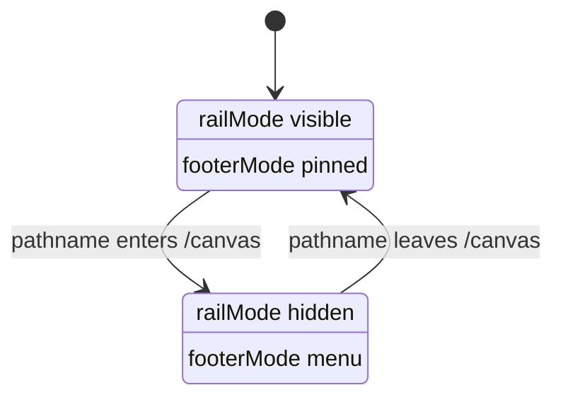
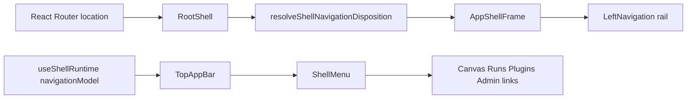

# Shell Navigation Disposition Component

## Owned Concern

The shell navigation disposition component decides whether global navigation is
rendered as a permanent left rail or as menu navigation for the active route
family. It owns chrome posture only. It does not own plugin registration,
Canvas workbench tabs, route authorization, or route bootstrap readiness.

## Public API

| API                                           | Kind               | Responsibility                                               |
| --------------------------------------------- | ------------------ | ------------------------------------------------------------ |
| `resolveShellNavigationDisposition(pathname)` | query model        | Returns the shell navigation posture for a route pathname.   |
| `ShellNavigationDisposition`                  | read model         | Describes `railMode`, `footerMode`, and the decision reason. |
| `AppShellFrame.navigationDisposition`         | presentation input | Applies the already-resolved shell posture to chrome slots.  |

Current values:

| Field        | Values                            | Meaning                                                     |
| ------------ | --------------------------------- | ----------------------------------------------------------- |
| `railMode`   | `visible`, `hidden`               | Whether the permanent left rail is mounted.                 |
| `footerMode` | `pinned`, `menu`                  | Whether footer routes live in the rail or the top-bar menu. |
| `reason`     | `global_route`, `workbench_route` | Explains the route-family decision.                         |

## Invariants

- Workbench routes such as `/canvas` and `/canvas/:workbenchTab` do not mount a
  permanent left rail.
- Global shell routes such as `/runs`, `/plugins`, and `/admin` keep the
  permanent rail.
- Hiding the rail must not hide global routes. The top-bar `View` menu remains
  the menu-mode navigation surface.
- `AppShellFrame` applies posture but does not classify route pathnames.
- Canvas workbench tab navigation remains separate from shell navigation.

## Transitions

## Consumers

| Consumer                                          | Use                                                        |
| ------------------------------------------------- | ---------------------------------------------------------- |
| `RootShell`                                       | Resolves the active route family once per pathname change. |
| `AppShellFrame`                                   | Mounts or omits the permanent left rail.                   |
| `ShellMenu`                                       | Provides global navigation links when the rail is hidden.  |
| `Root.shellChrome.test.tsx`                       | Verifies workbench and global-route render posture.        |
| `shellNavigationDisposition.architecture.test.ts` | Guards semantic ownership and menu fallback.               |

## Fowler Analysis

The earlier implementation used a convenience default: the frame mounted a
permanent rail for every route unless focus mode was active. In Fowler terms,
that was a control coupling smell. A generic layout component encoded a product
assumption that should have belonged to a route-family policy.

The revised model is closer to mature workbench systems:

- route-family posture is a small explicit read model;
- layout applies posture rather than inferring product semantics;
- global navigation stays available through an alternate shell affordance;
- Canvas workbench navigation remains bounded to Canvas tabs.

## Command And Query Rail

This is a frontend shell query rail:

| Rail                                | Type  | Owning context | Read model                   | Adapter surface                      |
| ----------------------------------- | ----- | -------------- | ---------------------------- | ------------------------------------ |
| `ResolveShellNavigationDisposition` | query | Frontend shell | `ShellNavigationDisposition` | React Router pathname in `RootShell` |

Negative coverage:

- `/canvas` must not mount `[data-slot="left-navigation-rail"]`.
- `/runs` must keep the left rail and active route state.
- `/canvas` must still expose `/canvas`, `/runs`, `/plugins`, and `/admin`
  through `shell-menu-navigation-link`.
