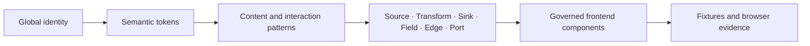

# DVT Style Guide v0.2

## Purpose and authority

This guide connects DVT's visual identity to implementation and verification:

It governs presentation and composition. Domain contracts, permissions, commands,
queries, persistence and execution remain owned by their existing bounded contexts.
Figma represents this guide; it does not create another product authority.

Version 0.2 is the review baseline for [#3016](https://github.com/dunay2/dvt/issues/3016)
and [#3033](https://github.com/dunay2/dvt/issues/3033). Version 0.1 is historical review
material and is not a second active guide.

## Governing sources

- [Iconography And Design Tokens Contract](./iconography-and-design-tokens-contract.md)
- [UX Implementation Guide](./ux-implementation-guide.md)
- [Frontend Component Inventory](./frontend-component-inventory.md)
- [Workbench UX Canon Component](./workbench-ux-canon-component.md)
- [Canvas Node Identity And Naming Policy](./canvas/node-identity-and-naming-policy.md)
- `apps/web/src/styles/theme.css` for semantic color tokens
- `apps/web/src/styles/fonts.css` for IBM Plex Sans and IBM Plex Mono
- Planning DB queries `frontend-components`, `frontend-component-files` and
  `frontend-component-rails`

## Global identity

| Rule | Requirement                                                                                                             |
| ---- | ----------------------------------------------------------------------------------------------------------------------- |
| G01  | One authority per meaning. Presentation consumes existing facts and rails.                                              |
| G02  | Every active product component has a record here or an explicit family variant. Private helpers belong to their parent. |
| G03  | Variants follow task, capability, authority or host. Visual convenience is not a variant.                               |
| G04  | Reuse existing hosts and primitives. Extract only proven shared responsibility.                                         |
| G05  | A replacement migrates consumers and removes the obsolete active path in the same cut. No aliases or double state.      |
| G06  | Type, provider, authoring, validity, persistence, execution, selection and focus remain separate signals.               |
| G07  | State is never conveyed only by color. Text, icon or accessible semantics must preserve the meaning.                    |
| G08  | Long content changes representation, never type size or stored value.                                                   |

The global base is dark ink and steel surfaces with cobalt emphasis, Lucide for
functional icons, IBM Plex Sans for interface text and IBM Plex Mono for code and
technical identifiers. Provider marks are allowed only for an identified provider.

## Canvas personalisation

| Rule | Requirement                                                                                               |
| ---- | --------------------------------------------------------------------------------------------------------- |
| C01  | The product base and Canvas background are separate. Canvas and grid colors remain configurable.          |
| C02  | Forms preserve their semantic surface, text, focus and error tokens over the effective Canvas background. |
| C03  | Nodes, selection, edges and ports exposed to the Canvas must be verified against the selected color.      |
| C04  | Canvas color does not recolor the application, change state meaning or mutate data.                       |

`apps/web/src/app/views/canvas/canvasPalette.ts` owns Canvas color normalization and
derived controls. A mint Canvas is not itself an identity defect.

## Content rules

| Rule | Requirement                                                                                           |
| ---- | ----------------------------------------------------------------------------------------------------- |
| T01  | CSS never truncates persisted, imported, searched or copied data.                                     |
| T02  | There is no universal `maxlength`. Each data owner defines its unit, excess behavior and error.       |
| T03  | A new field identifies its schema, unit, visual budget and full-value access.                         |
| T04  | Prose and eligible identifiers wrap long tokens with `overflow-wrap:anywhere`; no global `break-all`. |
| T05  | Ellipsis has keyboard-accessible full-value recovery. `title` alone is insufficient.                  |
| T06  | Copy uses the complete authorized value and never exposes secrets.                                    |
| T07  | Emoji, combining marks, IME, CJK and bidirectional text preserve user intent.                         |
| T08  | Collections use a bounded summary plus access to every item while retaining order and selection.      |

| Content              | Initial presentation                  | Full access                       |
| -------------------- | ------------------------------------- | --------------------------------- |
| Node or column name  | One line; visual ellipsis when needed | Detail and copy use the original  |
| ID, path or relation | Contextual summary                    | Wrapped exact identity            |
| Description          | Up to three summary lines             | Expand in the host scroll region  |
| Comment              | Up to four summary lines              | Expand or edit the complete value |
| Tags                 | Bounded chips and `+N`                | Reachable complete collection     |
| Validation error     | Useful reason beside the field        | Sanitized detail when required    |
| Code or document     | Dedicated viewer/editor scroll        | Complete source                   |

Data limits and Unicode enforcement belong to #3019. Rejection, local application
and remote acknowledgement belong to #3020. Presentation must not imitate either
owner.

## Geometry rules

| Rule | Requirement                                                                                       |
| ---- | ------------------------------------------------------------------------------------------------- |
| L01  | The host owns outer width, useful width, header, tabs, body and scroll boundaries.                |
| L02  | Summary, list/detail and editor tasks use explicit host profiles rather than one universal width. |
| L03  | Source desktop keeps the approved simultaneous list/detail composition near 40/60.                |
| L04  | Close, validation, state and primary actions retain space before the name.                        |
| L05  | The host limits height and the task body scrolls. Nested scroll regions require a distinct task.  |
| L06  | Multiline editors show a useful bounded range before local scrolling; this is not a data limit.   |
| L07  | Overlays define anchor, viewport collision, close behavior and focus return.                      |
| L08  | Verify 1366×768, 1920×1080 and 3440×1440, plus browser zoom. Graph scale is a separate dimension. |

A flex or grid child that must yield uses `min-width: 0` or `minmax(0, …)` together
with the correct content policy. `overflow-hidden` on an ancestor does not solve
content access.

## State and interaction rules

| Rule | Requirement                                                                                                   |
| ---- | ------------------------------------------------------------------------------------------------------------- |
| S01  | No capability means omit it; no content, loading, unavailable and error are distinct states.                  |
| S02  | A relevant tab contains content or an explicit state. No unexplained empty region.                            |
| S03  | Zero, no matches and not calculated are different facts.                                                      |
| S04  | Editing, local application and persisted acknowledgement retain their rail meanings.                          |
| S05  | Validation stays with its field, query errors with their section and persistence feedback with its rail.      |
| S06  | Every visible action has a real intent, permission, input and result.                                         |
| S07  | Pointer and keyboard converge on the same existing command. New gestures require an accepted interaction map. |
| S08  | ES and EN copy are equivalent; code, identifiers and external data are not translated.                        |

`ProjectGraphNodeCardReadModel` is the governing query for database identity. It
projects only the provider and connection identity already authorized on the
canonical Source node; opening or closing its disclosure performs no catalog,
provider or credential query. The disclosure opens only from the provider/database
icon with click, Enter or Space; Escape and outside activation close it and return
focus. Full-name recovery is a separate interaction. Inline editing uses one native
textual **Edit** action, without a duplicate pencil action.

## Object anatomy

A card composes conditional slots in this order: identity and type, name, useful
context, relevant authorship/state, facts or fields, operation and ports. An
inspector composes a shared header, capability tabs, content or explicit state,
and actions or feedback from the owning rail.

| Object    | Owns                                                                            | Must not invent                                           |
| --------- | ------------------------------------------------------------------------------- | --------------------------------------------------------- |
| Source    | Physical origin, external structure and metadata, plus separate DVT annotations | Hidden transformations or secret editing in the inspector |
| Transform | Governed semantics and outputs from #2635/#2919                                 | A second AST or SQL-first authority                       |
| Sink      | Supported destination and publication intent                                    | Fake controls or metrics copied from Source               |
| Field     | Stable identity, type, constraints and expression where supported               | Identity from display position alone                      |
| Edge/Port | Direction, relation and allowed interactions                                    | Decorative data flow or execution gates                   |

Source retains Overview, Columns and Inputs/Outputs, without empty Advanced or More
tabs. External read-only facts and DVT-editable metadata remain visibly separate.

## Pattern records

| Record | Pattern                  | Governing components                                 | Required stress                                                              |
| ------ | ------------------------ | ---------------------------------------------------- | ---------------------------------------------------------------------------- |
| F01    | Identity and header      | `GraphNodeCardView`, Source header, workbench header | Long name, provider identity, independent state, close and focus             |
| F02    | Column row and detail    | Source columns and field consumers                   | 0/1/many fields, long Unicode name, truthful constraints, keyboard selection |
| F03    | Metadata prose and value | Source overview, facts and annotations               | Long token, multiline prose, full copy, external versus DVT ownership        |
| F04    | Tag and constraint       | `GraphNodeTagList`, `Badge` consumers                | Width, count, Unicode, `+N`, complete reachable collection                   |
| F05    | Inline edit and textarea | Source overview and existing form primitives         | Read/edit/error, Enter, Escape, rejection with draft retained                |
| F06    | Context body and states  | Node workbench, properties tabs, `WorkbenchStates`   | Capability, empty, loading, unavailable, error, low height and scroll        |

A component record must name purpose, source and SHA, hosts, owner and rail,
anatomy, variants, tokens, data policy, visual budget, full-value access, states,
keyboard/focus, ES/EN copy, Figma, tests and disposition.

## Governed component census

The reproducible baseline is `main@7669649783400f73cb68a39ba94d38544120c4ec`.
Planning DB returned 15 current frontend components. The exhaustive physical paths,
rails and evidence remain canonical in the
[Frontend Component Inventory](./frontend-component-inventory.md); this table adds
the style disposition and pattern binding without copying that registry.

| Component ID                                  | Host/object                             | Patterns              | Disposition                                  | Style acceptance owner |
| --------------------------------------------- | --------------------------------------- | --------------------- | -------------------------------------------- | ---------------------- |
| `web.component.canvas.NodeWorkbench`          | Canvas inspector; Source/Transform/Sink | F01, F03, F05, F06    | REUSE and harden contextual states           | Canvas workbench       |
| `web.component.canvas.CanvasViewport`         | Canvas graph viewport                   | F06, C01–C04, L07–L08 | ADAPT contrast and reflow evidence           | Canvas workbench       |
| `web.component.canvas.CanvasContextMenu`      | Canvas contextual actions               | F06, S06–S07          | ADAPT reachability and focus                 | Canvas workbench       |
| `web.component.canvas.SourceImportDialog`     | Governed source import                  | F02–F06               | ADAPT content stress; preserve lazy catalog  | Source import          |
| `web.component.shell.LeftNavigationRail`      | Application navigation                  | F01, F06              | REUSE; standardize state cues                | App shell              |
| `web.component.shell.BottomOperationalDrawer` | Run/log operational detail              | F03, F06              | ADAPT height, scroll and long errors         | App shell / Runs       |
| `web.component.canvas.CanvasSurfaceStrategy`  | Canvas surface projection               | C01–C04, S01–S03      | REUSE; no independent visual system          | Canvas workbench       |
| `web.component.canvas.GraphNodeCardStrategy`  | Source/Transform/Sink cards             | F01–F04               | ADAPT shared anatomy and provider activation | Canvas workbench       |
| `web.component.canvas.CanvasShellChrome`      | Canvas route controls                   | F01, F06              | ADAPT action/state separation                | Canvas workbench       |
| `web.component.artifacts.ArtifactsWorkbench`  | Artifact list and preview               | F02, F03, F06         | ADAPT long identity and viewer boundaries    | Artifacts              |
| `web.component.templates.TemplatesWorkbench`  | Template list, parameters and preview   | F02, F05, F06         | ADAPT form states and code boundaries        | Templates              |
| `web.component.workbench.RouteWorkbenchFrame` | Shared route frame                      | F06, L01–L08          | REUSE as host geometry owner                 | Workbench              |
| `web.component.shell.ShellTopBar`             | Global context and session actions      | F01, F06              | ADAPT long context and protected actions     | App shell              |
| `web.component.shell.AppShellFrame`           | Global shell layout                     | L01, L04–L08          | REUSE as global host                         | App shell              |
| `web.component.workbench.WorkbenchStates`     | Loading/empty/error presentation        | F06, S01–S06          | REUSE and standardize copy                   | Workbench              |

Private helpers and strategy implementations are covered by their governing row.
A file without a consumer does not increase the denominator. New current components
must first enter the existing Planning DB/frontend inventory rail, then receive a
row or declared family variant here.

## E01: Source metadata form

The v0.2 reference applies the rules to the existing Source overview rather than
creating a second form framework. It preserves the 40/60 external/DVT split and
reuses `SourceOverviewPanel`, `Input`, `Textarea`, `Badge` and the workbench host.

| State         | Required behavior                                                               |
| ------------- | ------------------------------------------------------------------------------- |
| Read          | Complete value in detail and one textual Edit action                            |
| Edit          | Complete value in the existing field, focused, with Cancel                      |
| Enter         | Apply through the existing rail without claiming remote acknowledgement         |
| Escape/Cancel | Discard the field draft and return focus to Edit                                |
| Blank         | Show “Name is required” beside the field; keep editing and do not mutate        |
| Long          | Keep type size; ellipsis only in the header; complete detail remains accessible |

Figma review examples:

- [Read on base Canvas](https://www.figma.com/design/cwN0VotdfJNzXLZnuiujmo?node-id=71-7)
- [Read on mint Canvas](https://www.figma.com/design/cwN0VotdfJNzXLZnuiujmo?node-id=71-75)
- [Name editing](https://www.figma.com/design/cwN0VotdfJNzXLZnuiujmo?node-id=71-143)
- [Required error](https://www.figma.com/design/cwN0VotdfJNzXLZnuiujmo?node-id=71-218)
- [Long content](https://www.figma.com/design/cwN0VotdfJNzXLZnuiujmo?node-id=71-293)

These are editable specimens, not browser, persistence or accessibility evidence.

## Verification matrix

Every adopted component exercises only the dimensions it can represent, and records
exclusions explicitly.

| Dimension   | Required cases                                                                |
| ----------- | ----------------------------------------------------------------------------- |
| Content     | Empty, normal, longest accepted, unbroken token, multiline, many items        |
| Unicode     | Emoji at boundary, combining mark, IME, CJK and bidirectional text            |
| State       | Loading, empty, unavailable, denied, validation error, query error, persisted |
| Interaction | Pointer, keyboard, Escape, focus return and full-value copy                   |
| Geometry    | Three desktop viewports, browser zoom, low host height and scroll ownership   |
| Canvas      | Default, mint and one custom effective background where exposed               |
| Evidence    | Unit/presentation tests plus visible browser geometry at the exact SHA        |

JSDOM can verify semantics and state, not real geometry. Browser evidence must use a
visible supported runner and identify its commit. A screenshot proves a result, not
its root cause.

## Adoption and maintenance

1. Query the existing Planning DB component, file and rail authorities.
2. Update the component record and hostile fixtures before implementation.
3. Reuse or adapt the existing owner; do not create a parallel component family.
4. Implement and remove the superseded active path in the same cut.
5. Run package, browser and repository gates required by that component.
6. Update this same guide row and the existing component inventory evidence.

The guide changes with the component. Its existence does not complete adoption.
Open implementation remains owned by #3034–#3039 and existing functional issues;
The `#3016` epic tracks overall rollout.

## Change history

| Version | Date       | Change                                                                                                                                               |
| ------- | ---------- | ---------------------------------------------------------------------------------------------------------------------------------------------------- |
| 0.2     | 2026-09-07 | Adds Canvas personalisation, E01, PO interaction deltas, six pattern records and a Planning DB-reconciled census of 15 governed frontend components. |
| 0.1     | 2026-09-07 | Historical GitHub review nucleus: global identity, content, geometry and state rules.                                                                |
