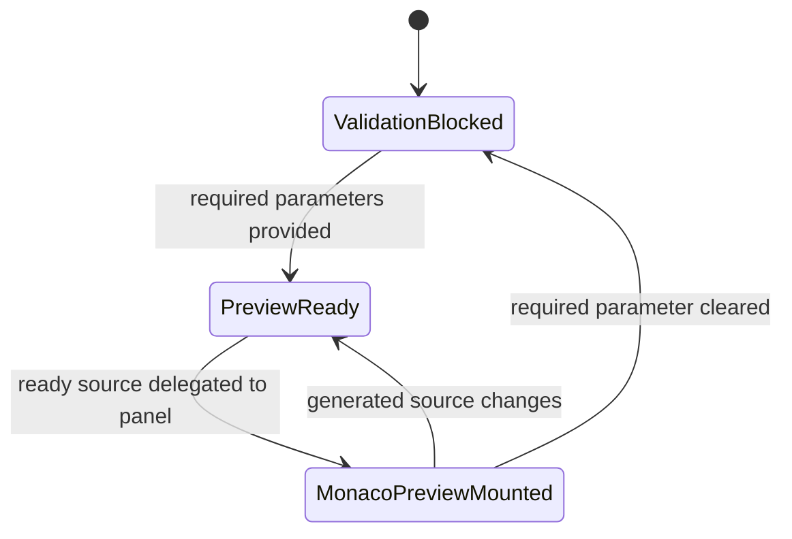
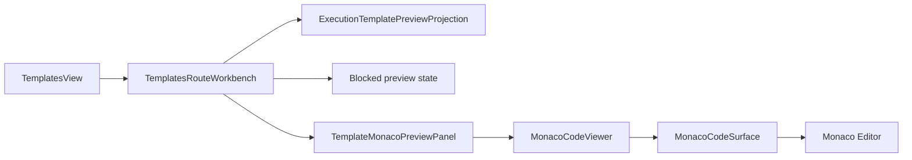

# Execution Template Monaco Preview Component

## Owned Concern

The Templates Monaco preview component owns read-only inspection of generated
template source inside the `/templates` route.

It does not own template catalog semantics, parameter validation, source
generation, shell navigation, persistence, provider execution, or Monaco's
third-party editor binding.

## Public API

| API                          | Surface                                                           | Responsibility                                |
| ---------------------------- | ----------------------------------------------------------------- | --------------------------------------------- |
| `TemplateMonacoPreviewPanel` | `apps/web/src/app/views/templates/TemplateMonacoPreviewPanel.tsx` | Adapts one ready generated preview to Monaco. |
| `TemplatesRouteWorkbench`    | `apps/web/src/app/views/templates/TemplatesRouteWorkbench.tsx`    | Delegates ready preview rendering.            |
| `MonacoCodeViewer`           | `apps/web/src/app/components/monaco/MonacoCodeViewer.tsx`         | Lazy read-only Monaco code gateway.           |
| `ExecutionTemplatePreview`   | `apps/web/src/app/views/templates/templatesViewModel.ts`          | Preview projection consumed by the panel.     |

## Command And Query Rails

| Rail                               | Type  | DDD owner                            | Status      |
| ---------------------------------- | ----- | ------------------------------------ | ----------- |
| `GenerateExecutionTemplatePreview` | query | `ExecutionTemplatePreviewProjection` | Implemented |
| `ListExecutionTemplateProfiles`    | query | `ExecutionTemplateCatalogReadModel`  | Implemented |

## Invariants

- Monaco renders only `ready` previews.
- Blocked previews stay in the route validation state and do not mount Monaco.
- `TemplateMonacoPreviewPanel` is read-only and exposes no save, apply, export,
  or dispatch command.
- `TemplatesView` and `TemplatesRouteWorkbench` do not import
  `@monaco-editor/react` directly.
- The shared `MonacoCodeViewer` remains the only gateway from Templates to the
  Monaco code surface.
- Canvas production modules do not become Monaco hosts through this slice.

## Transitions

## Component Diagram

## Consumers

| Consumer            | Relationship                                                    |
| ------------------- | --------------------------------------------------------------- |
| Templates route     | Shows generated source as read-only Monaco preview.             |
| Cypress UX guard    | Proves the route still reaches a ready generated preview.       |
| F-17 parent         | Uses this as the Templates leg of the embedded Monaco strategy. |
| Future Diff handoff | May compare generated source after backend query rails exist.   |

## Non-Goals

- No edit mode.
- No export/download command.
- No backend template persistence.
- No provider execution.
- No route shell changes.
