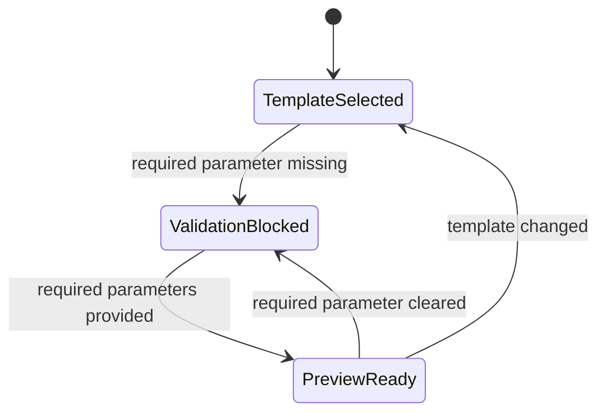
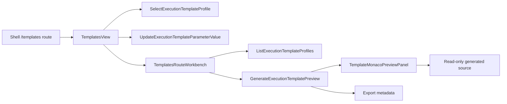

# Execution Template Source Generation Component

## Owned Concern

The Templates workbench owns presentation-local selection, parameter capture,
validation, deterministic preview generation, and export metadata for governed
execution-template scaffolds.

It does not own provider execution, persistence, credentials, backend template
contracts, or Monaco infrastructure. Those remain separate governed surfaces.

## Public API

| API                                       | Surface                                                           | Responsibility                                      |
| ----------------------------------------- | ----------------------------------------------------------------- | --------------------------------------------------- |
| `EXECUTION_TEMPLATE_CATALOG`              | `apps/web/src/app/views/templates/templatesViewModel.ts`          | Built-in read model for available template profiles |
| `resolveExecutionTemplateSelection`       | `apps/web/src/app/views/templates/templatesViewModel.ts`          | Route-local template selection state                |
| `resolveExecutionTemplatePreview`         | `apps/web/src/app/views/templates/templatesViewModel.ts`          | Validation and deterministic preview projection     |
| `TemplatesView`                           | `apps/web/src/app/views/TemplatesView.tsx`                        | Route controller and route-local command handlers   |
| `TemplatesRouteWorkbench`                 | `apps/web/src/app/views/templates/TemplatesRouteWorkbench.tsx`    | Workbench slot renderer                             |
| `TemplateMonacoPreviewPanel`              | `apps/web/src/app/views/templates/TemplateMonacoPreviewPanel.tsx` | Ready generated-source preview adapter              |
| DVT plugin `/templates` view contribution | `apps/web/src/app/plugins/dvt/dvtContributions.ts`                | Shell route registration                            |

## Command And Query Rails

| Rail                                    | Type    | DDD owner                            | Status      |
| --------------------------------------- | ------- | ------------------------------------ | ----------- |
| `ListExecutionTemplateProfiles`         | query   | `ExecutionTemplateCatalogReadModel`  | Implemented |
| `GenerateExecutionTemplatePreview`      | query   | `ExecutionTemplatePreviewProjection` | Implemented |
| `SelectExecutionTemplateProfile`        | command | `ExecutionTemplateSelectionState`    | Implemented |
| `UpdateExecutionTemplateParameterValue` | command | `ExecutionTemplateParameterState`    | Implemented |

## Invariants

- Preview generation is deterministic from the selected template and parameter
  values.
- Required parameters block preview and expose field-specific errors.
- Unknown template ids resolve to the first catalog entry rather than creating
  unowned semantics.
- Generated source is read-only route output; the route does not dispatch,
  persist, or apply generated artifacts.
- Ready generated source is inspected through `TemplateMonacoPreviewPanel` and
  the shared read-only `MonacoCodeViewer` gateway.
- Provider semantics are descriptive profile metadata until backend contracts
  accept provider-owned generation behavior.
- The route uses `RouteWorkbenchFrame` slots and does not create a parallel
  shell layout.

## Transitions

## Component Flow

## Consumers

| Consumer              | Relationship                                                              |
| --------------------- | ------------------------------------------------------------------------- |
| Shell navigation      | Shows Templates as an extended DVT route.                                 |
| Future Canvas handoff | May pass workflow context into the route after a governed rail exists.    |
| Future Diff handoff   | May review generated source deltas after F-17 preview work lands.         |
| F-17 Monaco work      | Provides the read-only Monaco preview adapter for ready generated source. |

## Non-Goals

- No provider execution or apply action.
- No backend persistence.
- No generic template engine.
- No credentials, tenant-specific catalog, or provider API calls.
- No Monaco editing, save, apply, or export command.
