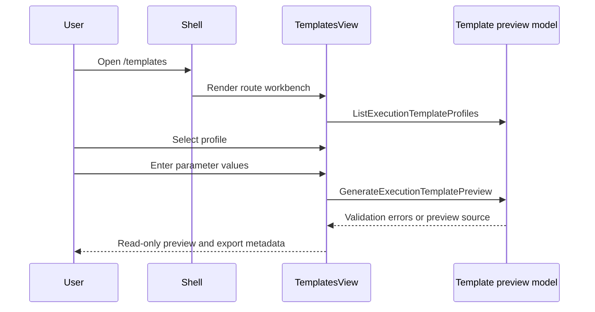

# Execution Template Source Generation User Stories

## Stories

| Story id         | Scenario                       | Acceptance criteria                                                                       |
| ---------------- | ------------------------------ | ----------------------------------------------------------------------------------------- |
| US-TEMPLATES-001 | Select a template profile      | User can open `/templates`, see provider profiles, and switch the selected profile.       |
| US-TEMPLATES-002 | Block incomplete generation    | Missing required parameters show field-specific validation and no generated source.       |
| US-TEMPLATES-003 | Generate preview               | Completing required fields produces deterministic read-only source and filename metadata. |
| US-TEMPLATES-004 | Preserve route ownership       | Templates uses the shared route workbench frame and is not embedded as a Canvas tab.      |
| US-TEMPLATES-005 | Avoid hidden backend authority | The route exposes preview/export posture only and does not persist, dispatch, or apply.   |

## UX Flow

## Negative Scenarios

| Scenario               | Expected result                                                | Guard                                          |
| ---------------------- | -------------------------------------------------------------- | ---------------------------------------------- |
| Required value empty   | Preview remains blocked with explicit required-field message.  | `templatesViewModel.test.ts` and Cypress flow. |
| Unknown template id    | Pure model falls back to first catalog entry.                  | `templatesViewModel.test.ts`.                  |
| Route tries to persist | Architecture guard rejects provider mutation wording in route. | `templatesWorkbench.architecture.test.ts`.     |
