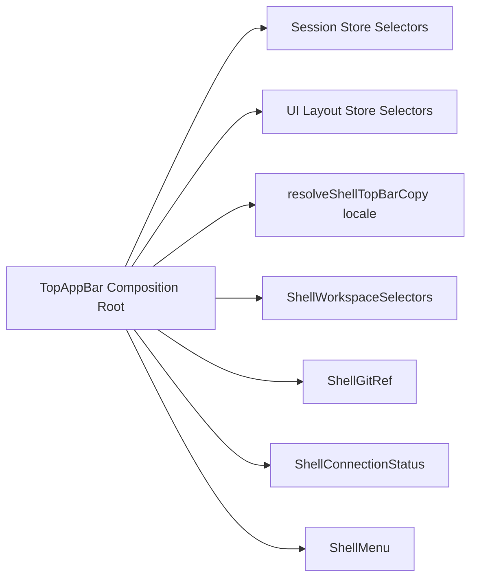

# Top App Bar Component Technical Manual

## Goal

Define the current technical shape of the top app bar so the UI stays modular,
multi-language ready, and style-consistent.

## Scope

- `apps/web/src/app/components/TopAppBar.tsx`
- `apps/web/src/app/components/shell/*`

## Component Boundary

`TopAppBar.tsx` is a composition root only. It owns store wiring and delegates
rendering to small UI components:

- `ShellWorkspaceSelectors`
- `ShellGitRef`
- `ShellConnectionStatus`
- `ShellMenu`

## Runtime Composition

## Multi-Language Strategy

- `shell/copy.ts` is the single copy authority for app bar text.
- Current locales:
  - `en` default
  - `es` selected when browser locale starts with `es`.
- No hardcoded UI labels are allowed in app bar subcomponents.

## Styling Strategy

- `shell/chrome.ts` contains reusable shell chrome tokens for recurring visual
  patterns.
- Subcomponents consume these tokens instead of duplicating Tailwind strings.

## SRP Rules

- Each file in `components/shell/` should keep one shell UI responsibility.
- `TopAppBar.tsx` should not contain menu internals, health rendering branches,
  or selector option rendering loops.

## Negative Test Targets

- Missing locale key fallback must resolve to `en`.
- `connectionStateOverride` must still override store state.
- Menu controls must continue toggling layout flags.
- Shell-owned controls must not import `topAppBar/*` support files.

## Definition Of Done

- [ ] `TopAppBar.tsx` stays as composition root only.
- [ ] App bar labels come from `components/shell/copy.ts`.
- [ ] Reused class tokens come from `components/shell/chrome.ts`.
- [ ] `pnpm --filter @dvt/web typecheck` passes.
- [ ] `pnpm --filter @dvt/web test` passes.
- [ ] `pnpm --filter @dvt/web build` passes.
