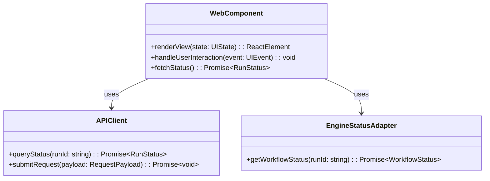

# Web DDD Structure

## DDD Diagram

## Aggregates & Entities

- **WebComponent**: The primary UI unit in the `@dvt/web` package. Encapsulates rendering logic, user interaction handlers, and state queries for a given part of the DVT interface.
- **APIClient**: Thin adapter that wraps HTTP calls to `apps/api`, isolating the UI layer from transport concerns.
- **EngineStatusAdapter**: Adapter that surfaces `@dvt/engine` workflow status data to the UI components, translating engine state into displayable models.

## Domain Events

- `UserInteractionTriggered`: Emitted when a user action (e.g., button click, form submission) is captured by a WebComponent and dispatched for processing.
- `StatusRefreshed`: Emitted when a UI component successfully fetches updated run or workflow status from the API or engine.

## Key Files

- `packages/@dvt/web/src/components/`
- `packages/@dvt/web/src/adapters/APIClient.ts`
- `packages/@dvt/web/src/adapters/EngineStatusAdapter.ts`
- `packages/@dvt/web/src/index.ts`
