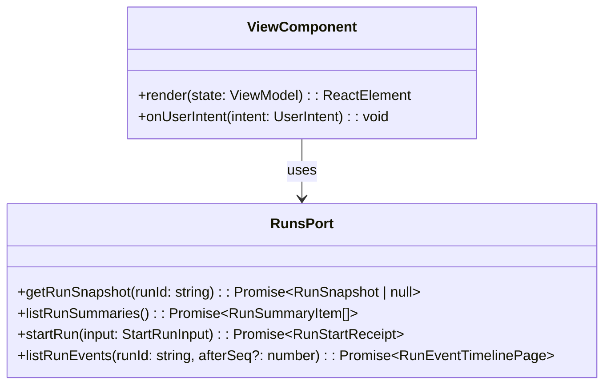

# Web DDD Structure

This document summarizes the current frontend DDD boundary for the deployable
`apps/web` workspace. The route and DTO authority for run orchestration remains
the protected runtime contract in
[Frontend Runtime Contract Technical Manual](./runs/frontend-runtime-contract-technical-manual.md).

## DDD Diagram

## Aggregates & Entities

- **ViewComponent**: A React component in `apps/web` that renders a route or
  workbench surface from view models and local UI state.
- **RunsPort**: Presentation-facing run boundary implemented by
  `runsService.api.ts`. It wraps protected HTTP calls to `apps/api` and keeps
  transport concerns out of route views.
- **WorkspaceScope**: Session-derived tenant, project, environment, and target
  adapter context used by `startRun` and by list/read tenant-scope queries.

## Domain Events

- UI components do not own runtime domain events. They dispatch user intents
  through ports and render read models returned by governed API rails.
- Runtime event history is read through `listRunEvents(runId, afterSeq?)`; the
  authoritative write-side events remain owned by the runtime backend.

## Key Files

- `apps/web/src/app/services/runs/runsService.ts`
- `apps/web/src/app/services/runs/runsService.api.ts`
- `apps/web/src/app/ports/runs.ts`
- `apps/web/src/app/ports/sessionContext.ts`
- `apps/api/src/application/ports/protectedRuntimeRunRailVocabulary.ts`
