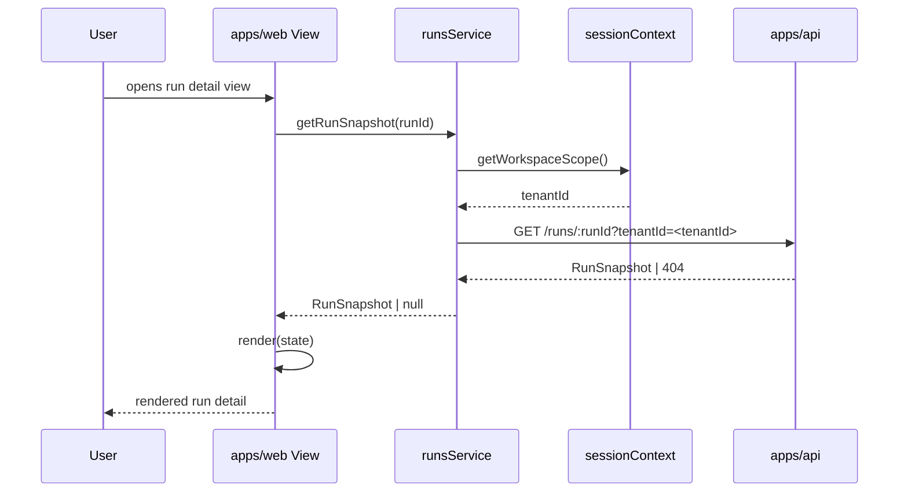

# Web Sequence

This document summarizes the active `apps/web` run-detail fetch sequence. Route
truth remains the protected runtime contract documented in
[Frontend Runtime Contract Technical Manual](./runs/frontend-runtime-contract-technical-manual.md).

## Main Flow: Run Snapshot Fetch

## Global Flow Position

`apps/web` sits at the outermost layer of the DVT system, serving as the browser
application shell and route-level workbench host. It calls `apps/api` for data
through governed service boundaries and port adapters. It has no knowledge of
the Planning, Execution, or Infra domains; all business logic and data access
is delegated downstream through the API layer.

## Key Files

- `apps/web/src/app/services/runs/runsService.ts`
- `apps/web/src/app/services/runs/runsService.api.ts`
- `apps/web/src/app/ports/runs.ts`
- `apps/web/src/app/views/RunsView.tsx`
- `apps/api/src/application/ports/protectedRuntimeRunRailVocabulary.ts`
