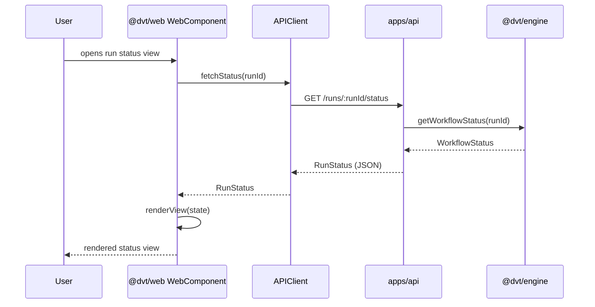

# Web Sequence

## Main Flow: fetchStatus and Render

## Global Flow Position

`@dvt/web` sits at the outermost layer of the DVT system, serving as the shared UI component library for `apps/web`. It is consumed by the web application to render run status, workflow progress, and user interaction surfaces. It calls `apps/api` for data and may surface engine workflow status via the EngineStatusAdapter. It has no knowledge of the Planning, Execution, or Infra domains — all business logic and data access is delegated downstream through the API layer. The web layer is entirely read-driven with user interactions dispatched as API requests.

## Key Files

- `packages/@dvt/web/src/components/`
- `packages/@dvt/web/src/adapters/APIClient.ts`
- `packages/@dvt/web/src/adapters/EngineStatusAdapter.ts`
- `packages/@dvt/web/src/index.ts`
