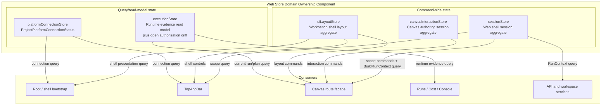
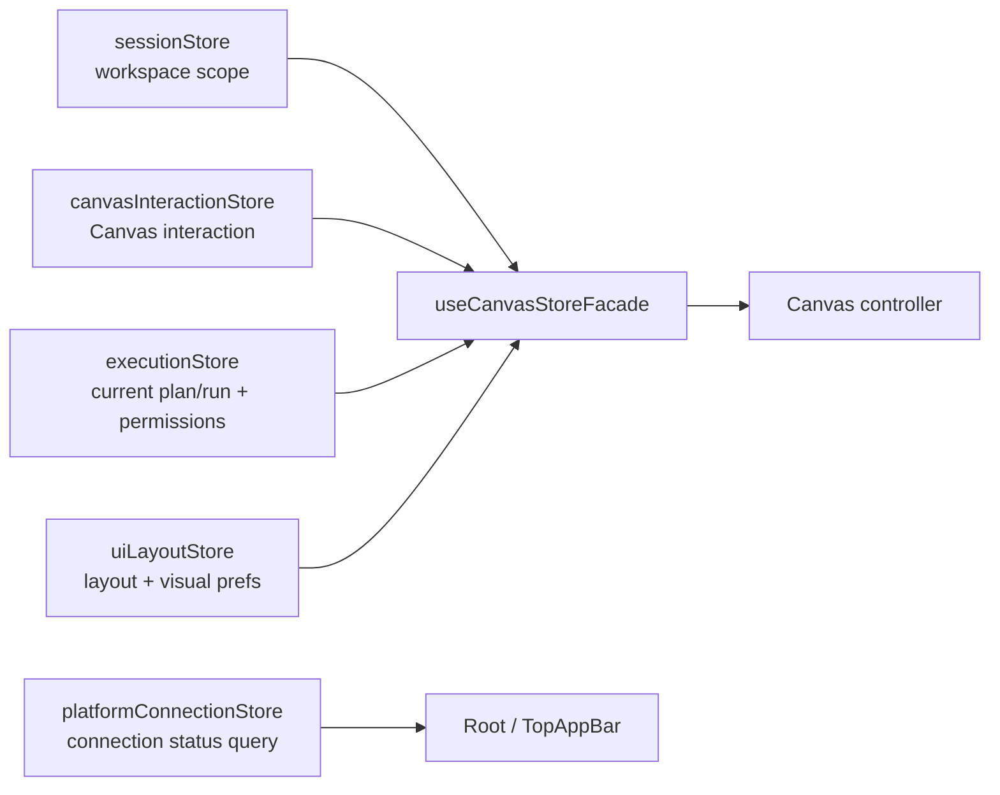
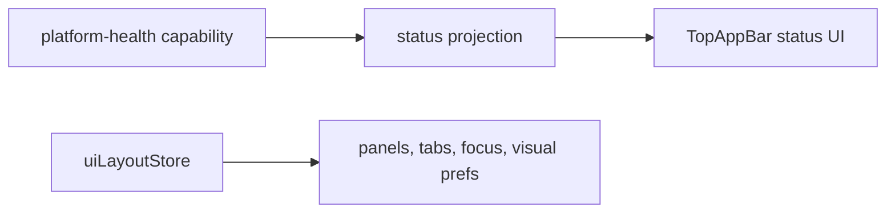

# Web Store Domain Ownership Component

This page is the current component map for the active Zustand store surfaces in
`apps/web`. It exists so F-05 can be reviewed against the code that exists now,
not against the retired `appStore.ts` aggregate.

## Current Component Map

| Store                        | Component role              | DDD owner                          | Command/query role | Reason to exist                                                                                                     |
| ---------------------------- | --------------------------- | ---------------------------------- | ------------------ | ------------------------------------------------------------------------------------------------------------------- |
| `sessionStore.ts`            | Workspace session state     | Web shell session aggregate        | command/query      | Owns tenant, project, environment, target adapter, and `RunContext` construction for route and API calls.           |
| `canvasInteractionStore.ts`  | Canvas interaction state    | Canvas authoring session aggregate | command            | Owns selected nodes, inspector focus, overlays, viewport, and node position persistence by workspace key.           |
| `executionStore.ts`          | Runtime evidence projection | Runtime evidence read model        | query              | Carries current plan/run selections for Canvas, Runs, Cost, and Console while F-05 decides the authorization split. |
| `uiLayoutStore.ts`           | Workbench shell layout      | Web shell layout aggregate         | command            | Owns panel visibility, focus mode, tabs, grid size, and canvas palette.                                             |
| `platformConnectionStore.ts` | Platform connection status  | Platform health read model         | query              | Owns `ProjectPlatformConnectionStatus` for shell presentation without persisting it as layout.                      |

## Component Diagram

## Store Method Inventory

The table is the current method-level ownership map. New methods must be added
here before implementation so the DDD owner and C&Q rail are explicit.

| Store                        | Method or state surface     | Type    | DDD owner                          | Rail                              | Notes                                                                 |
| ---------------------------- | --------------------------- | ------- | ---------------------------------- | --------------------------------- | --------------------------------------------------------------------- |
| `sessionStore.ts`            | `tenantId`                  | query   | Web shell session aggregate        | Workspace scope selection         | Current tenant scope.                                                 |
| `sessionStore.ts`            | `projectId`                 | query   | Web shell session aggregate        | Workspace scope selection         | Current project scope.                                                |
| `sessionStore.ts`            | `environmentId`             | query   | Web shell session aggregate        | Workspace scope selection         | Current environment scope.                                            |
| `sessionStore.ts`            | `targetAdapter`             | query   | Web shell session aggregate        | Workspace scope selection         | Current run target adapter.                                           |
| `sessionStore.ts`            | `setTenantId`               | command | Web shell session aggregate        | Workspace scope selection         | Changes tenant scope.                                                 |
| `sessionStore.ts`            | `setProjectId`              | command | Web shell session aggregate        | Workspace scope selection         | Changes project scope.                                                |
| `sessionStore.ts`            | `setEnvironmentId`          | command | Web shell session aggregate        | Workspace scope selection         | Changes environment scope.                                            |
| `sessionStore.ts`            | `setTargetAdapter`          | command | Web shell session aggregate        | Workspace scope selection         | Changes target adapter.                                               |
| `sessionStore.ts`            | `setSessionContext`         | command | Web shell session aggregate        | Workspace scope selection         | Updates multiple scope fields atomically.                             |
| `sessionStore.ts`            | `buildRunContext`           | query   | Web shell session aggregate        | Build run context                 | Builds command payload context for run actions.                       |
| `canvasInteractionStore.ts`  | `selectedNodes`             | query   | Canvas authoring session aggregate | Canvas interaction updates        | Current selected Canvas node ids.                                     |
| `canvasInteractionStore.ts`  | `impactOverlayEnabled`      | query   | Canvas authoring session aggregate | Canvas interaction updates        | Current impact overlay state.                                         |
| `canvasInteractionStore.ts`  | `columnLevelLineageEnabled` | query   | Canvas authoring session aggregate | Canvas interaction updates        | Current lineage overlay state.                                        |
| `canvasInteractionStore.ts`  | `canvasLayouts`             | query   | Canvas authoring session aggregate | Canvas interaction updates        | Persisted viewport and node positions by workspace key.               |
| `canvasInteractionStore.ts`  | `inspectorNodeId`           | query   | Canvas authoring session aggregate | Canvas interaction updates        | Current inspector focus.                                              |
| `canvasInteractionStore.ts`  | `setSelectedNodes`          | command | Canvas authoring session aggregate | Canvas interaction updates        | Updates selection.                                                    |
| `canvasInteractionStore.ts`  | `toggleImpactOverlay`       | command | Canvas authoring session aggregate | Canvas interaction updates        | Toggles impact overlay.                                               |
| `canvasInteractionStore.ts`  | `toggleColumnLevelLineage`  | command | Canvas authoring session aggregate | Canvas interaction updates        | Toggles column-level lineage.                                         |
| `canvasInteractionStore.ts`  | `setCanvasViewport`         | command | Canvas authoring session aggregate | Canvas interaction updates        | Persists viewport by workspace key.                                   |
| `canvasInteractionStore.ts`  | `setCanvasNodePositions`    | command | Canvas authoring session aggregate | Canvas interaction updates        | Persists node positions by workspace key.                             |
| `canvasInteractionStore.ts`  | `setInspectorNode`          | command | Canvas authoring session aggregate | Canvas interaction updates        | Sets inspector focus.                                                 |
| `uiLayoutStore.ts`           | `leftNavCollapsed`          | query   | Web shell layout aggregate         | Shell panel/layout updates        | Current left navigation display.                                      |
| `uiLayoutStore.ts`           | `explorerPanelWidth`        | query   | Web shell layout aggregate         | Shell panel/layout updates        | Current explorer width.                                               |
| `uiLayoutStore.ts`           | `explorerPanelVisible`      | query   | Web shell layout aggregate         | Shell panel/layout updates        | Current explorer visibility.                                          |
| `uiLayoutStore.ts`           | `inspectorPanelWidth`       | query   | Web shell layout aggregate         | Shell panel/layout updates        | Current inspector width.                                              |
| `uiLayoutStore.ts`           | `inspectorPanelVisible`     | query   | Web shell layout aggregate         | Shell panel/layout updates        | Current inspector visibility.                                         |
| `uiLayoutStore.ts`           | `consolePanelHeight`        | query   | Web shell layout aggregate         | Shell panel/layout updates        | Current console drawer height.                                        |
| `uiLayoutStore.ts`           | `consolePanelVisible`       | query   | Web shell layout aggregate         | Shell panel/layout updates        | Current console drawer visibility.                                    |
| `uiLayoutStore.ts`           | `focusMode`                 | query   | Web shell layout aggregate         | Shell panel/layout updates        | Current focus-mode state.                                             |
| `uiLayoutStore.ts`           | `gridSize`                  | query   | Web shell layout aggregate         | Shell panel/layout updates        | Current Canvas grid preference.                                       |
| `uiLayoutStore.ts`           | `canvasPalette`             | query   | Web shell layout aggregate         | Shell panel/layout updates        | Current Canvas palette preference.                                    |
| `uiLayoutStore.ts`           | `activeTabs`                | query   | Web shell layout aggregate         | Shell panel/layout updates        | Current shell tab list.                                               |
| `uiLayoutStore.ts`           | `activeTabId`               | query   | Web shell layout aggregate         | Shell panel/layout updates        | Current active shell tab.                                             |
| `uiLayoutStore.ts`           | `toggleLeftNav`             | command | Web shell layout aggregate         | Shell panel/layout updates        | Toggles left navigation.                                              |
| `uiLayoutStore.ts`           | `setExplorerPanelWidth`     | command | Web shell layout aggregate         | Shell panel/layout updates        | Changes explorer width.                                               |
| `uiLayoutStore.ts`           | `setInspectorPanelWidth`    | command | Web shell layout aggregate         | Shell panel/layout updates        | Changes inspector width.                                              |
| `uiLayoutStore.ts`           | `setConsolePanelHeight`     | command | Web shell layout aggregate         | Shell panel/layout updates        | Changes console drawer height.                                        |
| `uiLayoutStore.ts`           | `toggleFocusMode`           | command | Web shell layout aggregate         | Shell panel/layout updates        | Toggles focus mode.                                                   |
| `uiLayoutStore.ts`           | `toggleExplorerPanel`       | command | Web shell layout aggregate         | Shell panel/layout updates        | Toggles explorer visibility.                                          |
| `uiLayoutStore.ts`           | `toggleInspectorPanel`      | command | Web shell layout aggregate         | Shell panel/layout updates        | Toggles inspector visibility.                                         |
| `uiLayoutStore.ts`           | `toggleConsolePanel`        | command | Web shell layout aggregate         | Shell panel/layout updates        | Toggles console visibility and default height.                        |
| `uiLayoutStore.ts`           | `hideConsolePanel`          | command | Web shell layout aggregate         | Shell panel/layout updates        | Hides console drawer.                                                 |
| `uiLayoutStore.ts`           | `showExplorerPanel`         | command | Web shell layout aggregate         | Shell panel/layout updates        | Shows explorer panel.                                                 |
| `uiLayoutStore.ts`           | `hideExplorerPanel`         | command | Web shell layout aggregate         | Shell panel/layout updates        | Hides explorer panel.                                                 |
| `uiLayoutStore.ts`           | `showInspectorPanel`        | command | Web shell layout aggregate         | Shell panel/layout updates        | Shows inspector panel.                                                |
| `uiLayoutStore.ts`           | `hideInspectorPanel`        | command | Web shell layout aggregate         | Shell panel/layout updates        | Hides inspector panel.                                                |
| `uiLayoutStore.ts`           | `setGridSize`               | command | Web shell layout aggregate         | Shell panel/layout updates        | Changes Canvas grid preference.                                       |
| `uiLayoutStore.ts`           | `setCanvasPalette`          | command | Web shell layout aggregate         | Shell panel/layout updates        | Changes Canvas palette preference.                                    |
| `uiLayoutStore.ts`           | `addTab`                    | command | Web shell layout aggregate         | Shell panel/layout updates        | Adds and activates a shell tab.                                       |
| `uiLayoutStore.ts`           | `closeTab`                  | command | Web shell layout aggregate         | Shell panel/layout updates        | Closes a shell tab and resolves next active tab.                      |
| `uiLayoutStore.ts`           | `setActiveTab`              | command | Web shell layout aggregate         | Shell panel/layout updates        | Sets active shell tab.                                                |
| `platformConnectionStore.ts` | `connectionStatus`          | query   | Platform health read model         | `ProjectPlatformConnectionStatus` | Current REST and live-event connection projection for shell display.  |
| `platformConnectionStore.ts` | `setConnectionStatus`       | command | Platform health read model         | `ProjectPlatformConnectionStatus` | Updates the local projection from the authoritative health query.     |
| `executionStore.ts`          | `currentPlan`               | query   | Runtime evidence read model        | Current run/plan display          | Current plan projection; still shares store with authorization drift. |
| `executionStore.ts`          | `currentRun`                | query   | Runtime evidence read model        | Current run/plan display          | Current run projection.                                               |
| `executionStore.ts`          | `userPermissions`           | query   | Authorization projection           | Authorization capability display  | Active F-05 drift until split or deliberately documented projection.  |
| `executionStore.ts`          | `setCurrentPlan`            | command | Runtime evidence read model        | Current run/plan display          | Updates current plan projection.                                      |
| `executionStore.ts`          | `setCurrentRun`             | command | Runtime evidence read model        | Current run/plan display          | Updates current run projection.                                       |

## Current Cross-Store Composition

`useCanvasStoreFacade` is the active route-level composition seam. It reads the
four stores explicitly and exposes the Canvas controller state needed by the
route. This is allowed because it is a route facade, not a hidden replacement
for `appStore.ts`.

## Residual Drift

| Drift                                         | Current file                                | Why it is drift                                                                     | Target owner                                          |
| --------------------------------------------- | ------------------------------------------- | ----------------------------------------------------------------------------------- | ----------------------------------------------------- |
| Permission projection inside runtime evidence | `apps/web/src/app/stores/executionStore.ts` | Authorization capabilities are not the same aggregate as current plan/run evidence. | Authorization projection or guarded capability query. |

The previous platform connection status drift is closed: `uiLayoutStore.ts`
does not own or hydrate `connectionStatus`, and `platformConnectionStore.ts`
owns the `ProjectPlatformConnectionStatus` query projection.

The remaining row is the only active F-05 store ownership drift found in the
current store map. It must be removed or explicitly documented as a projection
before F-05 can close.

## Legacy And Barrel Rules

- `apps/web/src/app/stores/appStore.ts` must remain absent.
- `apps/web/src/app/stores/index.ts` must remain absent.
- New store state must be added to one named owner or to a new bounded store
  with this page updated first.
- Route facades may compose stores, but they must not become a generic global
  store API.

## Verification Surfaces

| Rule                                    | Current proof                                                                              |
| --------------------------------------- | ------------------------------------------------------------------------------------------ |
| No legacy aggregate store               | `canvasStartupAndDraftRecovery.architecture.test.ts` asserts `appStore.ts` does not exist. |
| No query imports from retired aggregate | `queryKeyPolicy.architecture.test.ts` forbids `stores/appStore` imports in query surfaces. |
| Canvas layout remains route-local       | `canvasInteractionStore.test.ts` covers persisted layout hydration.                        |
| Shell layout remains bounded            | `uiLayoutStore.test.ts` covers persisted layout normalization.                             |
| Platform status is not shell layout     | `platformConnectionStore.test.ts` and `uiLayoutStore.test.ts` cover the ownership split.   |

## Required Next Design

The status ownership cut now has this target shape:

This preserves the current product behavior while moving connection state out
of layout ownership.
