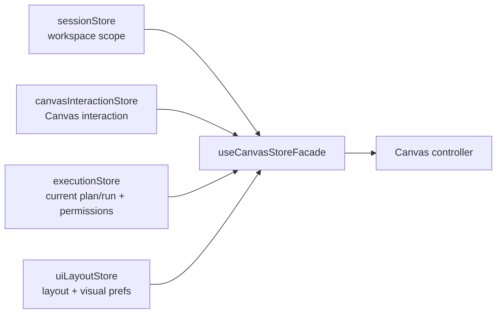
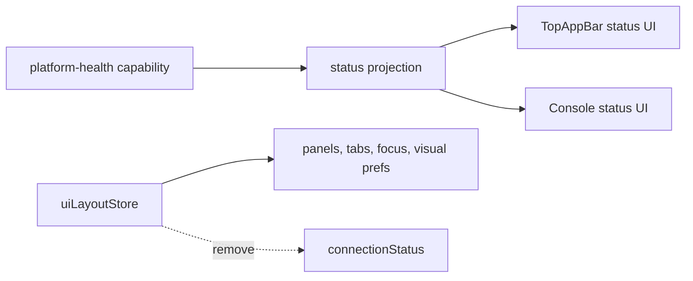

# Web Store Domain Ownership Component

This page is the current component map for the active Zustand store surfaces in
`apps/web`. It exists so F-05 can be reviewed against the code that exists now,
not against the retired `appStore.ts` aggregate.

## Current Component Map

| Store                       | Component role              | DDD owner                          | Command/query role | Reason to exist                                                                                                     |
| --------------------------- | --------------------------- | ---------------------------------- | ------------------ | ------------------------------------------------------------------------------------------------------------------- |
| `sessionStore.ts`           | Workspace session state     | Web shell session aggregate        | command/query      | Owns tenant, project, environment, target adapter, and `RunContext` construction for route and API calls.           |
| `canvasInteractionStore.ts` | Canvas interaction state    | Canvas authoring session aggregate | command            | Owns selected nodes, inspector focus, overlays, viewport, and node position persistence by workspace key.           |
| `executionStore.ts`         | Runtime evidence projection | Runtime evidence read model        | query              | Carries current plan/run selections for Canvas, Runs, Cost, and Console while F-05 decides the authorization split. |
| `uiLayoutStore.ts`          | Workbench shell layout      | Web shell layout aggregate         | command            | Owns panel visibility, focus mode, tabs, grid size, and canvas palette.                                             |

## Current Cross-Store Composition

`useCanvasStoreFacade` is the active route-level composition seam. It reads the
four stores explicitly and exposes the Canvas controller state needed by the
route. This is allowed because it is a route facade, not a hidden replacement
for `appStore.ts`.

## Residual Drift

| Drift                                         | Current file                                | Why it is drift                                                                     | Target owner                                          |
| --------------------------------------------- | ------------------------------------------- | ----------------------------------------------------------------------------------- | ----------------------------------------------------- |
| Platform connection status inside layout      | `apps/web/src/app/stores/uiLayoutStore.ts`  | Connectivity is a platform-health read model, not shell layout.                     | Platform health/status projection.                    |
| Permission projection inside runtime evidence | `apps/web/src/app/stores/executionStore.ts` | Authorization capabilities are not the same aggregate as current plan/run evidence. | Authorization projection or guarded capability query. |

These are the only active F-05 store ownership drifts found in the current
store map. They must be removed or explicitly documented as projections before
F-05 can close.

## Legacy And Barrel Rules

- `apps/web/src/app/stores/appStore.ts` must remain absent.
- `apps/web/src/app/stores/index.ts` must remain absent.
- New store state must be added to one named owner or to a new bounded store
  with this page updated first.
- Route facades may compose stores, but they must not become a generic global
  store API.

## Verification Surfaces

| Rule                                    | Current proof                                                                              |
| --------------------------------------- | ------------------------------------------------------------------------------------------ |
| No legacy aggregate store               | `canvasStartupAndDraftRecovery.architecture.test.ts` asserts `appStore.ts` does not exist. |
| No query imports from retired aggregate | `queryKeyPolicy.architecture.test.ts` forbids `stores/appStore` imports in query surfaces. |
| Canvas layout remains route-local       | `canvasInteractionStore.test.ts` covers persisted layout hydration.                        |
| Shell layout remains bounded            | `uiLayoutStore.test.ts` covers persisted layout normalization.                             |

## Required Next Design

The next implementation slice should start with the status ownership cut:

This preserves the current product behavior while moving connection state out
of layout ownership.
