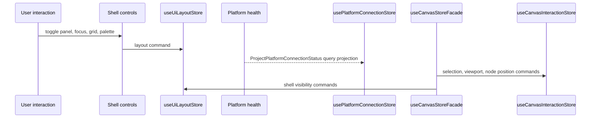
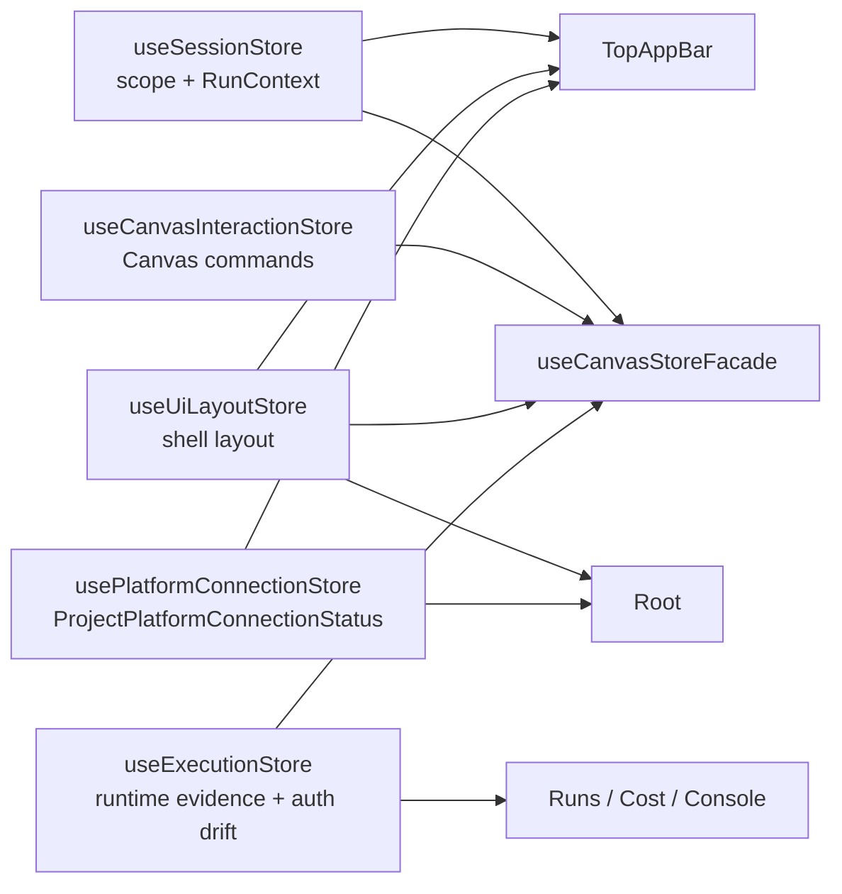

# Web Store Domain Ownership Local Guide

This local guide documents the executable API and invariants for the active
`apps/web/src/app/stores` component. It is intentionally narrower than the F-05
plan: it describes the component as it exists now.

Use this guide with:

- [Web Store Domain Ownership Component](./web-store-domain-ownership-component.md)
- [Web Store Domain Ownership User Stories](./web-store-domain-ownership-user-stories.md)
- [Fowler analysis mailbox](../../../../buzon/20260503-codex-fowler-web-store-domain-ownership-analysis-and-remediation.md)

## Public API

| API                          | Type             | Owned concern                                                  |
| ---------------------------- | ---------------- | -------------------------------------------------------------- |
| `useSessionStore`            | command/query    | Web workspace session scope and `RunContext` projection.       |
| `useCanvasInteractionStore`  | command/query    | Route-local Canvas interaction and persisted layout.           |
| `useUiLayoutStore`           | command/query    | Workbench shell layout commands and visual preferences.        |
| `usePlatformConnectionStore` | query projection | `ProjectPlatformConnectionStatus` read model.                  |
| `useExecutionStore`          | query            | Runtime evidence, with pending authorization projection drift. |

## Invariants

- `connectionStatus is not layout state`.
- `usePlatformConnectionStore` is the only active store that owns
  `PlatformConnectionState`.
- `useUiLayoutStore` persists layout and visual preferences only.
- `useCanvasInteractionStore` owns Canvas interaction state by workspace key.
- `useSessionStore` owns caller scope and builds `RunContext`; it does not own
  platform runtime identity.
- `useExecutionStore.userPermissions` is not accepted as final architecture; it
  remains active F-05 drift until authorization has its own projection or a
  documented read-model owner.

## Transitions

## Consumers

| Consumer                         | Expected dependency shape                                                  |
| -------------------------------- | -------------------------------------------------------------------------- |
| `Root.tsx`                       | Reads shell layout and updates platform connection projection from health. |
| `TopAppBar.tsx`                  | Reads session, shell layout, and `ProjectPlatformConnectionStatus`.        |
| `useCanvasStoreFacade.ts`        | Explicit route facade composing stores; never a global aggregate store.    |
| `apps/web/src/app/views/admin/*` | Reads platform health directly as an admin read model.                     |
| Runs, Cost, Console surfaces     | Read runtime evidence from `useExecutionStore`.                            |

## Component Diagram

## Semantic Encapsulation

The store component is semantically encapsulated when a reviewer can answer
these questions without reading unrelated UI code:

1. Which store owns each state transition?
2. Which store owns each query projection?
3. Which fields are drift rather than accepted architecture?
4. Which tests prevent a retired aggregate or layout/status mix from returning?

The current answer is encoded in this guide, the component map, and
`webStoreDomainOwnership.architecture.test.ts`.
